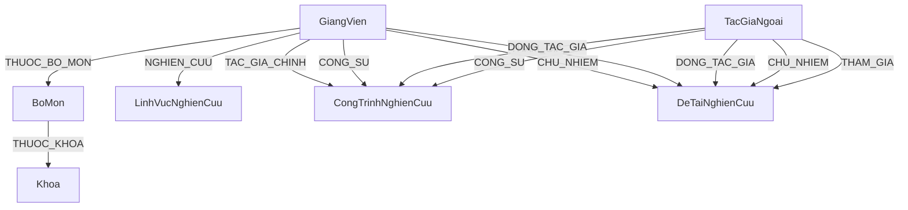

# SỔ TAY CHỨC NĂNG VÀ KỊCH BẢN KIỂM THỬ TOÀN DIỆN (DOÁN TỐT NGHIỆP NTU)
## ĐỀ TÀI: XÂY DỰNG BẢN ĐỒ TRI THỨC NGHIÊN CỨU KHOA HỌC (RESEARCH KNOWLEDGE GRAPH SYSTEM)

Tài liệu này là cẩm nang nghiệm thu và kiểm thử hệ thống từ A-Z, hỗ trợ người kiểm thử, nhà phát triển và đặc biệt là sinh viên dùng làm tài liệu bảo vệ trước Hội đồng tốt nghiệp. Tất cả kịch bản kiểm thử được trình bày chi tiết bằng văn bản và danh sách phân đoạn để dễ dàng theo dõi trực tiếp.

---

## MỤC LỤC
1. [PHẦN I: KIẾN TRÚC VÀ THÔNG TIN ĐỐ TÁC DỮ LIỆU (NEO4J SCHEMA)](#phan-i-kien-truc-va-thong-tin-do-tac-du-lieu-neo4j-schema)
2. [PHẦN II: TẤT CẢ CHỨC NĂNG VÀ KỊCH BẢN KIỂM THỬ CHI TIẾT](#phan-ii-tat-ca-chuc-nang-va-kich-ban-kiem-thu-chi-tiet)
   * [1. MODULE KHÁCH VÃNG LAI & SINH VIÊN (GUEST PORTAL)](#1-module-khach-vang-lai--sinh-vien-guest-portal)
   * [2. MODULE GIẢNG VIÊN (LECTURER PORTAL)](#2-module-giang-vien-lecturer-portal)
   * [3. MODULE QUẢN TRỊ VIÊN (ADMIN PORTAL)](#3-module-quan-tri-vien-admin-portal)
3. [PHẦN III: HƯỚNG DẪN BẢO VỆ ĐỒ ÁN CHO SINH VIÊN (DEFENSE STRATEGY)](#phan-iii-huong-dan-bao-ve-do-an-cho-sinh-vien-defense-strategy)
   * [1. Các Câu Hỏi Phản Biện Thường Gặp & Gợi Ý Trả Lời](#1-cac-cau-hoi-phan-bien-thuong-gap--goi-y-tra-loi)
   * [2. Danh Sách Cypher Query Live-Demo Trực Tiếp Cho Hội Đồng Xem](#2-danh-sach-cypher-query-live-demo-truc-tiep-cho-hoi-dong-xem)

---

## PHẦN I: KIẾN TRÚC VÀ THÔNG TIN ĐỐ TÁC DỮ LIỆU (NEO4J SCHEMA)

Hệ thống được thiết kế theo mô hình **Client-Server** với giao thức API RESTful:
* **Frontend:** Trình diễn tương tác thời gian thực sử dụng HTML5, CSS3 (Vanilla), JavaScript ES6 và thư viện đồ thị tương tác **Vis.js**.
* **Backend:** Phát triển trên nền tảng **Flask (Python)** xử lý logic nghiệp vụ, phân quyền theo phiên làm việc (Session/Token), tích hợp thư viện `deep-translator` hỗ trợ dịch thuật và gọi **Gemini AI API** cho tính năng Chatbot Graph-RAG.
* **Database:** Sử dụng Cơ sở dữ liệu đồ thị **Neo4j** để biểu diễn trực quan các thực thể và liên kết học thuật.

### Đồ thị Cơ sở dữ liệu (Neo4j Schema Design)


### Quy ước Trạng thái thực thể trong hệ thống:
1. **Trạng thái duyệt (`trang_thai`):** `Chờ duyệt` (đang đợi Admin xử lý), `Đã duyệt`/`Phê duyệt` (hiển thị công khai), `Từ chối` (ẩn khỏi bản đồ công khai, trả lại cho Giảng viên chỉnh sửa).
2. **Xóa mềm (`is_deleted`):** Mọi thực thể khi bị xóa mặc định đặt `is_deleted = true` và ẩn khỏi giao diện công khai để đảm bảo không bị gãy liên kết đồ thị đột ngột. Admin có thể khôi phục hoặc xóa vĩnh viễn (`DETACH DELETE`) từ thùng rác.

---

## PHẦN II: TẤT CẢ CHỨC NĂNG VÀ KỊCH BẢN KIỂM THỬ CHI TIẾT

### 1. MODULE KHÁCH VÃNG LAI & SINH VIÊN (GUEST PORTAL)

---

#### CHỨC NĂNG 1.1: BẢN ĐỒ TRI THỨC TƯƠNG TÁC (INTERACTIVE KNOWLEDGE MAP)
* **Frontend View:** `frontend/user/explore.html` (Khám phá đồ thị tri thức)
* **Backend API:** `GET /api/graph/all` và `GET /api/graph/node/<node_id>`

##### Kịch bản 1.1.1: Hiển thị đầy đủ bản đồ tri thức khoa học khi tải trang (Happy Path)
* **Mục tiêu:** Đảm bảo đồ thị vẽ đầy đủ các thực thể đang hoạt động khi người dùng truy cập.
* **Các bước thực hiện:**
  1. Mở trang chủ hoặc truy cập trực tiếp vào explore.html.
  2. Đợi giao diện tải dữ liệu từ API `/api/graph/all` và vẽ lên màn hình.
* **Dữ liệu đầu vào:** Không yêu cầu.
* **Kết quả trên giao diện:** Đồ thị Vis.js vẽ đầy đủ các Node (Giảng viên, Công trình, Đề tài, Lĩnh vực...) với các màu sắc đại diện khác nhau. Các cạnh liên kết hiển thị đúng hướng mũi tên và nhãn quan hệ rõ ràng.
* **Xác thực CSDL (Cypher Query):**
  ```cypher
  MATCH (n) WHERE coalesce(n.is_deleted, false) = false RETURN count(n) AS active_nodes
  ```
  *(Số lượng nút trên giao diện phải tương ứng với số nút có trạng thái hoạt động trong Neo4j).*

##### Kịch bản 1.1.2: Không hiển thị các thực thể đã bị xóa mềm (Logic/Fallback)
* **Mục tiêu:** Xác minh các dữ liệu bị xóa mềm không xuất hiện trên bản đồ công khai.
* **Các bước thực hiện:**
  1. Chọn một công trình nghiên cứu và đặt thuộc tính `is_deleted = true`.
  2. Tải lại trang explore.html.
* **Dữ liệu đầu vào:** Thực thể bị xóa mềm có ID tương ứng.
* **Kết quả trên giao diện:** Thực thể bị xóa mềm biến mất hoàn toàn khỏi bản đồ. Các cạnh liên kết chỉ đến nút này cũng tự động ẩn đi để tránh liên kết gãy.
* **Xác thực CSDL (Cypher Query):**
  ```cypher
  MATCH (ct:CongTrinhNghienCuu {id: $id}) RETURN ct.is_deleted
  ```
  *(Kết quả trả về phải là `true`).*

##### Kịch bản 1.1.3: Xem chi tiết đồ thị con khi Click vào Node (Happy Path)
* **Mục tiêu:** Hiển thị mạng lưới kết nối trực tiếp xung quanh một đối tượng được chọn.
* **Các bước thực hiện:**
  1. Click chuột trái vào 1 nút Giảng viên hoặc Đề tài trên bản đồ tri thức.
* **Dữ liệu đầu vào:** Click Event chứa Node ID (ví dụ: `gv_1`).
* **Kết quả trên giao diện:** Bản đồ tự động zoom cận cảnh vào nút được chọn, làm nổi bật đối tượng đó cùng các liên kết trực tiếp xung quanh (depth=1). Đồng thời sidebar bên phải trượt ra hiển thị chi tiết lý lịch khoa học của giảng viên hoặc tóm tắt nội dung đề tài.
* **Xác thực CSDL (Cypher Query):**
  ```cypher
  MATCH (gv:GiangVien {id: "gv_1"})-[r]-(n) RETURN type(r), labels(n)
  ```
  *(Các nút lân cận tìm thấy trong CSDL phải khớp chính xác với đồ thị con được làm nổi bật).*

---

#### CHỨC NĂNG 1.2: TÌM KIẾM TỔNG HỢP THÔNG MINH (GLOBAL SMART SEARCH)
* **Frontend View:** Ô tìm kiếm trên Header hoặc trang explore.html
* **Backend API:** `GET /api/search?q=<keyword>&type=<all|giang_vien|cong_trinh|de_tai>`

##### Kịch bản 1.2.1: Tìm kiếm chính xác có dấu tiếng Việt (Happy Path)
* **Mục tiêu:** Tìm ra kết quả mong muốn với từ khóa đầy đủ dấu tiếng Việt.
* **Các bước thực hiện:**
  1. Nhập từ khóa tiếng Việt có dấu vào thanh tìm kiếm.
  2. Nhấn phím Enter hoặc bấm biểu tượng kính lúp.
* **Dữ liệu đầu vào:** `q="Nguyễn Thanh Tú"`, `type="all"`
* **Kết quả trên giao diện:** Trả về danh sách giảng viên "Nguyễn Thanh Tú" ở vị trí đầu tiên, kèm danh sách bài báo và đề tài có liên quan đến giảng viên này.
* **Xác thực CSDL (Cypher Query):**
  ```cypher
  MATCH (n) WHERE toLower(n.ho_va_ten) CONTAINS toLower("Nguyễn Thanh Tú") RETURN n
  ```

##### Kịch bản 1.2.2: Tìm kiếm không dấu tự động chuẩn hóa (Happy Path)
* **Mục tiêu:** Hệ thống tự loại bỏ dấu phụ để tìm kiếm chính xác khi người dùng gõ không dấu.
* **Các bước thực hiện:**
  1. Nhập từ khóa không dấu vào ô tìm kiếm.
  2. Nhấn nút Tìm kiếm.
* **Dữ liệu đầu vào:** `q="nguyen thanh tu"`, `type="all"`
* **Kết quả trên giao diện:** Hệ thống vẫn hiển thị chính xác giảng viên "Nguyễn Thanh Tú" nhờ hàm chuẩn hóa chuỗi `remove_accents` chạy dưới backend.
* **Xác thực CSDL (Cypher Query):** Đảm bảo backend đã chuyển đổi từ khóa thô thành regex so khớp không dấu trước khi truy vấn Neo4j.

##### Kịch bản 1.2.3: Tìm kiếm viết liền không dấu (Boundary/Limit)
* **Mục tiêu:** Kiểm tra khả năng xử lý từ khóa viết liền sát nhau của hệ thống.
* **Các bước thực hiện:**
  1. Nhập từ khóa viết liền sát nhau không chứa khoảng trắng.
  2. Bấm Tìm kiếm.
* **Dữ liệu đầu vào:** `q="nguyenthanhtu"`, `type="giang_vien"`
* **Kết quả trên giao diện:** Hệ thống tự loại bỏ khoảng trắng trong dữ liệu gốc khi đối chiếu và tìm ra kết quả khớp là giảng viên "Nguyễn Thanh Tú".
* **Xác thực CSDL (Cypher Query):** Backend xử lý regex so khớp xóa khoảng trắng để tìm kiếm linh hoạt nhất.

##### Kịch bản 1.2.4: Ngăn chặn tiêm vấn mã lệnh Cypher (Security)
* **Mục tiêu:** Bảo vệ cơ sở dữ liệu khỏi các cuộc tấn công Cypher Injection qua ô tìm kiếm.
* **Các bước thực hiện:**
  1. Nhập các ký tự đặc biệt chứa cú pháp Cypher độc hại vào ô tìm kiếm.
  2. Nhấn Tìm kiếm.
* **Dữ liệu đầu vào:** `q="' OR 1=1 OR n.id = '"`, `type="all"`
* **Kết quả trên giao diện:** Hệ thống báo không tìm thấy kết quả hoặc báo lỗi định dạng đầu vào. Hệ thống không bị crash (lỗi 500) và không để lộ dữ liệu nhạy cảm.
* **Xác thực CSDL (Cypher Query):** API backend sử dụng cơ chế tham số hóa dữ liệu (parameterized queries) của Neo4j Driver để ngăn chặn chèn cú pháp ngoài ý muốn.

---

#### CHỨC NĂNG 1.3: HỎI ĐÁP TRI THỨC VÀ TRỰC QUAN HÓA AI (GRAPH-RAG CHATBOT)
* **Frontend View:** Hộp thoại Chatbot góc phải dưới màn hình hoặc trang `/chat`
* **Backend API:** `POST /api/chat/ask` (Payload: `{"message": "Câu hỏi"}`)

##### Kịch bản 1.3.1: Trả lời tự nhiên kèm vẽ đồ thị minh họa (Happy Path)
* **Mục tiêu:** Chatbot trả lời thông tin học thuật chính xác và vẽ đồ thị con tương tác tương ứng.
* **Các bước thực hiện:**
  1. Mở cửa sổ chat.
  2. Nhập một câu hỏi liên quan đến nghiên cứu khoa học của khoa và bấm Gửi.
* **Dữ liệu đầu vào:** `message="Giảng viên nào đang nghiên cứu về Xử lý ngôn ngữ tự nhiên?"`
* **Kết quả trên giao diện:**
  * Nhận được câu trả lời dạng văn bản tiếng Việt tự nhiên nêu rõ tên giảng viên và các đề tài của họ.
  * Ngay dưới câu trả lời xuất hiện một mini-graph (Vis.js) vẽ liên kết giữa giảng viên đó và các đề tài NLP liên quan.
* **Xác thực CSDL (Cypher Query):** API Gemini dịch câu hỏi sang câu lệnh Cypher, thực thi lấy danh sách nút/cạnh trong Neo4j để làm ngữ cảnh tổng hợp câu trả lời chính xác, tránh hiện tượng ảo tưởng thông tin.

##### Kịch bản 1.3.2: Cơ chế dự phòng khi AI Gemini gặp sự cố hoặc mất mạng (Fallback)
* **Mục tiêu:** Hệ thống vẫn phục vụ người dùng bằng dữ liệu thô khi không thể gọi API AI.
* **Các bước thực hiện:**
  1. Giả lập chặn kết nối API Gemini (xóa API Key trong file cấu hình).
  2. Nhập câu hỏi và gửi.
* **Dữ liệu đầu vào:** `message="Danh sách đề tài của giảng viên Nguyễn Thanh Tú"`
* **Kết quả trên giao diện:** Hệ thống chuyển sang chế độ Rule-based dự phòng, tự động bóc tách từ khóa bằng biểu thức chính quy (Regex), tìm kiếm trong cơ sở dữ liệu và hiển thị kết quả dưới dạng bảng thông tin tĩnh thay vì câu trả lời tự nhiên của AI.
* **Xác thực CSDL (Cypher Query):** Truy vấn Neo4j trực tiếp bằng từ khóa thô được bóc tách từ câu hỏi.

##### Kịch bản 1.3.3: Nhập câu hỏi nằm ngoài phạm vi học thuật (Boundary/Limit)
* **Mục tiêu:** Chatbot từ chối trả lời các thông tin không liên quan để bảo vệ tài nguyên hệ thống.
* **Các bước thực hiện:**
  1. Nhập một câu hỏi không liên quan đến nghiên cứu khoa học.
  2. Bấm Gửi.
* **Dữ liệu đầu vào:** `message="Mua iPhone 15 ở đâu rẻ nhất?"`
* **Kết quả trên giao diện:** Chatbot phản hồi lịch sự: "Tôi là trợ lý ảo hỗ trợ nghiên cứu khoa học của Nhà trường. Tôi chỉ trả lời các câu hỏi liên quan đến đề tài, công trình khoa học và lý lịch của các giảng viên."
* **Xác thực CSDL (Cypher Query):** Hệ thống không thực thi bất kỳ câu lệnh truy vấn nào lên cơ sở dữ liệu Neo4j đối với trường hợp này.

---

#### CHỨC NĂNG 1.4: TRỰC QUAN HÓA MẠNG LƯỚI HỢP TÁC (CO-AUTHORSHIP NETWORK)
* **Frontend View:** `frontend/user/collaboration.html` (Mạng lưới hợp tác)
* **Backend API:** `GET /api/collaboration/graph?bo_mon=<TenBoMon>&min_collab=<integer>`

##### Kịch bản 1.4.1: Tải đồ thị mạng lưới hợp tác toàn khoa (Happy Path)
* **Mục tiêu:** Vẽ mạng lưới giảng viên hợp tác viết chung bài báo hoặc làm chung đề tài.
* **Các bước thực hiện:**
  1. Truy cập vào trang mạng lưới hợp tác.
  2. Hệ thống mặc định tải dữ liệu toàn khoa.
* **Dữ liệu đầu vào:** Không yêu cầu.
* **Kết quả trên giao diện:** Bản đồ hiển thị các Node Giảng viên. Độ dày đường nối (cạnh) tỉ lệ thuận với số lần đồng tác giả/tham gia chung đề tài. Kích thước nút giảng viên tỉ lệ thuận với số lượng mối liên kết (Degree Centrality).
* **Xác thực CSDL (Cypher Query):**
  ```cypher
  MATCH (gv1:GiangVien)-[:LA_TAC_GIA_CUA|CHU_NHIEM|THAM_GIA|CONG_SU]->(work)<-[:LA_TAC_GIA_CUA|CHU_NHIEM|THAM_GIA|CONG_SU]-(gv2:GiangVien)
  WHERE gv1.id < gv2.id AND coalesce(work.is_deleted, false) = false
  RETURN gv1.ho_va_ten, gv2.ho_va_ten, count(work) AS times
  ```
  *(Các cặp cạnh trên đồ thị phải có trọng số liên kết bằng đúng giá trị `times` trả về từ truy vấn).*

##### Kịch bản 1.4.2: Lọc mạng lưới theo tần suất hợp tác tối thiểu (Boundary/Limit)
* **Mục tiêu:** Giới hạn hiển thị để tìm kiếm các nhóm nghiên cứu mạnh (mối liên kết khăng khít).
* **Các bước thực hiện:**
  1. Kéo thanh trượt số lần hợp tác tối thiểu lên mức `3`.
  2. Bấm nút "Cập nhật".
* **Dữ liệu đầu vào:** `min_collab=3`
* **Kết quả trên giao diện:** Các đường liên kết giữa các giảng viên có số lần viết chung < 3 bài báo/đề tài sẽ bị ẩn đi. Đồ thị chỉ còn lại các nhóm giảng viên làm việc chung thường xuyên.
* **Xác thực CSDL (Cypher Query):** Đối chiếu xem số lượng cạnh còn hiển thị có khớp với các cặp có `times >= 3` trong truy vấn Neo4j hay không.

##### Kịch bản 1.4.3: Lọc mạng lưới hợp tác theo bộ môn (Happy Path)
* **Mục tiêu:** Chỉ hiển thị mạng lưới của giảng viên thuộc bộ môn được chọn.
* **Các bước thực hiện:**
  1. Chọn bộ môn "Công nghệ phần mềm" ở thanh công cụ lọc.
  2. Bấm "Cập nhật".
* **Dữ liệu đầu vào:** `bo_mon="CÔNG NGHỆ PHẦN MỀM"`
* **Kết quả trên giao diện:** Bản đồ ẩn các giảng viên bộ môn khác đi, chỉ giữ lại giảng viên thuộc bộ môn Công nghệ phần mềm cùng các liên kết hợp tác nội bộ bộ môn (và liên kết với giảng viên ngoài bộ môn nếu có hợp tác chung).
* **Xác thực CSDL (Cypher Query):**
  ```cypher
  MATCH (gv:GiangVien)-[:THUOC_BO_MON]->(bm:BoMon {ten_bo_mon: "CÔNG NGHỆ PHẦN MỀM"})
  RETURN gv.ho_va_ten
  ```

---

#### CHỨC NĂNG 1.5: ĐỒNG BỘ CHỈ SỐ HỌC THUẬT QUỐC TẾ TRỰC TIẾP
* **Frontend View:** `frontend/user/lecturer_detail.html` (Trang hồ sơ giảng viên)
* **Backend API:** `GET /api/academic/<lecturer_name>`

##### Kịch bản 1.5.1: Tải động chỉ số trích dẫn từ OpenAlex (Happy Path)
* **Mục tiêu:** Hiển thị số trích dẫn, H-index và i10-index thời gian thực mà không lưu tĩnh trong CSDL.
* **Các bước thực hiện:**
  1. Click xem chi tiết lý lịch khoa học của một giảng viên bất kỳ.
  2. Backend gọi API OpenAlex toàn cầu để đối chiếu tên giảng viên.
* **Dữ liệu đầu vào:** Tên giảng viên dạng tiếng Anh (ví dụ: `"Nguyen Thanh Tu"`).
* **Kết quả trên giao diện:** Hiển thị thẻ thông tin chứa các chỉ số: Số trích dẫn (Citations), chỉ số H-index, chỉ số i10-index cùng nhãn nguồn dữ liệu: "Đồng bộ từ OpenAlex".
* **Xác thực CSDL (Cypher Query):** Các chỉ số học thuật này không được lưu cố định trong cơ sở dữ liệu Neo4j để đảm bảo tính cập nhật mới nhất từ các nguồn quốc tế khi xem trang.

##### Kịch bản 1.5.2: Tự động chuyển sang cào dữ liệu Google Scholar khi OpenAlex bị lỗi (Fallback)
* **Mục tiêu:** Kích hoạt cơ chế dự phòng cào dữ liệu thay thế khi API chính bị nghẽn mạng hoặc giới hạn lượt gọi.
* **Các bước thực hiện:**
  1. Ngắt kết nối tới OpenAlex (giả lập trả về mã lỗi HTTP 500).
  2. Truy cập vào hồ sơ chi tiết của giảng viên.
* **Dữ liệu đầu vào:** Tên giảng viên.
* **Kết quả trên giao diện:** Hệ thống mất nhiều thời gian hơn một chút để xử lý, sau đó hiển thị các chỉ số học thuật kèm nhãn nguồn dữ liệu: "Đồng bộ từ Google Scholar" (sử dụng thư viện cào tin học thuật `scholarly`).
* **Xác thực CSDL (Cypher Query):** Hồ sơ vẫn hiển thị đầy đủ thông tin hỗ trợ tốt nhất cho người xem mà không bị rỗng dữ liệu hay treo hệ thống.

---

### 2. MODULE GIẢNG VIÊN (LECTURER PORTAL)

---

#### CHỨC NĂNG 2.1: ĐĂNG NHẬP & THAY ĐỔI MẬT KHẨU
* **Frontend View:** `frontend/login.html` và `frontend/lecturer/profile.html`
* **Backend API:** `POST /api/auth/login` và `PUT /api/auth/change-password`

##### Kịch bản 2.1.1: Đăng nhập tài khoản Giảng viên thành công (Happy Path)
* **Mục tiêu:** Giảng viên truy cập đúng tài khoản và được dẫn tới trang Dashboard dành riêng cho giảng viên.
* **Các bước thực hiện:**
  1. Nhập Mã giảng viên (hoặc Email) làm Tên đăng nhập.
  2. Nhập mật khẩu chính xác.
  3. Nhấn nút Đăng nhập.
* **Dữ liệu đầu vào:** `username="gv_1"`, `password="123456"`
* **Kết quả trên giao diện:** Đăng nhập thành công, hệ thống lưu phiên làm việc (Session/Token) và tự động chuyển hướng giảng viên đến trang `lecturer/dashboard.html`.
* **Xác thực CSDL (Cypher Query):**
  ```cypher
  MATCH (gv:GiangVien {id: "gv_1", password: "123456"}) RETURN gv
  ```
  *(Thông tin tài khoản đăng nhập phải tồn tại và trùng khớp trong hệ thống).*

##### Kịch bản 2.1.2: Đăng nhập thất bại do thông tin không chính xác (Error)
* **Mục tiêu:** Ngăn chặn truy cập trái phép khi nhập sai mật khẩu hoặc tài khoản.
* **Các bước thực hiện:**
  1. Nhập Tên đăng nhập giảng viên.
  2. Nhập sai mật khẩu.
  3. Nhấn Đăng nhập.
* **Dữ liệu đầu vào:** `username="gv_1"`, `password="sai_mat_khau_123"`
* **Kết quả trên giao diện:** Hệ thống không chuyển trang, hiển thị dòng cảnh báo đỏ: "Tài khoản hoặc mật khẩu không chính xác. Vui lòng thử lại."
* **Xác thực CSDL (Cypher Query):** Backend trả về mã lỗi HTTP `401 Unauthorized` và không sinh mã token phiên làm việc.

##### Kịch bản 2.1.3: Giảng viên thực hiện thay đổi mật khẩu (Happy Path)
* **Mục tiêu:** Cho phép người dùng chủ động bảo mật tài khoản bằng cách đổi mật khẩu định kỳ.
* **Các bước thực hiện:**
  1. Đăng nhập vào hệ thống, vào trang Hồ sơ cá nhân.
  2. Nhập mật khẩu hiện tại, nhập mật khẩu mới và xác nhận mật khẩu mới.
  3. Bấm nút "Đổi mật khẩu".
* **Dữ liệu đầu vào:** `old_password="123456"`, `new_password="new_password_2026"`
* **Kết quả trên giao diện:** Hệ thống hiển thị thông báo: "Đổi mật khẩu thành công. Vui lòng sử dụng mật khẩu mới cho lần đăng nhập sau."
* **Xác thực CSDL (Cypher Query):**
  ```cypher
  MATCH (gv:GiangVien {id: "gv_1"}) RETURN gv.password
  ```
  *(Giá trị mật khẩu của giảng viên trong Neo4j đã được cập nhật thành "new_password_2026").*

##### Kịch bản 2.1.4: Đổi mật khẩu mới không đạt độ dài tối thiểu (Boundary/Limit)
* **Mục tiêu:** Ngăn chặn việc sử dụng mật khẩu quá ngắn, dễ bị dò quét.
* **Các bước thực hiện:**
  1. Nhập mật khẩu cũ.
  2. Nhập mật khẩu mới quá ngắn.
  3. Bấm đổi mật khẩu.
* **Dữ liệu đầu vào:** `old_password="123456"`, `new_password="123"`
* **Kết quả trên giao diện:** Hệ thống báo lỗi ngay trên form: "Mật khẩu mới phải từ 6 ký tự trở lên."
* **Xác thực CSDL (Cypher Query):** Backend chặn xử lý, trả về HTTP `400 Bad Request` và mật khẩu cũ của giảng viên trong Neo4j không thay đổi.

---

#### CHỨC NĂNG 2.2: QUÊN MẬT KHẨU & KHÔI PHỤC BẰNG OTP EMAIL
* **Frontend View:** `frontend/forgot-password.html` và `frontend/reset-password.html`
* **Backend API:** Các endpoint `/api/auth/forgot-password`, `/verify-otp`, `/reset-password`

##### Kịch bản 2.2.1: Gửi yêu cầu đặt lại mật khẩu và nhận OTP (Happy Path)
* **Mục tiêu:** Đảm bảo hệ thống nhận diện đúng email và gửi mã OTP khôi phục về hòm thư của giảng viên.
* **Các bước thực hiện:**
  1. Vào trang quên mật khẩu.
  2. Nhập email đăng ký của giảng viên.
  3. Bấm nút "Gửi yêu cầu".
* **Dữ liệu đầu vào:** `email="tu.nt@ntu.edu.vn"`
* **Kết quả trên giao diện:** Hệ thống hiển thị thông báo màu xanh: "Yêu cầu khôi phục mật khẩu đã được xử lý. Vui lòng kiểm tra email của bạn để lấy mã xác thực OTP."
* **Xác thực CSDL (Cypher Query):**
  ```cypher
  MATCH (g:GiangVien {email: "tu.nt@ntu.edu.vn"}) RETURN g.reset_otp, g.reset_otp_expiry
  ```
  *(Mã OTP 6 số đã được sinh ngẫu nhiên và lưu vào CSDL kèm mốc thời gian hết hạn là 15 phút sau).*

##### Kịch bản 2.2.2: Đặt lại mật khẩu với mã OTP không chính xác (Error)
* **Mục tiêu:** Ngăn chặn kẻ xấu nhập bừa mã số để đổi mật khẩu tài khoản người khác.
* **Các bước thực hiện:**
  1. Mở trang đặt lại mật khẩu từ liên kết trong email.
  2. Nhập mã OTP sai.
  3. Nhập mật khẩu mới và bấm xác nhận.
* **Dữ liệu đầu vào:** `otp="999999"` (mã giả lập), `new_password="mat_khau_moi_123"`
* **Kết quả trên giao diện:** Hệ thống báo lỗi đỏ: "Mã OTP xác thực không chính xác hoặc đã được sử dụng."
* **Xác thực CSDL (Cypher Query):** Mật khẩu chính thức của giảng viên trên CSDL giữ nguyên giá trị cũ.

##### Kịch bản 2.2.3: Sử dụng mã OTP đã quá hạn 15 phút (Boundary/Limit)
* **Mục tiêu:** Vô hiệu hóa mã OTP sau khoảng thời gian quy định để tránh rò rỉ mã xác nhận.
* **Các bước thực hiện:**
  1. Yêu cầu gửi mã OTP.
  2. Chờ quá 15 phút (cho đến khi `reset_otp_expiry` nhỏ hơn thời gian hiện tại).
  3. Nhập đúng mã OTP được gửi và mật khẩu mới, sau đó bấm Xác nhận.
* **Dữ liệu đầu vào:** Đúng mã OTP, thời gian thực hiện > 15 phút.
* **Kết quả trên giao diện:** Hệ thống báo lỗi: "Mã OTP đã hết hạn sử dụng. Vui lòng gửi yêu cầu khôi phục mật khẩu mới."
* **Xác thực CSDL (Cypher Query):** Không cập nhật mật khẩu mới của giảng viên trong Neo4j.

##### Kịch bản 2.2.4: Đặt lại mật khẩu thành công bằng mã OTP hợp lệ (Happy Path)
* **Mục tiêu:** Giảng viên lấy lại quyền truy cập tài khoản thành công khi nhập đúng OTP trong hạn.
* **Các bước thực hiện:**
  1. Nhập đúng mã OTP nhận được trong email.
  2. Nhập mật khẩu mới hợp lệ.
  3. Bấm nút Xác nhận.
* **Dữ liệu đầu vào:** Đúng mã OTP, `new_password="mat_khau_an_toan_999"`
* **Kết quả trên giao diện:** Hệ thống báo thành công, tự động chuyển hướng về trang Đăng nhập sau 3 giây.
* **Xác thực CSDL (Cypher Query):**
  ```cypher
  MATCH (g:GiangVien {email: "tu.nt@ntu.edu.vn"}) RETURN g.password, g.reset_otp, g.reset_otp_expiry
  ```
  *(Mật khẩu cập nhật thành công, đồng thời các trường `reset_otp` và `reset_otp_expiry` bị xóa về `null` để tránh tái sử dụng mã).*

---

#### CHỨC NĂNG 2.3: ĐỀ XUẤT CẬP NHẬT HỒ SƠ CÁ NHÂN (MAKER-CHECKER PROFILE)
* **Frontend View:** `frontend/lecturer/profile.html` (Thông tin cá nhân)
* **Backend API:** `PUT /api/auth/profile`

##### Kịch bản 2.3.1: Gửi đề xuất thay đổi thông tin thành công (Happy Path)
* **Mục tiêu:** Thông tin chỉnh sửa được đưa vào hàng đợi chờ duyệt thay vì cập nhật trực tiếp.
* **Các bước thực hiện:**
  1. Giảng viên sửa thông tin Học vị thành "Tiến sĩ".
  2. Nhấn nút "Lưu thay đổi".
* **Dữ liệu đầu vào:** `hoc_vi="Tiến sĩ"`
* **Kết quả trên giao diện:** Hệ thống báo: "Yêu cầu cập nhật hồ sơ đã được gửi đi thành công. Vui lòng đợi quản trị viên phê duyệt." Trạng thái hồ sơ chuyển sang hiển thị nhãn "Đang chờ duyệt".
* **Xác thực CSDL (Cypher Query):**
  ```cypher
  MATCH (g:GiangVien {id: "gv_1"}) RETURN g.hoc_vi, g.pending_hoc_vi, g.profile_edit_status
  ```
  *(Trường `hoc_vi` chính thức vẫn giữ nguyên là "Thạc sĩ", trường tạm `pending_hoc_vi` lưu giá trị mới là "Tiến sĩ", và cờ `profile_edit_status` chuyển thành "Chờ duyệt").*

##### Kịch bản 2.3.2: Ngăn chặn sửa đổi liên tục khi yêu cầu trước chưa được xử lý (Logic/Block)
* **Mục tiêu:** Không cho phép giảng viên gửi chồng chéo nhiều yêu cầu sửa hồ sơ cùng lúc.
* **Các bước thực hiện:**
  1. Gửi thành công một yêu cầu cập nhật hồ sơ (đang ở trạng thái Chờ duyệt).
  2. Tiếp tục thay đổi số điện thoại và cố tình nhấn nút Lưu thay đổi lần nữa.
* **Dữ liệu đầu vào:** Thay đổi trường dữ liệu bất kỳ.
* **Kết quả trên giao diện:** Nút lưu bị vô hiệu hóa (hoặc hệ thống bật thông báo lỗi): "Yêu cầu thay đổi thông tin trước đó của bạn đang chờ Admin duyệt. Bạn không thể gửi thêm yêu cầu mới lúc này."
* **Xác thực CSDL (Cypher Query):** Backend từ chối ghi đè dữ liệu lên Neo4j, trả về mã lỗi HTTP `400 Bad Request`.

##### Kịch bản 2.3.3: Dữ liệu công khai không thay đổi trước khi Admin duyệt (Logic/Fallback)
* **Mục tiêu:** Đảm bảo tính chính xác và an toàn của dữ liệu công khai trên bản đồ tri thức.
* **Các bước thực hiện:**
  1. Giảng viên gửi yêu cầu nâng học vị lên "Tiến sĩ" (chưa được duyệt).
  2. Mở trình duyệt ẩn danh (Khách vãng lai), tìm kiếm và xem chi tiết hồ sơ giảng viên này.
* **Dữ liệu đầu vào:** Xem hồ sơ công khai của giảng viên có ID `gv_1`.
* **Kết quả trên giao diện:** Khách vãng lai vẫn nhìn thấy học vị của giảng viên là "Thạc sĩ" (thông tin chính thức cũ). Thông tin "Tiến sĩ" hoàn toàn được giấu kín.
* **Xác thực CSDL (Cypher Query):** Đảm bảo API công khai lấy thông tin từ trường gốc (`hoc_vi`), tuyệt đối không đọc từ trường tạm (`pending_hoc_vi`).

---

#### CHỨC NĂNG 2.4: QUẢN LÝ CÔNG TRÌNH & ĐỀ TÀI CÁ NHÂN
* **Frontend View:** `frontend/lecturer/publications.html` và `projects.html`
* **Backend API:** `POST/PUT/DELETE` trên `/api/lecturer/cong-trinh` và `/api/lecturer/de-tai`

##### Kịch bản 2.4.1: Giảng viên tự thêm mới bài báo khoa học cá nhân (Happy Path)
* **Mục tiêu:** Bài báo được thêm thành công và rơi vào hàng đợi Chờ duyệt của Admin.
* **Các bước thực hiện:**
  1. Vào mục "Quản lý công trình", chọn "Thêm mới".
  2. Điền đầy đủ thông tin: Tên công trình, năm xuất bản, nơi xuất bản và chọn các đồng tác giả trong khoa.
  3. Bấm "Thêm".
* **Dữ liệu đầu vào:** `ten_cong_trinh="Nghiên cứu ứng dụng IoT"`, `nam_xuat_ban=2026`, `thanh_vien_ids=["gv_2"]`
* **Kết quả trên giao diện:** Bài báo được hiển thị trong danh sách cá nhân của giảng viên với nhãn trạng thái màu vàng: "Chờ duyệt". Bài báo này chưa xuất hiện trên đồ thị công khai.
* **Xác thực CSDL (Cypher Query):**
  ```cypher
  MATCH (g:GiangVien {id: "gv_1"})-[r:TAC_GIA_CHINH]->(ct:CongTrinhNghienCuu {ten_cong_trinh: "NGHIÊN CỨU ỨNG DỤNG IOT"})
  RETURN ct.trang_thai
  ```
  *(Mối quan hệ tác giả chính được tạo, thuộc tính `trang_thai` của bài báo là "Chờ duyệt").*

##### Kịch bản 2.4.2: Thêm công trình trùng tên đã tồn tại trong hệ thống (Error)
* **Mục tiêu:** Tránh việc tạo các nút trùng lặp gây nhiễu loạn thông tin đồ thị tri thức.
* **Các bước thực hiện:**
  1. Bấm thêm mới công trình.
  2. Nhập chính xác tên tiếng Anh hoặc tiếng Việt của một công trình đã có sẵn trên bản đồ.
  3. Bấm nút Thêm.
* **Dữ liệu đầu vào:** `ten_cong_trinh="Nghiên cứu ứng dụng IoT"` (trùng lặp).
* **Kết quả trên giao diện:** Hệ thống báo lỗi nổi bật: "Công trình nghiên cứu với tên này đã tồn tại trong hệ thống. Vui lòng kiểm tra lại."
* **Xác thực CSDL (Cypher Query):** Không tạo thêm Node mới nào trong cơ sở dữ liệu Neo4j.

##### Kịch bản 2.4.3: Sửa công trình đã duyệt - Tự động đưa về trạng thái Chờ duyệt (Happy Path)
* **Mục tiêu:** Đảm bảo mọi thay đổi thông tin khoa học đã công khai đều phải qua kiểm duyệt lại.
* **Các bước thực hiện:**
  1. Chọn một công trình đang ở trạng thái "Đã duyệt" trong danh sách cá nhân.
  2. Sửa thông tin Nơi xuất bản.
  3. Nhấn "Cập nhật".
* **Dữ liệu đầu vào:** `noi_xuat_ban="Tạp chí Khoa học Công nghệ"`
* **Kết quả trên giao diện:** Công trình cập nhật thông tin mới. Trạng thái của công trình lập tức chuyển từ "Đã duyệt" sang "Chờ duyệt" và tạm thời ẩn khỏi bản đồ công khai.
* **Xác thực CSDL (Cypher Query):**
  ```cypher
  MATCH (ct:CongTrinhNghienCuu {id: "ct_1"}) RETURN ct.trang_thai, ct.old_status
  ```
  *(Giá trị `trang_thai` chuyển thành "Chờ duyệt", trường `old_status` lưu trạng thái cũ là "Hoàn thành" để phục vụ việc khôi phục).*

##### Kịch bản 2.4.4: Gửi yêu cầu xóa công trình đã duyệt (Happy Path)
* **Mục tiêu:** Giảng viên không được tự ý xóa dữ liệu khoa học đã công khai mà phải gửi yêu cầu.
* **Các bước thực hiện:**
  1. Tìm công trình đã duyệt trong danh sách cá nhân.
  2. Nhấn vào biểu tượng thùng rác (Xóa).
* **Dữ liệu đầu vào:** Chọn công trình ID `ct_1` (đã duyệt).
* **Kết quả trên giao diện:** Công trình không bị biến mất khỏi danh sách, trạng thái chuyển thành "Yêu cầu xóa" kèm thông báo: "Yêu cầu xóa công trình đã được gửi tới Admin."
* **Xác thực CSDL (Cypher Query):**
  ```cypher
  MATCH (ct:CongTrinhNghienCuu {id: "ct_1"}) RETURN ct.trang_thai
  ```
  *(Trạng thái cập nhật thành "Yêu cầu xóa", nút bài báo vẫn liên kết bình thường trong Neo4j).*

##### Kịch bản 2.4.5: Xóa trực tiếp công trình bị từ chối duyệt hoặc bản nháp (Happy Path)
* **Mục tiêu:** Giảng viên được toàn quyền xóa nhanh các dữ liệu nháp, dữ liệu lỗi bị Admin từ chối.
* **Các bước thực hiện:**
  1. Tìm bài báo có trạng thái "Từ chối" hoặc nháp chưa gửi duyệt.
  2. Bấm Xóa.
* **Dữ liệu đầu vào:** Chọn bài báo ID `ct_2` (trạng thái "Từ chối").
* **Kết quả trên giao diện:** Bài báo biến mất ngay khỏi danh sách quản lý công trình chính của giảng viên và chuyển vào Thùng rác cá nhân.
* **Xác thực CSDL (Cypher Query):**
  ```cypher
  MATCH (ct:CongTrinhNghienCuu {id: "ct_2"}) RETURN ct.is_deleted
  ```
  *(Trường `is_deleted` chuyển thành `true` để ẩn khỏi các truy vấn thông thường).*

---

#### CHỨC NĂNG 2.5: GỢI Ý CỘNG SỰ TIỀM NĂNG THÔNG MINH
* **Frontend View:** `frontend/lecturer/dashboard.html` (Mục gợi ý cộng sự)
* **Backend API:** `GET /api/lecturer/suggest-collaborators?gv_id=<id>&keywords=<keyword>`

##### Kịch bản 2.5.1: Tự động gợi ý cộng sự theo độ tương đồng lĩnh vực (Happy Path)
* **Mục tiêu:** Giúp giảng viên tìm thấy các đồng nghiệp trong khoa có chung mối quan tâm khoa học.
* **Các bước thực hiện:**
  1. Đăng nhập tài khoản Giảng viên.
  2. Xem danh sách gợi ý tại bảng điều khiển chính.
* **Dữ liệu đầu vào:** Không nhập từ khóa.
* **Kết quả trên giao diện:** Hệ thống hiển thị tối đa 6 giảng viên trong khoa có điểm tương đồng cao nhất (chung lĩnh vực nghiên cứu, cùng bộ môn) kèm theo lý do rõ ràng như: "Chung lĩnh vực nghiên cứu: Trí tuệ nhân tạo".
* **Xác thực CSDL (Cypher Query):** So khớp thuật toán cộng điểm của backend: chung lĩnh vực cộng 3 điểm, cùng bộ môn cộng 1.5 điểm để xếp hạng gợi ý.

##### Kịch bản 2.5.2: Tìm kiếm cộng sự theo từ khóa chủ đề mong muốn (Happy Path)
* **Mục tiêu:** Gợi ý giảng viên có công trình hoặc đề tài khớp với từ khóa tìm kiếm.
* **Các bước thực hiện:**
  1. Nhập từ khóa chủ đề nghiên cứu vào ô tìm kiếm cộng sự.
  2. Bấm nút Tìm gợi ý.
* **Dữ liệu đầu vào:** `keywords="Machine Learning"`
* **Kết quả trên giao diện:** Hiển thị danh sách đồng nghiệp có các bài báo khoa học hoặc đề tài chứa từ khóa "Machine Learning" trong tiêu đề.
* **Xác thực CSDL (Cypher Query):** Backend quét tiêu đề công trình/đề tài của các giảng viên khác để tìm kiếm từ khóa phù hợp.

---

#### CHỨC NĂNG 2.6: THÙNG RÁC CÁ NHÂN CỦA GIẢNG VIÊN
* **Frontend View:** `frontend/lecturer/trash.html`
* **Backend API:** `GET /api/lecturer/trash` và `PUT /api/lecturer/trash/<id>/restore`

##### Kịch bản 2.6.1: Khôi phục trực tiếp công trình nháp chưa duyệt (Happy Path)
* **Mục tiêu:** Cho phép giảng viên lấy lại công trình nháp đã xóa nhầm mà không cần Admin can thiệp.
* **Các bước thực hiện:**
  1. Vào Thùng rác cá nhân.
  2. Chọn công trình nháp đã xóa mềm.
  3. Nhấp chọn "Khôi phục".
* **Dữ liệu đầu vào:** ID công trình nháp đã xóa mềm.
* **Kết quả trên giao diện:** Công trình biến mất khỏi thùng rác và xuất hiện lại trong danh sách quản lý chính với trạng thái nháp ban đầu.
* **Xác thực CSDL (Cypher Query):**
  ```cypher
  MATCH (ct:CongTrinhNghienCuu {id: "ct_nhap"}) RETURN ct.is_deleted
  ```
  *(Trường `is_deleted` đã bị xóa hoàn toàn khỏi Node công trình này).*

##### Kịch bản 2.6.2: Khôi phục công trình đã được duyệt trước đó (Happy Path)
* **Mục tiêu:** Mọi khôi phục dữ liệu đã từng công khai phải đi qua quy trình kiểm duyệt lại của Admin.
* **Các bước thực hiện:**
  1. Tìm công trình từng có trạng thái "Đã duyệt" trong Thùng rác.
  2. Nhấp nút "Khôi phục".
* **Dữ liệu đầu vào:** ID công trình từng được duyệt.
* **Kết quả trên giao diện:** Hệ thống thông báo: "Yêu cầu khôi phục công trình đã được gửi đi. Vui lòng chờ Admin phê duyệt." Trạng thái của công trình chuyển thành "Yêu cầu khôi phục".
* **Xác thực CSDL (Cypher Query):**
  ```cypher
  MATCH (ct:CongTrinhNghienCuu {id: "ct_id"}) RETURN ct.trang_thai
  ```
  *(Trạng thái cập nhật thành "Yêu cầu khôi phục" để Admin nhận biết trong hàng đợi).*

---

### 3. MODULE QUẢN TRỊ VIÊN (ADMIN PORTAL)

---

#### CHỨC NĂNG 3.1: HÀNG ĐỢI PHÊ DUYỆT YÊU CẦU HỆ THỐNG (MAKER-CHECKER QUEUE)
* **Frontend View:** `frontend/admin/approvals.html` (Duyệt yêu cầu)
* **Backend API:** Phê duyệt cập nhật hồ sơ, phê duyệt thêm/sửa/xóa công trình/đề tài.

##### Kịch bản 3.1.1: Admin phê duyệt yêu cầu thay đổi hồ sơ Giảng viên (Happy Path)
* **Mục tiêu:** Áp dụng chính thức các thông tin sửa đổi của giảng viên vào CSDL.
* **Các bước thực hiện:**
  1. Admin mở mục "Duyệt yêu cầu".
  2. Chọn yêu cầu đổi học vị sang "Tiến sĩ" của giảng viên.
  3. Nhấn nút "Phê duyệt".
* **Dữ liệu đầu vào:** ID giảng viên gửi yêu cầu.
* **Kết quả trên giao diện:** Yêu cầu biến mất khỏi hàng đợi phê duyệt. Hệ thống báo duyệt thành công. Hồ sơ công khai của giảng viên lập tức hiển thị học vị mới là "Tiến sĩ".
* **Xác thực CSDL (Cypher Query):**
  ```cypher
  MATCH (g:GiangVien {id: "gv_1"}) RETURN g.hoc_vi, g.pending_hoc_vi, g.profile_edit_status
  ```
  *(Trường `hoc_vi` chính thức đổi thành "Tiến sĩ", trường tạm `pending_hoc_vi` và `profile_edit_status` bị xóa về `null`).*

##### Kịch bản 3.1.2: Admin từ chối yêu cầu thay đổi hồ sơ Giảng viên (Happy Path)
* **Mục tiêu:** Hủy bỏ đề xuất sửa hồ sơ của giảng viên và giữ nguyên dữ liệu cũ.
* **Các bước thực hiện:**
  1. Admin chọn yêu cầu thay đổi hồ sơ giảng viên trong hàng đợi.
  2. Nhấn nút "Từ chối".
* **Dữ liệu đầu vào:** ID giảng viên gửi yêu cầu.
* **Kết quả trên giao diện:** Yêu cầu biến mất khỏi hàng đợi. Hệ thống báo đã từ chối yêu cầu. Thông tin giảng viên giữ nguyên học vị cũ là "Thạc sĩ".
* **Xác thực CSDL (Cypher Query):**
  ```cypher
  MATCH (g:GiangVien {id: "gv_1"}) RETURN g.hoc_vi, g.pending_hoc_vi, g.profile_edit_status
  ```
  *(Học vị gốc giữ nguyên, cờ `profile_edit_status` chuyển thành "Từ chối", trường tạm `pending_hoc_vi` được xóa sạch).*

##### Kịch bản 3.1.3: Admin phê duyệt yêu cầu thêm mới Công trình/Đề tài (Happy Path)
* **Mục tiêu:** Đưa bài báo/đề tài của giảng viên tự khai lên bản đồ tri thức toàn trường.
* **Các bước thực hiện:**
  1. Chọn yêu cầu thêm mới công trình nghiên cứu khoa học.
  2. Bấm "Phê duyệt".
* **Dữ liệu đầu vào:** ID công trình cần duyệt.
* **Kết quả trên giao diện:** Công trình chuyển trạng thái thành "Hoàn thành" (đã duyệt) và xuất hiện công khai trên bản đồ. Các giảng viên liên quan được gán nhãn tác giả tương ứng.
* **Xác thực CSDL (Cypher Query):**
  ```cypher
  MATCH (ct:CongTrinhNghienCuu {id: "ct_id"}) RETURN ct.trang_thai
  ```
  *(Giá trị `trang_thai` được cập nhật thành "Hoàn thành").*

##### Kịch bản 3.1.4: Admin phê duyệt yêu cầu xóa Công trình/Đề tài (Happy Path)
* **Mục tiêu:** Phê duyệt gỡ bỏ hoàn toàn công trình khỏi bản đồ công khai và đưa vào thùng rác hệ thống.
* **Các bước thực hiện:**
  1. Chọn yêu cầu xin xóa công trình khoa học trong danh sách duyệt.
  2. Nhấp nút "Phê duyệt".
* **Dữ liệu đầu vào:** ID công trình xin xóa.
* **Kết quả trên giao diện:** Công trình biến mất khỏi bản đồ tri thức công khai.
* **Xác thực CSDL (Cypher Query):**
  ```cypher
  MATCH (ct:CongTrinhNghienCuu {id: "ct_id"}) RETURN ct.is_deleted
  ```
  *(Cờ `is_deleted` chuyển sang giá trị `true` để ẩn thực thể).*

---

#### CHỨC NĂNG 3.2: NHẬP DỮ LIỆU TỪ EXCEL & NHẬT KÝ LỖI (BULK IMPORT)
* **Frontend View:** `frontend/admin/import.html` (Nhập dữ liệu hàng loạt)
* **Backend API:** `POST /api/admin/import/upload`

##### Kịch bản 3.2.1: Tải lên tệp Excel hợp lệ (Happy Path)
* **Mục tiêu:** Nhập hàng loạt giảng viên vào hệ thống nhanh chóng bằng file Excel đúng định dạng.
* **Các bước thực hiện:**
  1. Chọn loại dữ liệu nhập: "Giảng viên".
  2. Tải lên tệp Excel mẫu chứa danh sách giảng viên.
  3. Nhấn "Import dữ liệu".
* **Dữ liệu đầu vào:** Tệp Excel hợp lệ chứa 10 dòng thông tin giảng viên đầy đủ.
* **Kết quả trên giao diện:** Hệ thống chạy thanh tiến trình và thông báo: "Import thành công! Đã tạo mới: 10 giảng viên, Lỗi: 0 dòng."
* **Xác thực CSDL (Cypher Query):**
  ```cypher
  MATCH (gv:GiangVien) RETURN count(gv)
  ```
  *(Số lượng giảng viên trong CSDL tăng thêm đúng 10 người).*

##### Kịch bản 3.2.2: Tệp Excel chứa một số dòng bị lỗi định dạng (Logic/Fallback)
* **Mục tiêu:** Bỏ qua các dòng lỗi, ghi nhật ký cảnh báo và vẫn import thành công các dòng đúng.
* **Các bước thực hiện:**
  1. Chuẩn bị tệp Excel: dòng 1 và dòng 2 ghi đúng mẫu, dòng 3 để trống thông tin bắt buộc là Họ tên giảng viên.
  2. Tiến hành Import tệp này lên hệ thống.
* **Dữ liệu đầu vào:** Tệp Excel lỗi cấu trúc dòng thứ 3.
* **Kết quả trên giao diện:** Hệ thống báo nhập thành công 2 giảng viên (dòng 1, 2) và in ra nhật ký cảnh báo chi tiết ở khung bên dưới: "Dòng số 3 bị bỏ qua: thiếu thông tin bắt buộc Họ và tên giảng viên."
* **Xác thực CSDL (Cypher Query):** Đảm bảo hệ thống không bị rollback toàn bộ file khi chỉ có một dòng lỗi, giúp Admin không mất công chia nhỏ tệp để import lại.

##### Kịch bản 3.2.3: Tải lên tệp tin không đúng định dạng hỗ trợ (Error)
* **Mục tiêu:** Chặn tải lên các tệp tin lạ có thể gây lỗi hệ thống từ phía máy khách.
* **Các bước thực hiện:**
  1. Chọn tệp tải lên là file ảnh (.jpg) hoặc file văn bản thô (.txt).
  2. Nhấn nút Import.
* **Dữ liệu đầu vào:** Tệp `danh_sach.txt`.
* **Kết quả trên giao diện:** Nút bấm bị vô hiệu hóa hoặc hệ thống bật cảnh báo: "Định dạng file không hỗ trợ. Hệ thống chỉ chấp nhận file .xlsx, .xls hoặc .csv."
* **Xác thực CSDL (Cypher Query):** Backend không nhận bất kỳ request tải tệp tin lỗi nào gửi lên server.

---

#### CHỨC NĂNG 3.3: CHUYỂN TRẠNG THÁI GIẢNG VIÊN THÀNH TÁC GIẢ NGOÀI
* **Frontend View:** `frontend/admin/lecturers.html` (Quản lý giảng viên)
* **Backend API:** `PUT /api/admin/giang-vien/<id>`

##### Kịch bản 3.3.1: Chuyển giảng viên nghỉ việc/chuyển đi thành Tác giả ngoài (Happy Path)
* **Mục tiêu:** Giữ lại lịch sử bài báo/đề tài cũ nhưng gỡ bỏ thông tin giảng viên nội bộ khi họ chuyển công tác.
* **Các bước thực hiện:**
  1. Admin chọn sửa thông tin của giảng viên A.
  2. Chọn Trạng thái công tác là "Chuyển công tác".
  3. Nhấn "Lưu lại".
* **Dữ liệu đầu vào:** Trạng thái công tác: "Chuyển công tác".
* **Kết quả trên giao diện:** Giảng viên A biến mất khỏi danh sách quản lý giảng viên khoa, xuất hiện ở danh sách Tác giả ngoài khoa. Trên đồ thị, giảng viên này không còn thuộc Bộ môn nào.
* **Xác thực CSDL (Cypher Query):**
  ```cypher
  MATCH (n {id: "tgn_gv_5"}) RETURN labels(n)
  ```
  *(Nhãn Node tự động chuyển từ `GiangVien` thành `TacGiaNgoai`, ID đổi thành `tgn_gv_5`, xóa bỏ các quan hệ `THUOC_BO_MON` để giải phóng cấu trúc phòng ban nhưng giữ nguyên các quan hệ bài viết cũ).*

---

#### CHỨC NĂNG 3.4: QUẢN LÝ MỐI QUAN HỆ TÙY BIẾN (CUSTOM RELATION LINKER)
* **Frontend View:** `frontend/admin/relations.html` (Quản lý liên kết)
* **Backend API:** Các API trong nhóm `/api/admin/relations/*`

##### Kịch bản 3.4.1: Cập nhật vai trò tác giả công trình nghiên cứu (Happy Path)
* **Mục tiêu:** Cho phép Admin tái cấu trúc vai trò của các tác giả tham gia viết bài báo.
* **Các bước thực hiện:**
  1. Admin chọn bài báo khoa học cần chỉnh sửa.
  2. Kéo giảng viên A vào ô "Tác giả chính", giảng viên B vào ô "Cộng sự".
  3. Bấm "Cập nhật vai trò".
* **Dữ liệu đầu vào:** `tac_gia_chinh_ids=["gv_A"]`, `cong_su_ids=["gv_B"]`
* **Kết quả trên giao diện:** Đồ thị tri thức cập nhật liên kết: giảng viên A nối với bài báo bằng nét mũi tên đậm (Tác giả chính), giảng viên B nối bằng nét mũi tên mỏng (Cộng sự).
* **Xác thực CSDL (Cypher Query):**
  ```cypher
  MATCH (gv)-[r]->(ct:CongTrinhNghienCuu {id: "ct_id"}) RETURN gv.id, type(r)
  ```
  *(gv_A trả về quan hệ `TAC_GIA_CHINH`, gv_B trả về quan hệ `CONG_SU`).*

##### Kịch bản 3.4.2: Gán tác giả ngoài trường hợp tác viết bài (Happy Path)
* **Mục tiêu:** Thiết lập mối liên kết cộng tác nghiên cứu liên ngành/ngoài trường.
* **Các bước thực hiện:**
  1. Chọn bài báo khoa học.
  2. Tìm kiếm và chọn tác giả ngoài C gán vào danh sách đồng tác giả.
  3. Bấm Cập nhật.
* **Dữ liệu đầu vào:** ID tác giả ngoài `tgn_C`.
* **Kết quả trên giao diện:** Bản đồ hiển thị đường nối đứt nét liên kết tác giả ngoài C với bài báo của khoa, thể hiện sự hợp tác mở rộng.
* **Xác thực CSDL (Cypher Query):**
  ```cypher
  MATCH (tgn:TacGiaNgoai {id: "tgn_C"})-[r:DONG_TAC_GIA]->(ct) RETURN type(r)
  ```
  *(Mối liên kết được tạo thành công trong Neo4j).*

---

#### CHỨC NĂNG 3.5: THÙNG RÁC HỆ THỐNG & DỌN DẸP THỰC THỂ MỒ CÔI (ORPHAN CLEANUP)
* **Frontend View:** `frontend/admin/trash.html` (Thùng rác hệ thống)
* **Backend API:** `DELETE /api/admin/trash/<entity_type>/<id>/permanent`

##### Kịch bản 3.5.1: Xóa vĩnh viễn thực thể khỏi cơ sở dữ liệu đồ thị (Happy Path)
* **Mục tiêu:** Loại bỏ hoàn toàn Node khỏi Neo4j một cách an toàn và sạch sẽ khi Admin nhấn xóa vĩnh viễn.
* **Các bước thực hiện:**
  1. Admin mở Thùng rác hệ thống.
  2. Tìm bài báo khoa học đang bị xóa mềm.
  3. Nhấn "Xóa vĩnh viễn".
* **Dữ liệu đầu vào:** ID bài báo trong thùng rác.
* **Kết quả trên giao diện:** Bài báo biến mất vĩnh viễn khỏi danh sách thùng rác và không thể phục hồi lại được nữa.
* **Xác thực CSDL (Cypher Query):**
  ```cypher
  MATCH (ct:CongTrinhNghienCuu {id: "ct_id"}) RETURN count(ct)
  ```
  *(Kết quả đếm trả về `0`. Backend thực hiện lệnh `DETACH DELETE` để tự động bẻ gãy và xóa sạch các cạnh liên kết liên quan trước khi xóa nút).*

##### Kịch bản 3.5.2: Tự động dọn dẹp Tác giả ngoài mồ côi (Fallback/Logic)
* **Mục tiêu:** Giải phóng bộ nhớ đồ thị khi tác giả ngoài không còn liên kết với bất kỳ công trình/đề tài nào của khoa.
* **Các bước thực hiện:**
  1. Admin xóa vĩnh viễn công trình duy nhất mà tác giả ngoài X tham gia viết chung.
* **Dữ liệu đầu vào:** Xóa vĩnh viễn công trình liên kết với tác giả ngoài X.
* **Kết quả trên giao diện:** Công trình bị xóa vĩnh viễn. Tác giả ngoài X cũng tự động biến mất khỏi danh sách Tác giả ngoài trong hệ thống.
* **Xác thực CSDL (Cypher Query):**
  ```cypher
  MATCH (tgn:TacGiaNgoai {id: "tgn_X"}) RETURN count(tgn)
  ```
  *(Kết quả trả về `0`. Hệ thống tự động quét và thu dọn các nút mồ côi không còn giá trị liên kết để giữ cho dữ liệu đồ thị luôn tinh gọn).*

---

## PHẦN III: HƯỚNG DẪN BẢO VỆ ĐỒ ÁN CHO SINH VIÊN (DEFENSE STRATEGY)

Để tự tin đạt điểm cao trước Hội đồng chấm tốt nghiệp, hãy nắm vững các nguyên tắc cốt lõi sau:

### 1. Các Câu Hỏi Phản Biện Thường Gặp & Gợi Ý Trả Lời

#### ❓ Câu 1: Sự khác biệt lớn nhất giữa Cơ sở dữ liệu đồ thị (Neo4j) và CSDL quan hệ truyền thống (MySQL/PostgreSQL) trong đồ án này là gì?
* **Gợi ý trả lời:**
  * **Về lưu trữ:** CSDL quan hệ lưu trữ dữ liệu dưới dạng các bảng độc lập và liên kết chúng bằng khóa ngoại qua các phép nối (JOIN). Khi dữ liệu lớn và mối quan hệ phức tạp (ví dụ: tìm cộng tác chéo 3-4 cấp), phép JOIN sẽ cực kỳ chậm.
  * **Về Neo4j:** Neo4j lưu trữ thực thể dưới dạng các nút (Nodes) và các liên kết dưới dạng quan hệ (Relationships) trực tiếp. Mối quan hệ được đối xử như một thành phần chính thức (First-class citizen) và được lưu trữ vật lý trên đĩa cứng.
  * **Hiệu năng:** Việc truy vấn tìm kiếm các đường đi nghiên cứu, mạng lưới đồng tác giả hay các cụm liên kết trong Neo4j chỉ là thao tác duyệt đồ thị (Graph traversal) với độ phức tạp $O(1)$ cho mỗi bước nhảy, nhanh hơn gấp hàng trăm lần so với phép JOIN bảng của SQL.

#### ❓ Câu 2: Giải thích cơ chế hoạt động của tính năng Chatbot AI (Graph-RAG) trong hệ thống?
* **Gợi ý trả lời:** Chatbot của em hoạt động theo cơ chế **Graph-RAG** (Graph Retrieval-Augmented Generation) gồm 3 bước:
  1. **Dịch truy vấn:** Khi người dùng nhập câu hỏi tự nhiên (VD: "Ai nghiên cứu về AI?"), hệ thống gửi câu hỏi kèm theo mô tả cấu trúc dữ liệu đồ thị (Schema) cho Gemini AI để dịch thành câu truy vấn Cypher chính xác.
  2. **Truy xuất dữ liệu:** Backend Flask thực thi câu lệnh Cypher đó trực tiếp trên Neo4j để lấy về dữ liệu thực tế (Nodes & Relationships).
  3. **Tổng hợp câu trả lời:** Hệ thống gửi dữ liệu thô nhận được quay lại cho Gemini AI để AI tổng hợp thành một câu trả lời bằng ngôn ngữ tự nhiên, mạch lạc, chính xác bằng tiếng Việt, tránh hiện tượng "ảo tưởng" (hallucination) của mô hình ngôn ngữ lớn. Đồng thời vẽ trực quan hóa đồ thị con đó lên màn hình chat bằng Vis.js.

#### ❓ Câu 3: Làm thế nào em đảm bảo an toàn thông tin khi cho phép Giảng viên tự sửa hồ sơ của mình?
* **Gợi ý trả lời:** Em áp dụng mô hình kiểm duyệt 2 bước **Maker-Checker** (Người tạo - Người duyệt):
  * Giảng viên sửa hồ sơ thì thông tin mới chỉ được ghi vào các trường tạm có tiền tố `pending_...` (ví dụ `pending_hoc_vi`) và đặt cờ trạng thái là `Chờ duyệt`. Dữ liệu hiển thị công khai trên Bản đồ tri thức vẫn lấy từ trường chính thức.
  * Chỉ khi Quản trị viên (Admin) phê duyệt yêu cầu trong bảng điều khiển, hệ thống mới chạy câu lệnh Cypher sao chép giá trị từ trường `pending_...` sang trường chính và xóa trường tạm. Điều này giúp ngăn chặn tuyệt đối việc tự ý công bố thông tin sai lệch lên trang chủ của khoa.

---

### 2. Danh Sách Cypher Query Live-Demo Trực Tiếp Cho Hội Đồng Xem

Hãy mở sẵn công cụ quản trị **Neo4j Browser** (thường chạy ở đường dẫn `http://localhost:7474`) để biểu diễn chạy trực tiếp các câu lệnh sau khi Hội đồng yêu cầu:

#### 📊 Query 1: Hiển thị toàn bộ đồ thị của Khoa (Nodes và Edges công khai)
```cypher
MATCH (n)
WHERE coalesce(n.is_deleted, false) = false
OPTIONAL MATCH (n)-[r]->(m)
WHERE coalesce(m.is_deleted, false) = false
RETURN n, r, m
LIMIT 150
```
*(Ý nghĩa: Vẽ ra toàn bộ bức tranh tri thức gồm Giảng viên, Đề tài, Công trình đang hoạt động để hội đồng thấy trực quan màu sắc sinh động).*

#### 👥 Query 2: Tìm các cặp giảng viên cùng hợp tác viết bài báo khoa học chung
```cypher
MATCH (gv1:GiangVien)-[:LA_TAC_GIA_CUA|CONG_SU]->(ct:CongTrinhNghienCuu)<-[:LA_TAC_GIA_CUA|CONG_SU]-(gv2:GiangVien)
WHERE gv1.id < gv2.id AND coalesce(ct.is_deleted, false) = false
RETURN gv1.ho_va_ten AS GiangVien_1, 
       gv2.ho_va_ten AS GiangVien_2, 
       count(ct) AS SoCongTrinhChung, 
       collect(ct.ten_cong_trinh) AS DanhSachBaiBao
ORDER BY SoCongTrinhChung DESC
```
*(Ý nghĩa: Thể hiện thế mạnh truy vấn đồ thị trong việc thống kê các mối quan hệ cộng tác học thuật liên bộ môn).*

#### 🔍 Query 3: Tìm kiếm giảng viên theo Lĩnh vực nghiên cứu (Bao gồm cả bộ môn của họ)
```cypher
MATCH (gv:GiangVien)-[:NGHIEN_CUU]->(lv:LinhVucNghienCuu)
WHERE lv.ten_linh_vuc CONTAINS 'TRÍ TUỆ NHÂN TẠO' AND coalesce(gv.is_deleted, false) = false
OPTIONAL MATCH (gv)-[:THUOC_BO_MON]->(bm:BoMon)
RETURN gv.ho_va_ten AS HoTen, gv.hoc_vi AS HocVi, bm.ten_bo_mon AS BoMon
```
*(Ý nghĩa: Thống kê nhanh các chuyên gia đang nghiên cứu về một chủ đề cụ thể trong khoa).*

#### 🛠️ Query 4: Phê duyệt thông tin giảng viên từ hàng đợi (Maker-Checker Approval Script)
```cypher
MATCH (g:GiangVien {id: 'gv_1'}) 
WHERE g.profile_edit_status = 'Chờ duyệt'
SET g.ho_va_ten = coalesce(g.pending_ho_va_ten, g.ho_va_ten),
    g.hoc_vi = coalesce(g.pending_hoc_vi, g.hoc_vi),
    g.chuc_danh = coalesce(g.pending_chuc_danh, g.chuc_danh),
    g.profile_edit_status = 'Phê duyệt',
    g.pending_ho_va_ten = null,
    g.pending_hoc_vi = null,
    g.pending_chuc_danh = null
RETURN g.id, g.ho_va_ten, g.hoc_vi, g.profile_edit_status
```
*(Ý nghĩa: Trình diễn cách thực hiện cập nhật dữ liệu an toàn dưới tầng CSDL khi Admin nhấn nút duyệt trên giao diện).*
