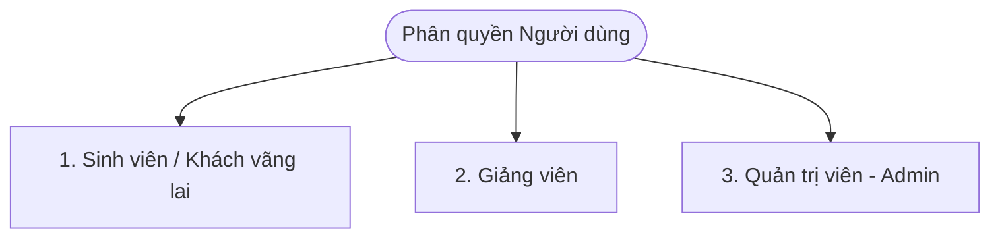

# 🎓 GIỚI THIỆU TOÀN DIỆN HỆ THỐNG NTUKNOWLEGDE
## Hướng Dẫn Trình Bày & Phản Biện Đồ Án (Cơ Sở Dữ Liệu & Phân Quyền Chức Năng)

Tài liệu này được biên soạn ngắn gọn, súc tích để bạn có thể nắm bắt nhanh toàn bộ cấu trúc cơ sở dữ liệu đồ thị và chức năng của từng nhóm người dùng phục vụ cho việc giới thiệu và phản biện trước Hội đồng.

---

## PHẦN I: TỔNG QUAN HỆ THỐNG & CƠ SỞ DỮ LIỆU ĐỒ THỊ (NEO4J)

### 1. Tại sao lựa chọn CSDL Đồ thị Neo4j thay vì SQL truyền thống?
* **Index-free Adjacency (Kề cận không dùng chỉ mục):** Trong SQL, việc truy vấn quan hệ nhiều-nhiều sâu nhiều cấp (ví dụ: tìm cộng sự viết bài chung của giảng viên A qua nhiều bài viết) đòi hỏi các phép toán `JOIN` bảng phức tạp, làm giảm hiệu năng hệ thống khi dữ liệu lớn. Đối với Neo4j, các mối quan hệ được lưu trữ vật lý như một con trỏ trực tiếp nối giữa các Node. Truy vấn đồ thị chỉ là việc lần theo con trỏ với thời gian phản hồi ở mức mili-giây.
* **Ngôn ngữ Cypher trực quan:** Dễ dàng viết các truy vấn đệ quy hoặc tìm đường đi ngắn nhất giữa các thực thể chỉ bằng vài dòng so khớp mẫu (Pattern Matching).

### 2. Mô hình Đồ thị Tri thức (Schema)
Cơ sở dữ liệu được tổ chức thành các **Nút (Nodes - Thực thể)** và các **Cạnh (Relationships - Mối quan hệ)**:

#### Danh sách các Nút chính (Nodes) và Thuộc tính:
* **GiangVien (Giảng viên):** `id` (Mã GV duy nhất), `ho_va_ten`, `email`, `hoc_vi`, `chuc_danh`, `anh_dai_dien`, `is_deleted` (xóa mềm), các thuộc tính đệm `pending_...` (phục vụ kiểm duyệt).
* **CongTrinhNghienCuu (Bài báo/Ấn phẩm):** `id`, `ten_cong_trinh` (tiếng Anh), `ten_cong_trinh_vi` (tiếng Việt), `nam_xuat_ban`, `noi_xuat_ban`, `lien_ket`, `tom_tat`, `trang_thai` (Nháp/Chờ duyệt/Đã duyệt), `is_deleted`.
* **DeTaiNghienCuu (Đề tài):** `id`, `ten_de_tai`, `cap_de_tai` (Nhà nước/Bộ/Tỉnh/Trường), `nam`, `kinh_phi`, `trang_thai`, `is_deleted`.
* **TacGiaNgoai (Tác giả ngoài khoa/trường):** `id`, `ho_va_ten`, `don_vi_cong_tac`.
* **BoMon (Bộ môn), LinhVucNghienCuu (Lĩnh vực), Khoa, TruongCon, DaiHoc:** Lưu danh mục quản lý hành chính và học thuật.

#### Các Mối Quan Hệ (Relationships/Edges):
* `(GiangVien) -[:THUOC_BO_MON]-> (BoMon) -[:THUOC_KHOA]-> (Khoa)`: Quản lý cơ cấu tổ chức.
* `(GiangVien) -[:NGHIEN_CUU]-> (LinhVucNghienCuu)`: Thể hiện hướng nghiên cứu chuyên sâu.
* `(GiangVien) -[:TAC_GIA_CHINH | CONG_SU | LA_TAC_GIA_CUA]-> (CongTrinhNghienCuu)`: Vai trò trong bài báo.
* `(GiangVien) -[:CHU_NHIEM | THAM_GIA]-> (DeTaiNghienCuu)`: Vai trò trong đề tài khoa học.
* `(TacGiaNgoai) -[:DONG_TAC_GIA]-> (CongTrinhNghienCuu / DeTaiNghienCuu)`: Sự hợp tác ngoài trường.

---

## PHẦN II: CHI TIẾT CHỨC NĂNG THEO NHÓM NGƯỜI DÙNG

Hệ thống phân quyền rõ ràng thành **3 tầng vai trò**:

### 1. Khách Vãng Lai / Sinh Viên (Quyền Đọc - Read-only)
Phục vụ mục đích tra cứu học thuật, tìm giảng viên hướng dẫn hoặc tìm chuyên gia nghiên cứu.
* **Trực quan hóa Bản đồ Tri thức (Vis.js):**
  * Hiển thị toàn cảnh mạng lưới liên kết học thuật của khoa CNTT.
  * Hỗ trợ bộ lọc động theo bộ môn, năm công bố, hoặc hướng nghiên cứu.
  * Tối ưu hóa hiệu năng render bằng cách tắt tính toán lực vật lý (`physics: false`) sau khi đồ thị đã dàn đều cấu trúc (`stabilization`).
* **Chatbot hỏi đáp thông minh (Graph-RAG):**
  * Cho phép đặt câu hỏi bằng tiếng Việt tự nhiên (VD: *"Thầy Nguyễn Thanh Tú nghiên cứu về mảng nào?"*).
  * Backend Flask sử dụng **Gemini AI** dịch câu hỏi thành câu lệnh **Cypher** để truy vấn chính xác dữ liệu từ Neo4j, tránh hiện tượng "ảo tưởng" (hallucination) của AI thông thường.
  * **Cơ chế Fallback (Dự phòng):** Nếu API Gemini bị lỗi hoặc hết hạn định ngạch, hệ thống tự động chuyển sang phân tích Regex nội bộ kết hợp so khớp mờ (`rapidfuzz`) để trả về bảng kết quả tĩnh.
  * **Vẽ đồ thị ngữ cảnh:** Hiển thị câu trả lời dạng văn bản kèm theo đồ thị con 1-hop vẽ trực tiếp trong khung chat bằng Vis.js để tương tác trực quan.
* **Thống kê sản lượng NCKH (Chart.js):**
  * Thống kê cơ cấu học vị giảng viên (cột/tròn).
  * Biểu đồ đường phân tích xu hướng số lượng công bố bài báo khoa học qua các năm.
* **Tìm kiếm toàn cục (Global Search):**
  * Tìm kiếm không dấu/có dấu trên giảng viên, đề tài, bài báo với tốc độ dưới 200ms.

---

### 2. Giảng Viên (Quyền Quản Lý Cá Nhân - Personal Portal)
Cung cấp cổng thông tin cá nhân để tự quản lý lý lịch khoa học và đồng bộ quốc tế.
* **Đăng nhập & Khôi phục mật khẩu bảo mật:**
  * Xác thực dựa trên Token.
  * Khôi phục mật khẩu thông qua mã OTP 6 số gửi tới Email cá nhân với thời gian sống ngắn (15 phút), chống lạm dụng mã OTP cũ.
* **Cập nhật hồ sơ cá nhân (Maker-Checker):**
  * Giảng viên cập nhật học vị, chức vụ nhưng không ghi đè trực tiếp. Dữ liệu mới lưu tạm vào trường `pending_...` và chờ Admin phê duyệt. Trong thời gian này, trang công khai vẫn hiển thị thông tin cũ.
* **Đề xuất công trình & Đề tài mới:**
  * Khai báo bài báo hoặc đề tài do mình thực hiện dưới dạng "Nháp" hoặc gửi "Chờ duyệt" lên Admin.
* **Quản lý Thùng rác cá nhân (Soft Delete):**
  * Cho phép xóa mềm (`is_deleted = true`) các đề tài/công trình của riêng mình và tự khôi phục từ thùng rác cá nhân mà không cần quyền Admin đối với các mục chưa được duyệt chính thức.
* **Đồng bộ học thuật quốc tế thời gian thực:**
  * Kết nối trực tiếp đến **OpenAlex API** và cào **Google Scholar** để lấy số trích dẫn (Citations), chỉ số H-Index, i10-Index tự động hiển thị trên profile.

---

### 3. Quản Trị Viên / Admin (Quyền Quản Trị Toàn Cục - Full Control)
Đảm bảo vận hành hệ thống, kiểm duyệt chất lượng dữ liệu và import hàng loạt.
* **Hàng đợi kiểm duyệt Maker-Checker:**
  * So sánh trực quan dữ liệu cũ và dữ liệu mới do giảng viên đề xuất.
  * Bấm "Duyệt" để ghi đè trường `pending_...` vào trường chính, hoặc "Từ chối" để hủy bỏ các trường đệm này.
* **Nhập liệu Excel hàng loạt (ETL):**
  * Upload file Excel giảng viên/bài báo, backend sử dụng **Pandas** để đọc dữ liệu.
  * Thực thi lệnh Cypher `MERGE` để kiểm tra trùng lặp dựa trên mã định danh, tránh tình trạng tạo trùng nút trong đồ thị.
* **Tự động chuyển nhãn nhân sự khi chuyển công tác:**
  * Khi giảng viên chuyển công tác, hệ thống xóa quan hệ `:THUOC_BO_MON`, đổi nhãn Node từ `:GiangVien` sang `:TacGiaNgoai` nhưng **giữ nguyên** các cạnh `:LA_TAC_GIA_CUA` liên kết với bài báo cũ. Điều này giúp bảo toàn lịch sử nghiên cứu khoa học của Khoa mà không hiển thị giảng viên đó trong danh sách bộ môn hiện tại.
* **Quản lý Thùng rác hệ thống & Dọn dẹp tác giả ngoài mồ côi:**
  * Admin phê duyệt các yêu cầu xóa từ giảng viên hoặc xóa vĩnh viễn thực thể.
  * Sử dụng lệnh `DETACH DELETE` trong Cypher để cắt sạch các liên kết vật lý trước khi xóa nút khỏi Neo4j.
  * **Orphan Cleanup:** Tự động quét và xóa sạch các nút `:TacGiaNgoai` mồ côi (không còn liên kết với bất kỳ bài báo hay đề tài nào) để tránh phình to và làm rác cơ sở dữ liệu đồ thị.
