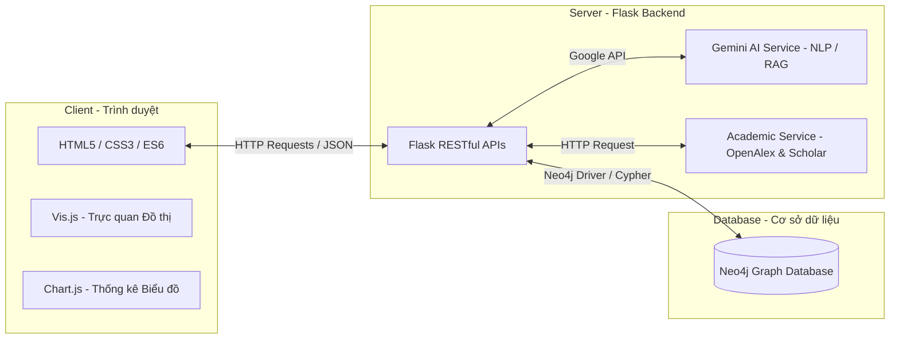
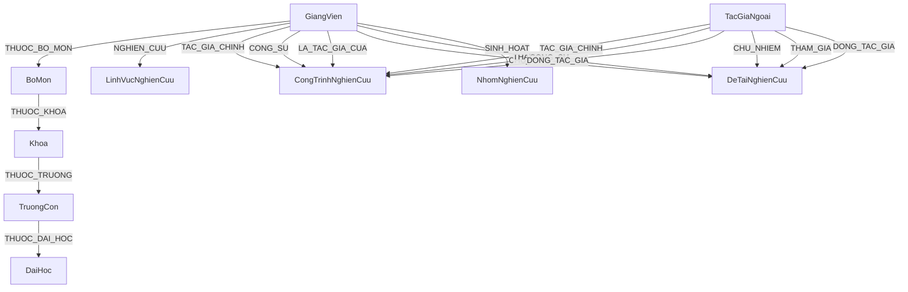
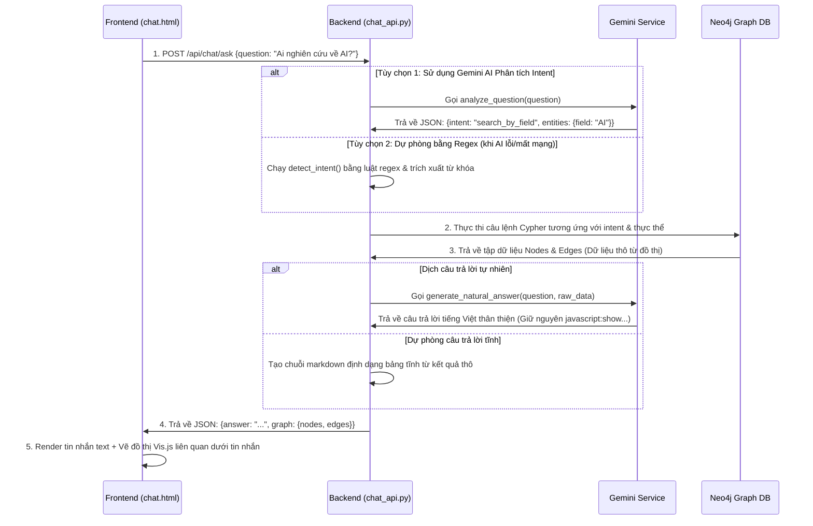

# BẢN ĐỒ TRI THỨC NGHIÊN CỨU KHOA HỌC (NTUKnowledge)
## TÀI LIỆU KIẾN TRÚC HỆ THỐNG & LUỒNG HOẠT ĐỘNG CỐT LÕI phục vụ bảo vệ đồ án tốt nghiệp

Tài liệu này tổng hợp toàn bộ cấu trúc công nghệ, mô hình dữ liệu, sơ đồ hoạt động, danh sách API và các cơ chế kỹ thuật đặc biệt của hệ thống **NTUKnowledge (Bản đồ Tri thức NCKH - Khoa CNTT, Trường Đại học Nha Trang)**. Hãy đọc kỹ tài liệu này để tự tin trả lời mọi câu hỏi từ Hội đồng Bảo vệ Đồ án.

---

## PHẦN I: KIẾN TRÚC TỔNG THỂ HỆ THỐNG (SYSTEM ARCHITECTURE)

Hệ thống được thiết kế theo kiến trúc **Client-Server** chuẩn kết hợp cơ chế **RESTful API** để trao đổi dữ liệu:



### 1. Frontend (Giao diện người dùng)
* **Công nghệ cốt lõi:** HTML5, CSS3 (Vanilla) và Javascript ES6 thuần.
  > **Lý do lựa chọn (Đặc biệt để trả lời Hội đồng):** Việc sử dụng Vanilla JS giúp ứng dụng cực kỳ nhẹ, thời gian tải trang nhanh, không cần cấu hình các bước build/compile phức tạp (như Webpack, Vite, Babel). Đồng thời, giúp lập trình viên dễ dàng can thiệp sâu vào DOM để vẽ và tùy biến các thư viện đồ thị trực quan.
* **Thư viện trực quan hóa:**
  * **Vis.js (vis-network):** Thư viện chuyên dụng mạnh mẽ nhất để dựng và vẽ đồ thị mạng lưới liên kết (nodes & edges) tương tác trong thời gian thực, hỗ trợ kéo thả, zoom, lọc cụm.
  * **Chart.js:** Dùng để render các biểu đồ thống kê dạng cột (bar), tròn (pie), đường (line) trực quan tại trang Thống kê Xu hướng.

### 2. Backend (Logic nghiệp vụ)
* **Framework:** **Flask (Python)**.
  > **Lý do lựa chọn:** Flask là một micro-framework viết bằng Python rất nhẹ nhàng, linh hoạt, dễ dàng mở rộng. Việc sử dụng Python ở backend mở ra khả năng tích hợp nhanh chóng và hiệu quả với các thư viện phân tích dữ liệu, xử lý file (Pandas, Openpyxl), cào dữ liệu (Scholarly) và đặc biệt là bộ SDK Trí tuệ nhân tạo của Google (`google-generativeai` cho Gemini).
* **Kết nối Database:** Sử dụng `neo4j-python-driver` chính thức từ Neo4j để duy trì kết nối hiệu năng cao, thực thi các câu lệnh truy vấn đồ thị Cypher thông qua transaction an toàn.

### 3. Database (Cơ sở dữ liệu Đồ thị)
* **Hệ quản trị CSDL:** **Neo4j** (Graph Database).
  > **Lý do lựa chọn (Câu hỏi kinh điển của Hội đồng):** *"Tại sao không dùng SQL (MySQL, PostgreSQL) hay NoSQL (MongoDB) mà lại dùng Graph DB?"*
  > * **Trả lời:** Dữ liệu nghiên cứu khoa học mang tính chất kết nối mạng lưới rất cao (Giảng viên làm chung Đề tài, Giảng viên viết chung Bài báo, Giảng viên thuộc Bộ môn, Bộ môn thuộc Khoa, bài viết thuộc Lĩnh vực...). Nếu dùng SQL truyền thống, để tìm "các giảng viên có mối quan hệ hợp tác gián tiếp với giảng viên A qua 2 thế hệ đề tài", ta phải thực hiện chuỗi lệnh `JOIN` qua 4-5 bảng trung gian, cực kỳ chậm và phức tạp. Đối với Neo4j, các mối quan hệ được lưu trữ vật lý như một con trỏ (pointer) trực tiếp giữa các Node. Truy vấn đồ thị chỉ cần "duyệt" (traverse) qua các cạnh này với độ phức tạp thời gian gần như bằng hằng số, giúp hệ thống truy vấn và hiển thị mạng lưới cực kỳ nhanh.

---

## PHẦN II: MÔ HÌNH DỮ LIỆU ĐỒ THỊ (NEO4J SCHEMA)

CSDL Neo4j lưu trữ dữ liệu dưới dạng các **Nút (Nodes - Thực thể)** và các **Cạnh (Relationships/Edges - Mối quan hệ)**:

### 1. Sơ đồ thực thể quan hệ đồ thị (Schema Diagram)



### 2. Chi tiết thuộc tính của các Nút chính (Node Properties)
* **GiangVien:** `id` (Mã GV duy nhất), `username`, `password`, `ho_va_ten`, `email`, `dien_thoai`, `hoc_vi`, `chuc_danh`, `chuc_vu`, `chuyen_nganh`, `anh_dai_dien`, `is_deleted` (xóa mềm), `trang_thai_duyet` (Chờ duyệt/Đã duyệt), cùng các trường tạm bắt đầu bằng `pending_...` phục vụ cơ chế kiểm duyệt.
* **CongTrinhNghienCuu (Bài báo/Ấn phẩm khoa học):** `id`, `ten_cong_trinh` (Tiêu đề tiếng Anh/chính), `ten_cong_trinh_vi` (Tiêu đề dịch tiếng Việt), `nam_xuat_ban`, `noi_xuat_ban` (Tên tạp chí/Hội thảo), `loai_cong_trinh`, `lien_ket` (URL bài báo), `tom_tat`, `tom_tat_vi`, `trang_thai` (Nháp/Chờ duyệt/Đã duyệt/Yêu cầu xóa/Yêu cầu đổi trạng thái), `is_deleted`.
* **DeTaiNghienCuu:** `id`, `ten_de_tai`, `cap_de_tai` (Nhà nước/Bộ/Tỉnh/Trường/Cơ sở), `nam` (Năm bắt đầu/Năm thực hiện), `kinh_phi`, `trang_thai` (Đang thực hiện/Đã nghiệm thu/Chờ duyệt/Yêu cầu xóa/Yêu cầu đổi trạng thái), `is_deleted`.
* **TacGiaNgoai (Tác giả ngoài khoa/trường):** `id`, `ho_va_ten`, `don_vi_cong_tac`, `trang_thai` (Đang hoạt động/Đã duyệt).

---

## PHẦN III: HỆ THỐNG RESTful APIs CHI TIẾT

Hệ thống chia các Endpoint API thành các module rõ ràng đặt trong thư mục `backend/routes`:

| Phân hệ (Module) | API Endpoint | Method | File Route xử lý | Chức năng chi tiết |
| :--- | :--- | :---: | :--- | :--- |
| **Công khai (Public)** | `/api/giang-vien` | `GET` | `api.py` | Lấy toàn bộ danh sách giảng viên đang hoạt động (chưa bị xóa mềm). |
| | `/api/giang-vien/<id>` | `GET` | `api.py` | Lấy chi tiết một giảng viên kèm danh sách công trình, đề tài, bộ môn liên quan. |
| | `/api/cong-trinh` | `GET` | `api.py` | Lấy tất cả công trình nghiên cứu đã được duyệt. |
| | `/api/cong-trinh/<id>` | `GET` | `api.py` | Lấy chi tiết công trình và thông tin các đồng tác giả (trong & ngoài). |
| | `/api/de-tai` | `GET` | `api.py` | Lấy toàn bộ danh sách đề tài nghiên cứu đã được duyệt. |
| | `/api/de-tai/<id>` | `GET` | `api.py` | Lấy chi tiết đề tài khoa học và danh sách thành viên thực hiện. |
| | `/api/linh-vuc` | `GET` | `api.py` | Lấy danh sách lĩnh vực kèm thống kê số GV, số bài viết, số đề tài thuộc lĩnh vực đó. |
| | `/api/search` | `GET` | `api.py` | Tìm kiếm tổng hợp theo từ khóa nhập vào (hỗ trợ không dấu/có dấu, lọc phân loại). |
| | `/api/graph/all` | `GET` | `api.py` | Lấy toàn bộ các Node và Edge trong hệ thống để Vis.js dựng bản đồ tri thức tổng quan. |
| | `/api/graph/node/<node_id>` | `GET` | `api.py` | Lấy đồ thị con xung quanh một nút cụ thể (bán kính liên kết depth = 1). |
| | `/api/stats/overview` | `GET` | `api.py` | Thống kê số lượng thực thể, top giảng viên nổi bật, biểu đồ xu hướng theo năm. |
| | `/api/stats/trends` | `GET` | `api.py` | Phân tích xu hướng nghiên cứu mới nổi bằng cách tính tần suất từ khóa khoa học. |
| | `/api/translate` | `POST` | `api.py` | Sử dụng thư viện dịch thuật để chuyển đổi song ngữ Anh - Việt cho tiêu đề/tóm tắt bài viết. |
| **Hỏi đáp AI** | `/api/chat/ask` | `POST` | `chat_api.py` | Tiếp nhận câu hỏi ngôn ngữ tự nhiên, phân tích intent và trả về câu trả lời Graph-RAG. |
| **Tích hợp Học thuật**| `/api/academic/<name>`| `GET` | `academic_api.py` | Truy xuất chỉ số Citation, H-Index thời gian thực từ API OpenAlex và Google Scholar. |
| **Đăng nhập & OTP** | `/api/auth/login` | `POST` | `auth.py` | Đăng nhập tài khoản, xác thực quyền Admin hoặc Giảng viên. |
| | `/api/auth/forgot-password`| `POST`| `auth.py` | Nhận email, tạo mã OTP 6 số ngẫu nhiên, lưu hạn dùng và gửi email khôi phục mật khẩu. |
| | `/api/auth/verify-otp` | `POST` | `auth.py` | Xác thực mã OTP người dùng nhập vào trình duyệt xem có khớp và chưa hết hạn. |
| | `/api/auth/reset-password` | `POST` | `auth.py` | Xác thực lại token + OTP, thực hiện cập nhật mật khẩu mới và xóa mã OTP đã dùng. |
| **Giảng viên cá nhân**| `/api/lecturer/profile`| `GET/PUT`| `lecturer_api.py` | Xem thông tin hồ sơ hoặc gửi yêu cầu cập nhật hồ sơ chờ Admin duyệt. |
| | `/api/lecturer/publications`| `POST/PUT`| `lecturer_api.py` | Thêm mới công trình nháp hoặc sửa đổi thông tin công trình cá nhân. |
| | `/api/lecturer/trash` | `GET` | `lecturer_api.py` | Xem danh sách các đề tài/công trình cá nhân bị xóa mềm của riêng giảng viên này. |
| **Quản trị (Admin)** | `/api/admin/lecturers`| `POST/PUT`| `admin_lecturers.py`| Quản lý giảng viên, CRUD thông tin, phê duyệt các yêu cầu sửa hồ sơ. |
| | `/api/admin/publications`| `GET/PUT`| `admin_publications.py`| Phê duyệt các bài báo mới thêm, yêu cầu sửa, yêu cầu xóa bài báo từ giảng viên. |
| | `/api/admin/import` | `POST` | `admin_import.py` | Tiếp nhận file Excel tải lên, gọi Pandas phân tích và import hàng loạt vào CSDL Neo4j. |
| | `/api/admin/trash` | `GET/DELETE`| `admin_trash.py` | Quản lý thùng rác hệ thống, xóa vĩnh viễn thực thể và dọn dẹp các node mồ côi. |

---

## PHẦN IV: CÁC LUỒNG HOẠT ĐỘNG & KỸ THUẬT ĐẶC BIỆT (CORE WORKFLOWS)

### 1. Luồng Hỏi đáp thông minh tích hợp AI (Graph-RAG Chatbot Flow)
Đây là chức năng đột phá nhất của đồ án, kết hợp sức mạnh của **Cơ sở dữ liệu Đồ thị** (chứa thông tin chính xác, tin cậy) và **Mô hình Ngôn ngữ lớn LLM - Gemini** (khả năng hiểu và diễn đạt tự nhiên).

#### Sơ đồ hoạt động chi tiết (Sequence Diagram)


* **Cơ chế Fallback (Bảo vệ đồ án cực tốt):** Nếu API Gemini bị lỗi hoặc hết hạn định ngạch (Rate Limit), hệ thống sẽ sử dụng thuật toán nội bộ trong `chat_api.py` dựa trên thư viện phân tích từ ngữ tiếng Việt `pyvi` và so khớp mờ `rapidfuzz` để tìm kiếm dữ liệu thô, sau đó trả về cấu trúc bảng Markdown tĩnh. Chatbot không bao giờ bị đứng hay báo lỗi đỏ.

---

### 2. Luồng kiểm duyệt 2 bước Cập nhật hồ sơ (Maker-Checker Workflow)
Để tránh việc Giảng viên tự ý sửa đổi thông tin không kiểm soát ảnh hưởng đến uy tín khoa học chung, hệ thống áp dụng quy trình kiểm duyệt dữ liệu nghiêm ngặt:

```mermaid
stateDiagram-v2
    [*] --> ActiveState : Dữ liệu gốc đang hiển thị công khai (hoc_vi: "Thạc sĩ")
    ActiveState --> EditPending : Giảng viên gửi yêu cầu cập nhật lên "Tiến sĩ"
    note on EditPending
        - hoc_vi vẫn giữ nguyên là "Thạc sĩ"
        - Lưu giá trị mới vào pending_hoc_vi = "Tiến sĩ"
        - Set profile_edit_status = "Chờ duyệt"
    end note
    
    EditPending --> AdminDecision : Admin kiểm tra danh sách duyệt
    
    AdminDecision --> Approved : Admin Bấm Duyệt
    note on Approved
        - Copy pending_hoc_vi sang hoc_vi
        - Xóa sạch pending_hoc_vi = null
        - Set profile_edit_status = "Đã duyệt"
    end note
    
    AdminDecision --> Rejected : Admin Bấm Từ chối
    note on Rejected
        - Xóa sạch pending_hoc_vi = null
        - Set profile_edit_status = "Từ chối"
    end note
    
    Approved --> ActiveState : Cập nhật thành công (Dữ liệu mới hiển thị)
    Rejected --> ActiveState : Trở về trạng thái ban đầu (Giữ nguyên dữ liệu cũ)
```

---

### 3. Luồng Nhập Excel hàng loạt & Tự động đổi trạng thái nhân sự
Khi import danh sách giảng viên từ Excel, hệ thống có hai cơ chế xử lý logic cực kỳ thông minh:

1. **Chống trùng lặp bằng Cypher `MERGE`:**
   Thay vì dùng lệnh `CREATE` (tạo mới mù quáng dễ gây trùng lặp nút), hệ thống sử dụng:
   ```cypher
   MERGE (gv:GiangVien {id: $ma_gv})
   ON CREATE SET gv.ho_va_ten = $ten, gv.email = $email, gv.is_deleted = false
   ON MATCH SET gv.ho_va_ten = $ten, gv.email = $email
   ```
   Nếu Mã giảng viên đã có sẵn, hệ thống chỉ cập nhật thông tin mới nhất.

2. **Tự động chuyển đổi Nhãn (Label) khi Chuyển công tác:**
   Khi giảng viên chuyển công tác khỏi khoa, để lưu trữ lịch sử nghiên cứu khoa học của khoa nhưng không hiển thị họ trong danh sách nhân sự của bộ môn hiện tại:
   * Backend phát hiện cột trạng thái trong Excel là "Chuyển công tác".
   * Backend gửi câu lệnh Cypher thực hiện:
     * Đổi nhãn (Label) của Node từ `GiangVien` sang `TacGiaNgoai`.
     * Xóa bỏ cạnh liên kết `THUOC_BO_MON` đến Bộ môn cũ.
     * Bảo lưu các quan hệ `LA_TAC_GIA_CUA` nối với các công trình nghiên cứu cũ để các biểu đồ thống kê sản lượng khoa học lịch sử của khoa không bị mất mát hay sai lệch số liệu.

---

### 4. Luồng Đồng bộ chỉ số trích dẫn quốc tế (Academic Citations Sync)
* **API Endpoint:** `/api/academic/<name>`
* **Cơ chế hoạt động:** 
  1. Khi người dùng click xem chi tiết giảng viên, Frontend gọi API này lên Backend.
  2. Backend thực hiện gọi API tới **OpenAlex API** (hệ thống mục lục học thuật mở toàn cầu).
  3. Để tránh trùng tên tác giả trên thế giới, hệ thống cài đặt thuật toán đối sánh: Lấy kết quả từ OpenAlex, so sánh nếu tên trường công tác của tác giả đó có chứa `"Nha Trang University"` hoặc `"NTU"`, hệ thống mới xác định đó là giảng viên của trường.
  4. Nếu OpenAlex không phản hồi, backend chuyển sang cào Google Scholar thông qua thư viện `scholarly` bằng cách ghép từ khóa tìm kiếm `"Tên giảng viên Nha Trang University"`.
  5. Trích xuất các chỉ số: **Citations (Số trích dẫn)**, **H-Index**, **i10-Index** hiển thị trực tiếp lên giao diện dưới dạng các Badge huy hiệu uy tín.

---

### 5. Luồng Quản lý thùng rác & Dọn dẹp Node mồ côi (Trash & Orphan Nodes Cleanup)
* **Xóa mềm (Soft Delete):** Khi người dùng bấm xóa đề tài hoặc bài báo, backend chỉ gán thuộc tính `is_deleted = true`. Mối quan hệ trong Neo4j vẫn tồn tại để giảng viên có thể khôi phục lại khi cần.
* **Xóa vĩnh viễn (Hard Delete):** Khi Admin bấm xóa vĩnh viễn trong Thùng rác hệ thống:
  * Backend chạy câu lệnh Cypher sử dụng từ khóa `DETACH DELETE` để Neo4j tự động tìm và xóa sạch các cạnh (Relationships) liên quan hướng vào/hướng ra của Node đó trước khi xóa Node, tránh lỗi vi phạm ràng buộc đồ thị.
  * **Dọn dẹp tác giả ngoài mồ côi (Orphan Cleanup):** Khi một bài báo bị xóa vĩnh viễn, các tác giả ngoài (`TacGiaNgoai`) liên quan đến bài viết đó có khả năng bị mồ côi (không còn liên kết với bất kỳ bài báo hay đề tài nào khác trong hệ thống). Backend sẽ tự động quét và xóa sạch những node tác giả ngoài mồ côi này để tránh làm rác và phình to bộ nhớ CSDL đồ thị.

---

## PHẦN V: BÍ QUYẾT BẢO VỆ ĐỒ ÁN (TIPS & Q&A THƯỜNG GẶP)

Dưới đây là các câu hỏi mà các thầy cô trong Hội đồng thường xuyên đặt ra cho các đồ án xây dựng hệ thống thông tin và cách trả lời thông minh, chuyên nghiệp nhất:

#### Q1: *"Tại sao hệ thống Chatbot của em lại cần chuyển câu hỏi thành câu lệnh Cypher mà không quét trực tiếp?"*
* **Trả lời:** *"Dạ thưa thầy/cô, vì CSDL của chúng em là CSDL đồ thị Neo4j. Khác với SQL sử dụng bảng, Neo4j sử dụng cấu trúc mạng lưới Nodes và Edges và ngôn ngữ truy vấn chính thống của nó là Cypher. Mô hình LLM (như Gemini) không thể trả lời chính xác số lượng công trình hay đề tài thời gian thực nếu chỉ dựa vào dữ liệu huấn luyện cũ của nó. Vì vậy, hệ thống sử dụng phương pháp **Graph-RAG**: Dịch câu hỏi thành lệnh Cypher để truy vấn dữ liệu chính xác nhất từ Neo4j, sau đó mới dùng AI biên soạn lại câu trả lời thành ngôn ngữ tự nhiên. Điều này đảm bảo câu trả lời của Chatbot luôn chính xác 100% theo dữ liệu thực tế và không bị hiện tượng 'ảo tưởng' (hallucination) của AI."*

#### Q2: *"Nếu hệ thống đang hoạt động mà API Gemini bị mất kết nối hoặc hết hạn key, Chatbot có bị hỏng hoàn toàn không?"*
* **Trả lời:** *"Dạ không ạ. Hệ thống đã được em thiết kế cơ chế **Fallback (Dự phòng)** cực kỳ an toàn. Khi API Gemini gặp sự cố, Backend sẽ tự động bắt ngoại lệ (Exception) và chuyển hướng luồng xử lý sang bộ phân tích intent bằng luật Regex nội bộ. Hệ thống vẫn tìm kiếm được dữ liệu từ Neo4j và hiển thị kết quả dưới dạng danh sách, bảng biểu tĩnh cho người dùng, đảm bảo tính liên tục của dịch vụ."*

#### Q3: *"Làm thế nào em phòng chống tấn công Cypher Injection vào cơ sở dữ liệu đồ thị thông qua các ô tìm kiếm?"*
* **Trả lời:** *"Dạ, tương tự như SQL Injection trong CSDL quan hệ, Cypher Injection xảy ra khi ta cộng chuỗi trực tiếp từ ô nhập liệu vào câu lệnh Cypher. Để phòng chống triệt để việc này, ở phía Backend Flask, em luôn sử dụng **Parameterized Queries (Truy vấn tham số hóa)** của driver Neo4j. Các chuỗi người dùng nhập được truyền dưới dạng biến tham số (ví dụ `$q` hoặc `$name`), Neo4j sẽ xử lý chúng đơn thuần là các tham số dữ liệu đầu vào chứ không bao giờ thực thi chúng như một đoạn mã lệnh Cypher, đảm bảo an toàn tuyệt đối."*

#### Q4: *"Tại sao em không lưu trực tiếp chỉ số Citation và H-Index của giảng viên vào CSDL Neo4j cho dễ hiển thị?"*
* **Trả lời:** *"Dạ thưa thầy/cô, các chỉ số học thuật quốc tế như số trích dẫn (Citations) hay chỉ số H-Index thay đổi liên tục hàng ngày trên các thư viện học thuật toàn cầu (Google Scholar, OpenAlex). Nếu ta lưu tĩnh trong DB, dữ liệu sẽ nhanh chóng bị lỗi thời và tốn rất nhiều công sức để Admin cập nhật thủ công. Bằng cách gọi API trực tiếp thời gian thực khi xem hồ sơ, hệ thống luôn đảm bảo số liệu hiển thị là mới nhất và chính xác nhất theo chuẩn quốc tế mà không tốn chi phí lưu trữ."*

---
> [!IMPORTANT]
> **Chúc bạn chuẩn bị thật tốt và bảo vệ đồ án thành công rực rỡ!** Hãy nhớ nắm chắc sơ đồ luồng dữ liệu (Sequence/Activity Diagrams) để giải thích mạch lạc khi được hỏi về cách các thành phần tương tác với nhau.
