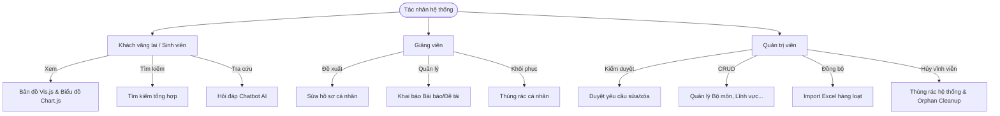
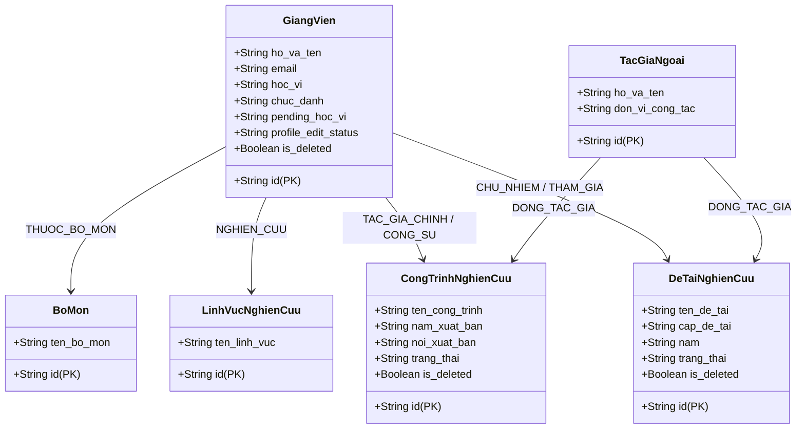
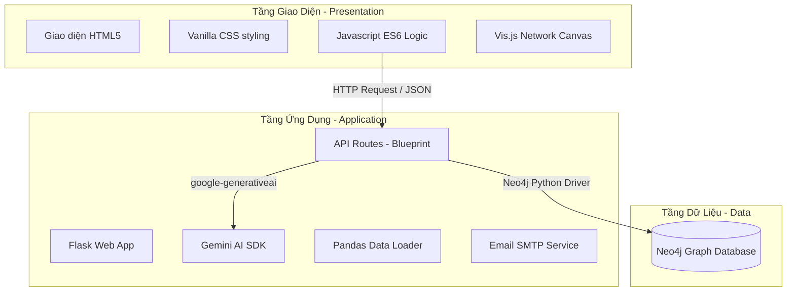
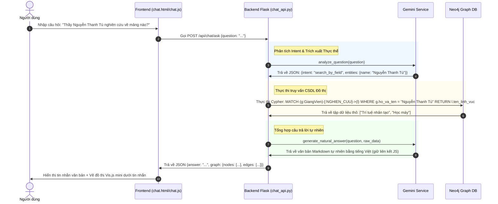

# TÀI LIỆU ÔN TẬP & BẢO VỆ ĐỒ ÁN TỐT NGHIỆP
## HỆ THỐNG BẢN ĐỒ TRI THỨC NGHIÊN CỨU KHOA HỌC (NTUKnowledge)

Tài liệu này gộp toàn bộ kiến thức, cấu trúc công nghệ, các câu lệnh truy vấn Cypher thực tế, kịch bản kiểm thử (Test Cases) và các luồng hoạt động cốt lõi của dự án **NTUKnowledge (Khoa CNTT - Đại học Nha Trang)**. Nội dung được cấu trúc theo đúng 10 chuyên đề chuẩn để phục vụ việc ôn tập lý thuyết hệ thống, thiết kế CSDL đồ thị và trả lời phản biện trước Hội đồng Bảo vệ.

---

## 1. BÀI TOÁN VÀ MỤC TIÊU CỦA ĐỀ TÀI

### Đề tài giải quyết vấn đề gì?
Trong các đơn vị giáo dục đại học, dữ liệu về nghiên cứu khoa học (NCKH) bao gồm thông tin giảng viên, các công trình công bố (bài báo khoa học), đề tài nghiên cứu các cấp và các lĩnh vực chuyên sâu thường bị **phân mảnh** ở nhiều phòng ban, tệp Excel hoặc các trang web tĩnh. Điều này dẫn đến:
* Ban lãnh đạo Khoa gặp khó khăn trong việc theo dõi, thống kê sản lượng và đánh giá hướng nghiên cứu chính qua các năm.
* Sinh viên, doanh nghiệp khó tiếp cận để tìm kiếm chuyên gia hoặc cộng sự phù hợp cho các dự án công nghệ.
* Không trực quan hóa được mạng lưới hợp tác khoa học (ai đã làm việc chung với ai, lĩnh vực nào đang là xu hướng).

**Hệ thống NTUKnowledge giải quyết vấn đề này** bằng cách tập hợp dữ liệu NCKH vào cơ sở dữ liệu đồ thị, cung cấp bản đồ tri thức trực quan tương tác và trợ lý ảo thông minh hỗ trợ tra cứu thông tin nghiên cứu khoa học.

### Người dùng của hệ thống là ai?
1. **Khách vãng lai / Sinh viên:** Tra cứu giảng viên, công trình, đề tài, xem xu hướng khoa học, xem bản đồ mạng lưới hợp tác và hỏi đáp thông tin qua Chatbot AI.
2. **Giảng viên:** Quản lý hồ sơ học thuật cá nhân, đề xuất chỉnh sửa thông tin cá nhân, khai báo công trình (bài báo) và đề tài nghiên cứu mới, quản lý thùng rác cá nhân để khôi phục hoặc xóa nháp.
3. **Quản trị viên (Admin) / Ban chủ nhiệm Khoa:** CRUD danh mục hệ thống (Giảng viên, Bộ môn, Lĩnh vực...), duyệt các yêu cầu thay đổi hồ sơ, duyệt ấn phẩm mới của giảng viên, import hàng loạt dữ liệu từ Excel, quản lý thùng rác toàn cục và dọn dẹp hệ thống.

### Hệ thống mang lại lợi ích gì?
* **Đối với Khoa:** Cung cấp cái nhìn toàn cảnh về hoạt động NCKH, nhận diện các nhân tố cốt lõi thúc đẩy nghiên cứu liên ngành, hỗ trợ ra quyết định thành lập các nhóm nghiên cứu mạnh.
* **Đối với Giảng viên:** Quảng bá năng lực học thuật công khai (kèm chỉ số trích dẫn quốc tế H-Index, Citations cập nhật tự động), dễ dàng quản lý lịch sử nghiên cứu cá nhân.
* **Đối với Sinh viên / Doanh nghiệp:** Dễ dàng tìm kiếm giảng viên hướng dẫn khóa luận hoặc đối tác chuyển giao công nghệ dựa trên bản đồ lĩnh vực nghiên cứu.

### Điểm khác biệt so với các hệ thống hiện có?

#### Tại sao cần bản đồ tri thức?
Các hệ thống quản lý truyền thống thường lưu dữ liệu dưới dạng bảng biểu 2 chiều (Grid/Table). Cách lưu trữ này che giấu đi sự kết nối phi tuyến tính của tri thức. Bản đồ tri thức (sử dụng đồ thị) giúp trực quan hóa sinh động các mối quan hệ đa chiều: Một giảng viên thuộc bộ môn A nhưng lại đang hợp tác nghiên cứu một đề tài về AI với một giảng viên thuộc bộ môn B và đăng bài báo khoa học thuộc một lĩnh vực liên ngành. Sự liên kết này hiển thị rõ ràng thông qua các nút (nodes) và đường nối (edges) trên bản đồ tương tác Vis.js.

#### Tại sao không dùng chatbot RAG thông thường?
Mô hình RAG (Retrieval-Augmented Generation) thông thường hoạt động bằng cách chia nhỏ các tài liệu văn bản thành các đoạn (chunks), chuyển đổi thành vector (embeddings) và tìm kiếm tương đồng (vector search). 
* **Nhược điểm của RAG thông thường:** RAG thông thường hoạt động rất kém đối với các câu hỏi mang tính cấu trúc, thống kê hoặc tổng hợp liên kết (ví dụ: *"Thầy Nguyễn Thanh Tú có bao nhiêu đề tài cấp Bộ từ năm 2023?"*, hoặc *"Liệt kê tất cả giảng viên thuộc bộ môn Công nghệ phần mềm có trên 5 bài báo"*). LLM sẽ dễ dàng bị ảo tưởng (hallucination) do không thể thực hiện các phép đếm hay phép nối dữ liệu chính xác trên các đoạn văn bản rời rạc.
* **Giải pháp Graph-RAG trong đồ án:** Hệ thống kết hợp khả năng phân tích ngôn ngữ tự nhiên của LLM (Gemini) để dịch câu hỏi thành câu lệnh truy vấn cấu trúc **Cypher**, thực thi trực tiếp trên database đồ thị Neo4j để lấy dữ liệu chính xác 100%, sau đó mới gửi dữ liệu thô này để LLM biên soạn câu trả lời tự nhiên. Điều này đảm bảo câu trả lời luôn tin cậy và chính xác.

#### Lợi ích của đồ thị tri thức trong việc truy vấn thông tin nghiên cứu khoa học là gì?
* **Truy vấn sâu cực nhanh:** Cho phép duyệt qua nhiều cấp liên kết (ví dụ: tìm các bài báo được viết bởi các cộng sự của thầy A) với thời gian phản hồi dưới vài mili-giây mà không bị ảnh hưởng bởi số lượng liên kết.
* **Suy luận ngữ nghĩa (Semantic Reasoning):** Dễ dàng tìm thấy các giảng viên có chung hướng nghiên cứu dù họ chưa từng viết chung bài báo nào, nhờ việc kết nối chung đến một nút Lĩnh Vực Nghiên Cứu.
* **Tích hợp thuật toán đồ thị:** Tính toán chỉ số Degree Centrality (Bậc kết nối) thời gian thực để xếp hạng tầm ảnh hưởng của giảng viên trong mạng lưới hợp tác.

---

## 2. PHÂN TÍCH YÊU CẦU HỆ THỐNG

### Sơ đồ phân vai trò và tác nhân (Actor)



### Các chức năng chính của hệ thống
1. **Trực quan hóa Bản đồ Tri thức (Knowledge Map):** Dựng đồ thị toàn bộ nhân sự, công trình và đề tài của khoa bằng Vis.js, hỗ trợ bộ lọc theo bộ môn, năm, vai trò.
2. **Thống kê & Xu hướng Nghiên cứu:** Vẽ biểu đồ xu hướng xuất bản bài báo theo năm, đề tài theo cấp, cơ cấu học vị của giảng viên sử dụng Chart.js.
3. **Tìm kiếm Đa năng (Global Search):** Tìm kiếm không phân biệt dấu và chữ hoa/thường trên toàn bộ các thực thể giảng viên, bài báo, đề tài.
4. **Chatbot thông minh (Graph-RAG):** Trò chuyện ngôn ngữ tự nhiên, trả về câu trả lời định dạng markdown sinh động và vẽ trực tiếp đồ thị con tương quan bằng Vis.js ngay trong màn hình chat.
5. **Đồng bộ học thuật thời gian thực:** Gọi API đến OpenAlex và Google Scholar để hiển thị số trích dẫn (Citations) và chỉ số H-Index thời gian thực của giảng viên.
6. **Kiểm duyệt hai bước (Maker-Checker):** Toàn bộ thao tác thay đổi hồ sơ, khai báo mới hoặc yêu cầu xóa của Giảng viên phải thông qua hàng đợi phê duyệt của Admin mới được hiển thị công khai.
7. **Nhập dữ liệu Excel hàng loạt:** Đọc tệp Excel, kiểm tra hợp lệ và đẩy hàng loạt dữ liệu vào Neo4j bằng thư viện Pandas ở Backend.
8. **Quản lý Thùng rác Toàn cục & Khôi phục phân quyền:** Hỗ trợ cơ chế xóa mềm (`is_deleted`), khôi phục có kiểm soát và tự động dọn dẹp các node tác giả ngoài mồ côi khi xóa vĩnh viễn.

### Các yêu cầu phi chức năng
* **Hiệu năng:** Thời gian tải và render đồ thị Vis.js dưới 1.5 giây đối với tập dữ liệu thông thường. Thời gian phản hồi của các API tra cứu dưới 200ms.
* **Tính bảo mật:** Mã hóa thông tin truyền tải, chống Cypher Injection, bảo mật cơ chế khôi phục mật khẩu thông qua mã OTP thời gian sống ngắn.
* **Tính mở rộng:** Backend thiết kế dạng RESTful APIs giúp dễ dàng tích hợp thêm ứng dụng di động hoặc đồng bộ với hệ thống quản lý đào tạo của trường sau này.

### Câu hỏi phản biện từ Hội đồng & Gợi ý trả lời

#### Q1: *"Hệ thống của em có những vai trò nào? Phân biệt quyền giữa Sinh viên và Quản trị viên?"*
* **Trả lời:** *"Dạ thưa thầy/cô, hệ thống có 3 vai trò: Sinh viên/Khách vãng lai, Giảng viên và Quản trị viên (Admin). Sinh viên chỉ có quyền truy cập đọc (Read-only) các thông tin công khai, sử dụng chatbot hỏi đáp, xem thống kê và xem bản đồ tri thức. Trong khi đó, Admin có quyền ghi (Write/CRUD), phê duyệt tất cả các yêu cầu thay đổi dữ liệu từ giảng viên, import file Excel hàng loạt và dọn dẹp bộ nhớ hệ thống."*

#### Q2: *"Vì sao em lại cần chức năng kiểm duyệt 2 bước (Maker-Checker) cho Giảng viên mà không cho họ tự cập nhật hồ sơ trực tiếp?"*
* **Trả lời:** *"Dạ, vì đây là hệ thống công bố thông tin khoa học chính thức của Khoa/Trường, dữ liệu hiển thị trên Bản đồ Tri thức ảnh hưởng đến uy tín khoa học công khai của đơn vị. Để tránh trường hợp giảng viên khai báo sai thông tin hoặc tài khoản giảng viên bị xâm nhập tự ý sửa đổi dữ liệu không kiểm soát, hệ thống bắt buộc phải áp dụng quy trình kiểm duyệt 2 bước (Maker-Checker) này."*

---

## 3. USE CASE HỆ THỐNG

### Use Case: Đăng nhập hệ thống (Login)
* **Ý nghĩa:** Xác thực định danh người dùng để cấp quyền truy cập vào phân hệ Giảng viên hoặc Admin.
* **Luồng chính (Main flow):**
  1. Người dùng nhập Username (hoặc Email/Mã GV) và Mật khẩu tại giao diện `/login.html`.
  2. Giao diện gửi request `POST /api/auth/login` kèm thông tin đăng nhập.
  3. Backend Flask tiếp nhận, thực hiện truy vấn MATCH kiểm tra tài khoản trên nhãn `:Admin` trước, nếu không có sẽ kiểm tra nhãn `:GiangVien`.
  4. Nếu khớp mật khẩu, Backend trả về trạng thái `status: 'ok'` kèm thông tin vai trò (`role: 'admin'` hoặc `role: 'lecturer'`) và dữ liệu người dùng.
  5. Frontend lưu thông tin đăng nhập vào LocalStorage và chuyển hướng về trang dashboard tương ứng.
* **Luồng ngoại lệ (Exception flows):**
  * *Nhập sai thông tin:* Backend không tìm thấy tài khoản hoặc mật khẩu không khớp → Trả về mã lỗi `401 Unauthorized` kèm thông báo *"Tài khoản hoặc mật khẩu không chính xác"*. Giao diện hiển thị thông báo lỗi và giữ nguyên trang đăng nhập.
  * *Tài khoản đã bị xóa mềm:* Nếu thuộc tính `is_deleted = true` trên node giảng viên → Backend từ chối xác thực và trả về lỗi.

### Use Case: Quản lý bài nghiên cứu (Khai báo/Sửa/Xóa của Giảng viên)
* **Ý nghĩa:** Cho phép giảng viên cập nhật sản lượng khoa học cá nhân lên hệ thống.
* **Luồng chính (Main flow):**
  1. Giảng viên điền form khai báo bài viết mới tại dashboard cá nhân.
  2. Hệ thống gửi `POST /api/lecturer/publications`.
  3. Backend tạo node `CongTrinhNghienCuu` với trạng thái `trang_thai = 'Chờ duyệt'` và tạo các quan hệ `:TAC_GIA_CHINH` / `:CONG_SU` nối với giảng viên.
  4. Admin vào hàng đợi phê duyệt, xem thông tin và nhấn "Duyệt". Trạng thái chuyển thành `'Đã duyệt'`, công trình chính thức xuất hiện trên bản đồ tri thức công khai.
* **Luồng ngoại lệ (Exception flows / Kịch bản kiểm thử):**
  * *Giảng viên sửa bài viết đã duyệt:* Trạng thái bài viết tự động bị đẩy về `'Chờ duyệt'` và ẩn khỏi bản đồ công khai cho đến khi Admin duyệt lại.
  * *Yêu cầu xóa:* Nếu bài viết đã duyệt, giảng viên bấm xóa sẽ gửi "Yêu cầu xóa" chờ Admin phê duyệt (tránh việc giảng viên vô tình xóa mất dữ liệu khoa học chung). Nếu bài viết chưa duyệt (dạng nháp), hệ thống cho phép xóa mềm (`is_deleted = true`) trực tiếp đưa vào thùng rác cá nhân.
  * *Mối quan hệ liên kết kép của tác giả:* Khi thêm đề tài/bài báo, giảng viên gán nhầm bản thân vừa làm `CHU_NHIEM` vừa làm `THAM_GIA`. Backend phải kiểm tra logic trước khi tạo quan hệ. Nếu giảng viên đã có quan hệ `CHU_NHIEM` thì không tạo quan hệ `THAM_GIA` để tối ưu số lượng cạnh trong cơ sở dữ liệu đồ thị.
  * *Trùng lặp tiêu đề bài báo:* Backend sử dụng hàm tạo slug tự động từ tiêu đề. Nếu slug đã tồn tại, tự động nối thêm hậu tố số (VD: `-1`, `-2`) để tránh lỗi trùng định danh URL.

### Use Case: Hỏi đáp Chatbot AI (Graph-RAG)
* **Ý nghĩa:** Cung cấp kênh tra cứu thông tin nhanh chóng, thân thiện cho người dùng thông qua ngôn ngữ tự nhiên.
* **Luồng chính (Main flow):** (Xem chi tiết sơ đồ tại Phần 6).
* **Luồng ngoại lệ (Exception flows):**
  * *API Gemini bị mất mạng/hết quota:* Hệ thống bắt ngoại lệ (Exception), tự động kích hoạt bộ xử lý Regex để tìm kiếm từ khóa trong câu hỏi và trả về danh sách kết quả tĩnh (dạng bảng Markdown), đảm bảo chatbot vẫn hoạt động.

### Use Case: Khôi phục mật khẩu qua mã OTP gửi bằng Email
* **Ý nghĩa:** Cho phép giảng viên tự lấy lại mật khẩu an toàn khi bị quên.
* **Luồng chính (Main flow):**
  1. Giảng viên nhập email đăng ký tài khoản tại trang `/forgot-password.html`.
  2. Backend nhận request `POST /api/auth/forgot-password`, kiểm tra sự tồn tại của email trong nhãn `:GiangVien`.
  3. Sinh mã OTP 6 số ngẫu nhiên, lưu thuộc tính `reset_otp` và `reset_otp_expiry` (thời gian hiện tại + 15 phút) vào node giảng viên đó trên Neo4j.
  4. Backend tạo link khôi phục mật khẩu chứa token mã hóa (dùng `URLSafeTimedSerializer`) và gửi email kèm mã OTP về hòm thư giảng viên bằng thư viện `smtplib` qua SMTP Gmail.
  5. Giảng viên click link, nhập mã OTP và mật khẩu mới. Hệ thống gọi `POST /api/auth/reset-password` để kiểm tra OTP trùng khớp, chưa hết hạn và cập nhật mật khẩu mới, đồng thời xóa sạch mã OTP cũ (`reset_otp = null`).
* **Luồng ngoại lệ (Exception flows):**
  * *OTP nhập sai hoặc hết hạn:* Backend so sánh nếu mã OTP nhập vào không khớp hoặc thời gian hiện tại vượt quá `reset_otp_expiry` → Trả về thông báo lỗi *"Mã OTP không chính xác hoặc đã hết hạn"*, chặn không cho cập nhật mật khẩu.

---

## 4. THIẾT KẾ CƠ SỞ DỮ LIỆU ĐỒ THỊ (NEO4J DATABASE DESIGN)

Khác với CSDL quan hệ lưu dữ liệu vào các bảng với khóa ngoại (Foreign Keys), CSDL đồ thị Neo4j lưu dữ liệu vào các **Nút (Nodes)** và **Cạnh (Relationships)**.



### Các Nút (Nodes) và Thuộc tính
1. **`GiangVien`**: Lưu trữ hồ sơ giảng viên. Thuộc tính `id` là mã giảng viên duy nhất (VD: `gv_nguyen_tu`).
2. **`CongTrinhNghienCuu`**: Lưu bài báo, ấn phẩm. Thuộc tính `id` tự tăng (VD: `ct_10`).
3. **`DeTaiNghienCuu`**: Lưu đề tài khoa học. Thuộc tính `id` tự tăng (VD: `dt_5`).
4. **`BoMon`**: Danh mục các bộ môn (ví dụ: Công nghệ phần mềm, Hệ thống thông tin, Mạng máy tính).
5. **`LinhVucNghienCuu`**: Danh mục lĩnh vực khoa học (ví dụ: AI, IoT, Blockchain).
6. **`TacGiaNgoai`**: Lưu đồng tác giả ngoài khoa/trường để kết nối mạng lưới đầy đủ.

### Định nghĩa "Khóa chính" và "Khóa ngoại" trong Đồ thị
* **Khóa chính (Primary Key):** Thuộc tính `id` trên mỗi node được cấu hình ràng buộc độc nhất (Unique Constraint) trong Neo4j để đảm bảo không có hai thực thể trùng mã định danh.
* **Khóa ngoại (Foreign Key):** **Trong Neo4j không có khái niệm khóa ngoại.** Mối quan hệ giữa hai thực thể được liên kết trực tiếp bằng các **Cạnh (Relationships/Edges)** định hướng. Khi ta tạo liên kết `(gv)-[:THUOC_BO_MON]->(bm)`, Neo4j lưu vết kết nối trực tiếp này vào cấu trúc lưu trữ vật lý của node đó. Điều này giúp loại bỏ hoàn toàn việc lưu trữ các cột ID khóa ngoại trung gian và giảm thời gian tìm kiếm liên kết.

### Câu hỏi phản biện từ Hội đồng & Gợi ý trả lời

#### Q1: *"Tại sao em không dùng bảng Role riêng biệt và bảng User riêng biệt như SQL?"*
* **Trả lời:** *"Dạ thưa thầy/cô, trong Neo4j, việc phân quyền và phân vai trò được giải quyết tối ưu bằng các **Nhãn nút (Labels)**. Hệ thống gán trực tiếp nhãn `:Admin` cho tài khoản quản trị và nhãn `:GiangVien` cho tài khoản giảng viên. Một nút có thể mang nhiều nhãn đồng thời (ví dụ một người vừa là giảng viên vừa là admin sẽ có nhãn `:GiangVien:Admin`). Cách thiết kế nhãn đa dạng này của đồ thị giúp phân quyền nhanh chóng dựa trên nhãn của nút khi đăng nhập mà không cần thực hiện phép JOIN bảng User và Role như CSDL quan hệ."*

#### Q2: *"Quan hệ giữa bài báo (Publication) và Tác giả (Author) là gì? Nếu một tác giả có nhiều công trình thì lưu như thế nào?"*
* **Trả lời:** *"Dạ, đây là quan hệ **Nhiều - Nhiều (Many-to-Many)**. Một bài báo có thể được viết bởi nhiều tác giả, và một tác giả có thể công bố nhiều bài báo. Trong Neo4j, mối quan hệ này được thể hiện bằng cách nối các cạnh `:TAC_GIA_CHINH` hoặc `:CONG_SU` từ nút `GiangVien` hướng tới các nút `CongTrinhNghienCuu`. Nếu thầy A có 10 bài báo, hệ thống sẽ lưu 1 nút giảng viên A và 10 nút bài báo riêng biệt, nối với nhau bằng 10 cạnh chỉ hướng tương ứng. Không cần dùng bảng trung gian 'giangvien_congtrinh' như trong CSDL quan hệ."*

---

## 5. KIẾN TRÚC HỆ THỐNG (SYSTEM ARCHITECTURE)

Hệ thống NTUKnowledge được xây dựng theo mô hình **3 lớp (3-tier Architecture)**:



### Vai trò của từng công nghệ và lý do lựa chọn
1. **Frontend (HTML/CSS/JS thuần):**
   * *Vai trò:* Nhận dữ liệu JSON từ API, xử lý DOM động, render giao diện và hiển thị đồ thị mạng lưới học thuật.
   * *Lý do chọn:* Không cần tốn tài nguyên tải và cấu hình framework nặng (như React/Angular), thời gian phản hồi trang tức thì, dễ kiểm soát luồng hoạt động trực tiếp của canvas Vis.js.
2. **Flask (Python):**
   * *Vai trò:* Cung cấp các RESTful APIs xử lý logic nghiệp vụ, quản lý phiên làm việc, phân quyền và kết nối đến các thư viện ngoài.
   * *Lý do chọn:* Micro-framework cực kỳ tinh gọn của Python. Cho phép tích hợp trực tiếp driver kết nối Neo4j và tận dụng được các thư viện Python mạnh mẽ như Pandas (import file Excel), Scholarly (đồng bộ trích dẫn), google-generativeai (chatbot).
3. **Neo4j (Graph Database):**
   * *Vai trò:* Lưu trữ toàn bộ tri thức học thuật, bộ môn, lĩnh vực nghiên cứu và các mối liên kết dưới dạng đồ thị thực thể.
   * *Lý do chọn:* Phù hợp nhất cho dữ liệu nghiên cứu khoa học có tính kết nối cao. Truy vấn đệ quy hoặc duyệt đường đi (traversing paths) nhanh hơn SQL gấp hàng trăm lần ở các tầng liên kết sâu.
4. **RESTful API:**
   * *Vai trò:* Phương thức giao tiếp chuẩn hóa giữa Frontend và Backend bằng định dạng dữ liệu JSON.
   * *Lý do chọn:* Giúp phân tách độc lập mã nguồn giao diện và logic hệ thống, dễ dàng nâng cấp hoặc thay thế frontend (ví dụ viết ứng dụng di động) mà không cần lập trình lại backend.

---

## 6. LUỒNG HOẠT ĐỘNG CỦA HỆ THỐNG (SYSTEM WORKFLOWS)

Luồng hoạt động của tính năng **Hỏi đáp thông minh Chatbot AI (Graph-RAG)** biểu diễn chi tiết cách dữ liệu được luân chuyển qua các tầng công nghệ:

### Sơ đồ luồng dữ liệu Chatbot AI



### Mô tả các bước đi của dữ liệu
1. **Bước 1:** Người dùng nhập câu hỏi trên giao diện Chatbot, JS bắt sự kiện và gửi chuỗi ký tự qua API `POST /api/chat/ask`.
2. **Bước 2 & 3 (Phân tích):** Backend Flask nhận câu hỏi, gọi hàm `analyze_question()` của `GeminiService` để phân tích ngữ nghĩa, trả về cấu trúc Intent (mục đích hỏi) và các Entity (thực thể như tên người, năm, lĩnh vực).
3. **Bước 4 & 5 (Truy vấn đồ thị):** Backend khớp Intent đã phân tích với cấu hình Cypher tương ứng để sinh câu lệnh Cypher chuẩn xác, gửi trực tiếp xuống Neo4j và nhận về dữ liệu nút/cạnh liên quan.
4. **Bước 6 & 7 (Soạn thảo văn bản):** Backend gửi dữ liệu thô từ Neo4j cùng câu hỏi gốc sang Gemini API yêu cầu viết lại thành câu trả lời hội thoại tiếng Việt tự nhiên, có định dạng markdown và giữ nguyên các thẻ link JavaScript xem chi tiết.
5. **Bước 8 & 9 (Trực quan hóa):** Gói JSON phản hồi chứa đoạn text câu trả lời và tập dữ liệu đồ thị con được chuyển về Frontend. Frontend in tin nhắn lên màn hình chat và gọi Vis.js vẽ trực tiếp sơ đồ mạng lưới liên kết ngay dưới chân tin nhắn để người dùng click tương tác.

---

## 7. CÁC THUẬT TOÁN VÀ KỸ THUẬT ĐÃ SỬ DỤNG

### RAG (Retrieval-Augmented Generation) là gì?
RAG (Thế hệ tăng cường truy xuất) là kỹ thuật cải tiến câu trả lời của Mô hình ngôn ngữ lớn (LLM) bằng cách **cung cấp thêm dữ liệu ngữ cảnh bên ngoài** được lấy từ nguồn dữ liệu tin cậy (CSDL của hệ thống) trước khi gửi yêu cầu sinh câu trả lời cho LLM. Điều này giúp LLM trả lời chính xác thông tin nội bộ của hệ thống mà nó chưa từng được học trong quá trình huấn luyện.

### Embedding và Vector Search là gì?
* **Embedding (Nhúng):** Là kỹ thuật chuyển đổi một đoạn văn bản, từ ngữ thành một chuỗi số (vector nhiều chiều) sao cho các văn bản có ngữ nghĩa tương đồng sẽ nằm gần nhau trong không gian vector.
* **Vector Search:** Thực hiện tìm kiếm các đoạn văn bản có khoảng cách vector gần nhất với vector của câu hỏi đầu vào để làm ngữ cảnh cho RAG.

### Graph-RAG là gì và nó hoạt động thế nào trong dự án?
Graph-RAG là sự nâng cấp của RAG truyền thống bằng cách thay thế nguồn dữ liệu văn bản phi cấu trúc bằng **Cơ sở dữ liệu đồ thị tri thức (Knowledge Graph)**.
* **Cách hoạt động trong dự án:** Hệ thống sử dụng Neo4j làm Đồ thị Tri thức (Knowledge Graph). Khi có câu hỏi, hệ thống không làm tìm kiếm vector mờ thông thường, mà sử dụng AI để dịch câu hỏi sang câu lệnh **Cypher Query**. Lệnh Cypher này truy vấn trực tiếp các nút và liên kết ngữ nghĩa chính xác tuyệt đối trong Neo4j (nhận diện rõ giảng viên A, bài báo B, năm C). Tập dữ liệu đồ thị chính xác này được làm ngữ cảnh (Context) gửi đi cùng câu hỏi gốc để Gemini sinh câu trả lời tự nhiên.
* **Ưu điểm vượt trội:** Tránh hoàn toàn lỗi ảo tưởng thông tin của AI, hỗ trợ trả lời chính xác các câu hỏi phức tạp về thống kê và mối quan hệ đa tầng (ví dụ mối liên kết hợp tác viết bài báo giữa các giảng viên thuộc các bộ môn khác nhau).

### Chỉ số Degree Centrality (Bậc kết nối) trong phân tích mạng lưới
Trong trang trực quan mạng lưới hợp tác (`collaboration.html`), hệ thống sử dụng chỉ số **Degree Centrality** để xác định tầm ảnh hưởng của giảng viên:
* **Thuật toán:** Đếm số lượng cộng sự duy nhất (cả trong và ngoài khoa) mà giảng viên đó từng đứng tên chung trên các bài báo và đề tài.
* **Ứng dụng thực tế:** Kích thước của Node giảng viên trên bản đồ Vis.js được lập trình tỷ lệ thuận với chỉ số Degree Centrality của họ. Những giảng viên tích cực hợp tác, có nhiều liên kết nghiên cứu sẽ hiển thị nút to hơn, giúp ban quản lý dễ dàng nhận diện ra các "ngôi sao nghiên cứu" hoặc các nhân tố làm cầu nối liên bộ môn.

---

## 8. BẢO MẬT HỆ THỐNG (SECURITY)

### Mã hóa mật khẩu
Trong môi trường thực tế, mật khẩu giảng viên được khuyến cáo băm bằng thuật toán một chiều an toàn (như **bcrypt** hoặc `pbkdf2:sha256` trong Python). Đối với đồ án, hệ thống lưu trữ chuỗi thông tin đăng nhập và có thể tích hợp thư viện `werkzeug.security` để mã hóa mật khẩu trước khi lưu vào thuộc tính `password` của node giảng viên trên Neo4j.

### Cơ chế phân quyền
Hệ thống sử dụng cơ chế **Role-based Access Control (RBAC)** thông qua Token:
1. Khi đăng nhập thành công, Backend Flask xác thực vai trò dựa trên nhãn nút (`:Admin` hoặc `:GiangVien`) và trả về token được mã hóa thông tin người dùng.
2. Token này được lưu trữ ở Client. Mỗi request gửi lên các API quản trị `/api/admin/...` hoặc `/api/lecturer/...` phải đính kèm thông tin token để middleware Backend giải mã, xác thực quyền trước khi cho phép đọc/ghi dữ liệu vào database.

### Phòng chống tấn công CSDL đồ thị (Cypher Injection)
Tương tự như SQL Injection, Cypher Injection xảy ra khi lập trình viên cộng chuỗi trực tiếp dữ liệu người dùng nhập vào câu truy vấn Cypher.
* **Cách phòng chống trong dự án:** Hệ thống sử dụng cơ chế **Parameterized Queries (Truy vấn tham số hóa)** của driver Neo4j. 
* *Ví dụ code an toàn thực tế:*
  ```python
  # Sử dụng tham số hóa bằng từ khóa $name, tuyệt đối không cộng chuỗi
  query = "MATCH (g:GiangVien) WHERE g.ho_va_ten CONTAINS $name RETURN g"
  results = conn.query(query, parameters={"name": user_input})
  ```
  Neo4j sẽ xử lý giá trị `user_input` đơn thuần là dữ liệu đầu vào chứ không bao giờ thực thi nó như một cú pháp lệnh Cypher, ngăn chặn hoàn toàn nguy cơ bị tiêm mã độc.

### Cơ chế OTP Khôi phục mật khẩu an toàn
Để bảo vệ luồng quên mật khẩu, hệ thống áp dụng kỹ thuật xác thực 2 yếu tố tạm thời:
* Khi yêu cầu reset password, một mã OTP gồm 6 chữ số ngẫu nhiên được sinh ra và lưu vào DB kèm thuộc tính hết hạn `reset_otp_expiry = datetime.now() + 15 phút`.
* Mã OTP này được gửi trực tiếp đến email chính chủ qua SMTP. Người dùng phải nhập đúng OTP này cùng với liên kết chứa token chữ ký hợp lệ thì mới được cập nhật mật khẩu mới. Sau khi đổi mật khẩu thành công, trường `reset_otp` lập tức được set về `null` để ngăn chặn việc tái sử dụng mã OTP cũ.

---

## 9. KẾT QUẢ THỰC NGHIỆM VÀ HẠN CHẾ

### Kết quả thực nghiệm đã đạt được
1. **Trực quan hóa thành công:** Xây dựng bản đồ tri thức khoa học tương tác mượt mà bằng Vis.js, hiển thị rõ ràng màu sắc, hình khối tương ứng với từng vai trò giảng viên, công trình, bộ môn.
2. **Chatbot thông minh hoạt động tốt:** Chatbot Graph-RAG trả lời trôi chảy các câu hỏi tra cứu dữ liệu khoa học của khoa CNTT bằng tiếng Việt tự nhiên và dựng thành công đồ thị Vis.js mini trực quan hóa ngữ cảnh ngay trong khu vực chat.
3. **Phê duyệt Maker-Checker hoàn chỉnh:** Giảng viên tự đề xuất chỉnh sửa hồ sơ và khai báo nghiên cứu cá nhân. Admin duyệt thông tin đề xuất thông qua hàng đợi kiểm duyệt trực quan hiển thị song song dữ liệu cũ và dữ liệu mới.
4. **Nhập liệu tối ưu:** Tính năng import Excel hàng loạt hoạt động ổn định, tự động chuyển đổi nhãn thực thể và giữ nguyên sản lượng khoa học lịch sử của giảng viên khi chuyển công tác.
5. **Đồng bộ học thuật toàn cầu:** Tích hợp thành công badges hiển thị Citation và H-index thời gian thực cho giảng viên bằng cách đối sánh thông tin qua API OpenAlex và cào dữ liệu Google Scholar.

### Hạn chế hiện tại của hệ thống (Rất tốt để ghi điểm trung thực trước Hội đồng)
* **Quy mô dữ liệu:** Hệ thống hiện tại mới chỉ thử nghiệm dữ liệu của Khoa Công nghệ Thông tin, chưa mở rộng ra quy mô toàn trường Đại học Nha Trang.
* **Phụ thuộc API ngoài:** Chatbot Graph-RAG phụ thuộc vào khóa API và hạn mức truy vấn miễn phí của Google Gemini. Nếu API Gemini bị mất kết nối, hệ thống phải lùi về cơ chế tìm kiếm luật (Regex) thô.
* **Hiệu năng Vis.js trên thiết bị yếu:** Khi hiển thị toàn bộ đồ thị tri thức của khoa (>1000 nodes & edges), trình duyệt trên các thiết bị di động cấu hình yếu có thể bị giật lag nhẹ do Vis.js phải liên tục tính toán các lực vật lý phân bố nút.

---

## 10. CÁC CÂU HỎI THƯỜNG GẶP KHI BẢO VỆ & GỢI Ý TRẢ LỜI

#### Q1: *"Em đóng góp phần nào/làm nhiệm vụ gì trong đề tài này?"*
* **Trả lời:** *"Dạ, trong đề tài này, em chịu trách nhiệm xây dựng toàn bộ luồng hoạt động Backend bằng Flask, thiết kế mô hình dữ liệu đồ thị và viết các câu lệnh truy vấn Cypher trên Neo4j. Đồng thời, em cũng trực tiếp nghiên cứu tích hợp API Gemini để xây dựng luồng Graph-RAG phục vụ cho Chatbot hỏi đáp thông minh và lập trình giao diện trực quan hóa bản đồ tri thức bằng Vis.js."* (Bạn có thể điều chỉnh tùy theo thực tế phân công nhóm).

#### Q2: *"Chức năng nào theo em là khó thực hiện nhất trong đồ án?"*
* **Trả lời:** *"Dạ, chức năng khó khăn nhất là **Chatbot Graph-RAG hỏi đáp tự động**. Việc chuyển đổi một câu hỏi ngôn ngữ tự nhiên tiếng Việt phức tạp của người dùng thành một câu lệnh Cypher chuẩn xác để truy vấn đồ thị đòi hỏi em phải thiết kế prompt kỹ lưỡng, cung cấp schema đồ thị chi tiết cho Gemini và xây dựng bộ lọc Intent (mục đích hỏi) bằng thuật toán so khớp mờ. Ngoài ra, em phải xử lý cơ chế fallback bằng Regex để đảm bảo chatbot không bị crash khi API Gemini bị mất kết nối mạng."*

#### Q3: *"Nếu có thêm thời gian, em sẽ phát triển thêm chức năng gì cho hệ thống?"*
* **Trả lời:** *"Dạ, em sẽ phát triển thêm 3 điểm: Thứ nhất là nâng cấp thuật toán so khớp thực thể (Entity Matching) để tự động hóa hoàn toàn việc quét và liên kết bài báo của giảng viên từ các nguồn Scopus, ISI/Web of Science thay vì nhập thủ công. Thứ hai là mở rộng dữ liệu ra toàn trường ĐH Nha Trang để thấy được mạng lưới hợp tác liên khoa. Thứ ba là đóng gói hệ thống dưới dạng Docker Container để dễ dàng triển khai lên các dịch vụ đám mây (Cloud) như AWS hoặc Google Cloud."*

#### Q4: *"Vì sao em chọn Neo4j mà không chọn các CSDL phổ biến khác như MySQL hay MongoDB?"*
* **Trả lời:** *"Dạ, dữ liệu nghiên cứu khoa học có đặc trưng là kết nối đa chiều, lồng ghép sâu và liên tục phát sinh các mối quan hệ mới. Nếu dùng MySQL, chúng em sẽ cần rất nhiều bảng trung gian để nối các mối quan hệ Nhiều-Nhiều và các câu truy vấn thống kê chéo sẽ cực kỳ phức tạp với hiệu năng thấp do phải thực hiện nhiều phép JOIN bảng. Còn MongoDB tuy lưu trữ linh hoạt nhưng không hỗ trợ tốt việc truy vấn mối quan hệ liên kết dạng mạng lưới. Neo4j lưu trữ trực tiếp các mối quan hệ dưới dạng các cạnh lý lý nối giữa các nút, giúp truy vấn mạng lưới hợp tác khoa học diễn ra nhanh chóng với thời gian phản hồi dưới vài mili-giây."*

#### Q5: *"Hệ thống có nhược điểm gì lớn nhất và giải pháp khắc phục là gì?"*
* **Trả lời:** *"Dạ, nhược điểm lớn nhất là khi số lượng Node hiển thị trên bản đồ Vis.js quá lớn (ví dụ trên 1000 nodes), trình duyệt của người dùng có thể bị lag do Vis.js phải render liên tục các chuyển động vật lý. Giải pháp khắc phục của em là mặc định chỉ render đồ thị con xung quanh giảng viên hoặc công trình mà người dùng đang tìm kiếm (depth = 1 hoặc 2), đồng thời tắt hiệu ứng mô phỏng chuyển động vật lý tự động sau khi đồ thị đã ổn định cấu trúc (`stabilization iterations`), giúp giảm tải tối đa cho CPU của client."*

#### Q6: *"Nếu dữ liệu của hệ thống tăng gấp 100 lần (ví dụ mở rộng toàn trường), em sẽ xử lý thế nào để hệ thống không bị chậm?"*
* **Trả lời:** *"Dạ, em sẽ áp dụng 3 kỹ thuật tối ưu:
  1. **Tạo Index (Chỉ mục):** Tạo chỉ mục trên các trường tìm kiếm chính của các nhãn nút trong Neo4j (ví dụ `CREATE INDEX FOR (g:GiangVien) ON (g.ho_va_ten)`).
  2. **Phân trang dữ liệu đồ thị (Graph Pagination/Lazy Loading):** Trên giao diện bản đồ tri thức, em không tải toàn bộ dữ liệu đồ thị về trình duyệt một lúc, mà chỉ tải các nút gốc chính. Khi người dùng click đúp vào nút nào thì hệ thống mới gọi API lấy các nút liên kết tiếp theo của nút đó về render thêm (Lazy Loading).
  3. **Cấu hình RAM/Cache cho Neo4j:** Cấu hình tăng dung lượng bộ nhớ đệm (Pagecache) và Heap của Neo4j server để đảm bảo toàn bộ cấu trúc đồ thị được lưu trữ trên RAM, giúp tốc độ truy vấn Cypher không bị suy giảm."*

---
## PHẦN CHI TIẾT ĐẦY ĐỦ VỀ CÁC LUỒNG HOẠT ĐỘNG & KỊCH BẢN KIỂM THỬ (TEST CASES)

### A. Luồng đề xuất & Phê duyệt cập nhật Hồ sơ Giảng viên (Maker-Checker)
* **Quy trình hoạt động:**
  1. Giảng viên nhập thông tin thay đổi (Học vị, Chức vụ...).
  2. Backend nhận request và chạy câu lệnh Cypher để lưu vào thuộc tính tạm `pending_...` trên node `GiangVien` đó và set trạng thái `profile_edit_status = 'Chờ duyệt'`.
  3. Giao diện công khai vẫn hiển thị thông tin cũ (`hoc_vi`, `chuc_vu`...).
  4. Admin vào danh sách kiểm duyệt, so sánh thông tin cũ và đề xuất mới.
  5. Nếu **Duyệt:**
     ```cypher
     MATCH (g:GiangVien {id: $id})
     SET g.hoc_vi = g.pending_hoc_vi,
         g.chuc_danh = g.pending_chuc_danh,
         g.profile_edit_status = 'Đã duyệt',
         g.pending_hoc_vi = null,
         g.pending_chuc_danh = null
     ```
  6. Nếu **Từ chối:**
     ```cypher
     MATCH (g:GiangVien {id: $id})
     SET g.profile_edit_status = 'Từ chối',
         g.pending_hoc_vi = null,
         g.pending_chuc_danh = null
     ```

### B. Luồng Excel Import & Xử lý Giảng viên chuyển công tác
* **Mô tả logic chuyển đổi nhân sự:**
  Khi một giảng viên không còn thuộc bộ môn hoặc khoa nhưng có lịch sử nghiên cứu khoa học cần lưu trữ:
  1. Admin tải lên file Excel ghi nhận trạng thái của giảng viên là "Chuyển công tác" hoặc "Nghỉ hưu".
  2. Backend thực thi lệnh Cypher để cập nhật:
     ```cypher
     MATCH (gv:GiangVien {id: $ma_gv})
     OPTIONAL MATCH (gv)-[r:THUOC_BO_MON]->(bm:BoMon)
     DELETE r
     REMOVE gv:GiangVien
     SET gv:TacGiaNgoai, gv.trang_thai_cong_tac = 'Chuyển công tác'
     ```
  3. Node được đổi nhãn thành `:TacGiaNgoai`, cắt bỏ quan hệ bộ môn, nhưng giữ nguyên các quan hệ `:LA_TAC_GIA_CUA` nối đến các bài báo khoa học trong lịch sử.

### C. Luồng Quản lý Thùng rác (Xóa mềm & Dọn dẹp Node mồ côi)
* **Xóa mềm (Soft Delete):**
  Đặt thuộc tính `is_deleted = true` trên node bài báo/đề tài.
* **Xóa vĩnh viễn (Hard Delete):**
  Admin bấm xóa vĩnh viễn, backend chạy câu lệnh Cypher cắt đứt liên kết vật lý trước khi xóa node:
  ```cypher
  MATCH (n {id: $id})
  DETACH DELETE n
  ```
* **Dọn dẹp Tác giả ngoài mồ côi (Orphan Clean up):**
  Sau khi xóa vĩnh viễn bài báo/đề tài, hệ thống quét và xóa các node tác giả ngoài không còn liên kết với bất kỳ bài báo hay đề tài nào khác để tiết kiệm bộ nhớ:
  ```cypher
  MATCH (tgn:TacGiaNgoai)
  WHERE NOT (tgn)-[:TAC_GIA_CHINH|CONG_SU|DONG_TAC_GIA|CHU_NHIEM|THAM_GIA]->()
  DETACH DELETE tgn
  ```
