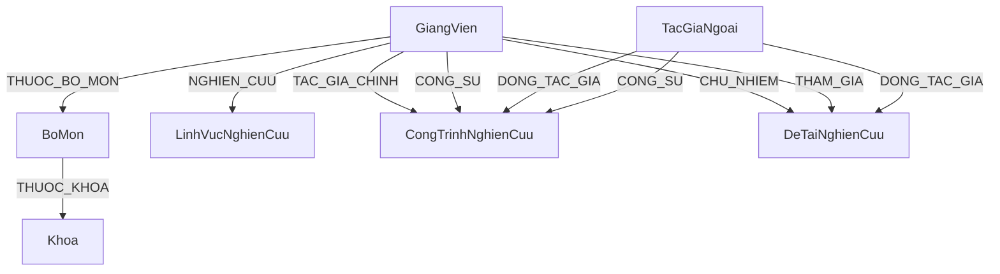

# TÀI LIỆU HƯỚNG DẪN NGHIỆP VỤ & PHÁT TRIỂN HỆ THỐNG BẢN ĐỒ TRI THỨC (NTU)

Tài liệu này cung cấp toàn bộ đặc tả chi tiết cho 30 chức năng cốt lõi của hệ thống Bản đồ Tri thức Nghiên cứu Khoa học (NTU). Mỗi chức năng được cấu trúc đồng bộ thành 4 phần để các lập trình viên và sinh viên kế thừa dự án dễ dàng kiểm thử, phát triển hoặc bảo trì.

---

## I. KIẾN TRÚC DỮ LIỆU ĐỒ THỊ (NEO4J SCHEMA)

Hệ thống lưu trữ các đối tượng dưới dạng các **Nút (Nodes)** và các mối liên kết dưới dạng các **Quan hệ (Relationships/Edges)**. 



---

## II. CHI TIẾT CÁC CHỨC NĂNG NGHIỆP VỤ (30 CHỨC NĂNG)

---

### PHÂN HỆ I: KHÁCH VÃNG LAI & SINH VIÊN (GUEST / STUDENT)

#### CHỨC NĂNG 1: TRỰC QUAN HÓA BẢN ĐỒ TRI THỨC (KNOWLEDGE MAP VISUALIZATION)
*   **1. Mô tả chức năng:**
    Hiển thị mạng lưới kết nối trực quan giữa các thực thể (Giảng viên, Đề tài, Công trình, Bộ môn, Khoa, Lĩnh vực) dưới dạng đồ thị tương tác bằng thư viện **Vis.js Network**. Người dùng có thể zoom, kéo thả, lọc thực thể và xem sidebar chi tiết của từng nút.
*   **2. Cách chức năng hoạt động (Kịch bản kiểm thử):**
    *   **Bước 1:** Truy cập trang chủ Khám phá (`explore.html`).
    *   **Bước 2:** Click chọn một bộ lọc phân loại thực thể phía dưới thanh tìm kiếm (ví dụ: Giảng viên).
    *   **Bước 3:** Nhấp chuột trực tiếp vào một nút Giảng viên trên đồ thị.
    *   **Kết quả kỳ vọng:** Đồ thị hiển thị đầy đủ màu sắc theo Legend. Nhấp vào nút Giảng viên mở Sidebar chi tiết ở cạnh phải. Các nút bị xóa mềm (`is_deleted=true`) không xuất hiện.
*   **3. Luồng hoạt động (Workflow):**
    1. Trình duyệt tải `explore.html` và nạp các tệp JS xử lý đồ thị.
    2. Client gửi yêu cầu HTTP GET đến `/api/graph/all`.
    3. Backend kết nối Neo4j, lọc bỏ các thực thể có `is_deleted = true`, định dạng màu sắc/kích thước cho từng nhóm thực thể.
    4. Backend phản hồi dữ liệu JSON. Client khởi tạo `vis.Network` để vẽ lên canvas HTML5.
*   **4. Code & Query chi tiết:**
    *   **Frontend HTML:** [explore.html](file:///d:/research-graph-system/frontend/user/explore.html)
    *   **Frontend JS:** [explore.js](file:///d:/research-graph-system/frontend/js/user/explore.js) & [graph.js](file:///d:/research-graph-system/frontend/js/user/graph.js)
    *   **Backend File:** [api.py](file:///d:/research-graph-system/backend/routes/api.py)
    *   **Hàm xử lý:** `get_full_graph()` (Route: `/api/graph/all`) và `get_node_graph(node_id)` (Route: `/api/graph/node/<node_id>`)
    *   **Truy vấn Cypher chính:**
        ```cypher
        // Lấy toàn bộ Nodes
        MATCH (n) WHERE n.id IS NOT NULL AND coalesce(n.is_deleted, false) = false
        RETURN n.id AS id, labels(n) AS labels, properties(n) AS props;
        
        // Lấy toàn bộ Mối quan hệ
        MATCH (a)-[r]->(b)
        WHERE a.id IS NOT NULL AND b.id IS NOT NULL
          AND coalesce(a.is_deleted, false) = false
          AND coalesce(b.is_deleted, false) = false
        RETURN a.id AS source, b.id AS target, type(r) AS type, properties(r) AS props;
        ```

---

#### CHỨC NĂNG 2: TÌM KIẾM TỔNG HỢP (GLOBAL SEARCH)
*   **1. Mô tả chức năng:**
    Cho phép tìm kiếm nhanh các thông tin trong hệ thống bằng tiếng Việt có dấu, không dấu, chữ hoa, chữ thường hoặc viết liền trên toàn bộ các thực thể giảng viên, bài báo, đề tài.
*   **2. Cách chức năng hoạt động (Kịch bản kiểm thử):**
    *   **Bước 1:** Nhập từ khóa không dấu `"nguyen thanh tu"` -> Trả về kết quả khớp `"NGUYỄN THANH TÚ"`.
    *   **Bước 2:** Nhập từ khóa viết liền `"nguyenthanhtu"` -> Trả về kết quả khớp `"NGUYỄN THANH TÚ"`.
    *   **Bước 3:** Nhập từ khóa đặc biệt nguy hiểm `' OR 1=1 OR n.id = '` -> Hệ thống chặn an toàn, không báo lỗi.
*   **3. Luồng hoạt động (Workflow):**
    1. Frontend gửi yêu cầu `GET /api/search?q=<keyword>&type=<all|giang_vien|cong_trinh|de_tai>` lên backend.
    2. Backend Neo4j thực thi Cypher lấy tất cả các thực thể không bị xóa mềm, gom các tác giả liên quan.
    3. Backend Python chuẩn hóa chuỗi tìm kiếm bằng hàm loại bỏ dấu `remove_accents` và chuyển về chữ thường.
    4. Thực hiện khớp chuỗi theo 2 mức độ:
       - **Khớp thông thường:** Từ khóa đã bỏ dấu nằm trong văn bản đại diện đã bỏ dấu.
       - **Khớp dính liền:** Bỏ toàn bộ khoảng trắng của từ khóa và văn bản đại diện, kiểm tra sự tồn tại (áp dụng cho từ khóa >= 3 ký tự).
    5. Giới hạn trả về 30 kết quả đầu tiên.
*   **4. Code & Query chi tiết:**
    *   **Frontend JS:** [explore.js](file:///d:/research-graph-system/frontend/js/user/explore.js)
    *   **Backend File:** [api.py](file:///d:/research-graph-system/backend/routes/api.py) (Hàm `search()`)
    *   **Hàm chuẩn hóa bỏ dấu (Python):**
        ```python
        def remove_accents(input_str):
            if not input_str: return ""
            s = unicodedata.normalize('NFD', str(input_str))
            s = "".join(c for c in s if unicodedata.category(c) != 'Mn')
            return s.replace('đ', 'd').replace('Đ', 'D').lower()
        ```
    *   **Logic khớp dính liền (Python):**
        ```python
        normalized_search_text = remove_accents(search_text)
        if q_normalized in normalized_search_text:
            data.append(item)
        else:
            q_spaceless = "".join(q_normalized.split())
            if len(q_spaceless) >= 3:
                search_text_spaceless = "".join(normalized_search_text.split())
                if q_spaceless in search_text_spaceless:
                    data.append(item)
        ```
    *   **Truy vấn Cypher chính:**
        ```cypher
        MATCH (n) WHERE coalesce(n.is_deleted, false) = false
          AND NOT (n:TacGiaNgoai AND coalesce(n.trang_thai, 'Đã duyệt') <> 'Đã duyệt')
        OPTIONAL MATCH (tg)-[:LA_TAC_GIA_CUA|TAC_GIA_CHINH|CONG_SU|DONG_TAC_GIA]->(n)
        OPTIONAL MATCH (tv)-[:CHU_NHIEM|THAM_GIA]->(n)
        RETURN n, labels(n) AS labels, 
               collect(DISTINCT tg.ho_va_ten) AS related_authors, 
               collect(DISTINCT tv.ho_va_ten) AS related_members
        ```

---

#### CHỨC NĂNG 3: CHATBOT AI HỎI ĐÁP NGHIÊN CỨU (GRAPH-RAG CHATBOT)
*   **1. Mô tả chức năng:**
    Trợ lý ảo thông minh dịch câu hỏi tự nhiên của người dùng thành truy vấn Cypher, lấy dữ liệu từ Neo4j và dùng Gemini AI sinh câu trả lời tự nhiên kèm sơ đồ đồ thị con (Sub-graph) tương quan.
*   **2. Cách chức năng hoạt động (Kịch bản kiểm thử):**
    *   **Bước 1:** Nhập câu hỏi `"Ai nghiên cứu về AI và Machine Learning?"` vào ô chat.
    *   **Bước 2:** Cố tình cấu hình sai API Key Gemini ở server để kiểm tra chế độ Fallback.
    *   **Kết quả kỳ vọng:** Bước 1 trả về câu trả lời chi tiết kèm đồ thị con. Bước 2 kích hoạt cơ chế Fallback (Rule-based) dùng Regex tìm kiếm cục bộ và hiển thị dữ liệu dạng bảng tĩnh.
*   **3. Luồng hoạt động (Workflow):**
    1. Client gửi câu hỏi bằng POST request lên `/api/chat/ask`.
    2. Backend thực hiện **Intent Detection** dựa trên hệ thống tính điểm Scoring (Keywords * 10, Question patterns, Entities).
    3. Nếu không lỗi API, Backend gọi Gemini API sinh câu lệnh Cypher tương ứng.
    4. Backend thực thi Cypher trên Neo4j để lấy dữ liệu thô.
    5. Backend gửi (Dữ liệu thô + Câu hỏi gốc) sang Gemini để sinh câu trả lời tự nhiên.
    6. Trả về JSON bao gồm đoạn văn bản trả lời và cấu trúc các nút lân cận (Sub-graph) để Vis.js dựng hình.
*   **4. Code & Query chi tiết:**
    *   **Frontend HTML/JS:** [chat.html](file:///d:/research-graph-system/frontend/user/chat.html) & [chat.js](file:///d:/research-graph-system/frontend/js/user/chat.js)
    *   **Backend Files:** [chat_api.py](file:///d:/research-graph-system/backend/routes/chat_api.py) & [gemini_service.py](file:///d:/research-graph-system/backend/services/gemini_service.py)
    *   **Hệ thống Scoring xác định Intent (Python):**
        ```python
        # Trích xuất từ khóa, tính điểm cho từng intent
        scores = {intent: 0 for intent in CHAT_CONFIG["intents"].keys()}
        for intent, keywords in CHAT_CONFIG["intents"].items():
            for kw in keywords:
                if kw.lower() in q:
                    scores[intent] += len(kw.lower().split()) * 10
        # Boost điểm khi có các thực thể đặc biệt (Năm, Tên Giảng Viên)
        if extract_name(question):
            scores["search_lecturer"] += 30
        ```
    *   **Truy vấn Cypher dựng đồ thị con:**
        ```cypher
        MATCH (center) WHERE center.id = $nid WITH center
        MATCH (center)-[r]-(neighbor) WHERE neighbor.id IS NOT NULL
        RETURN center, r, neighbor LIMIT 30
        ```

---

#### CHỨC NĂNG 4: TRỰC QUAN MẠNG LƯỚI HỢP TÁC (CO-AUTHORSHIP NETWORK)
*   **1. Mô tả chức năng:**
    Xem mạng lưới đồng tác giả giữa các giảng viên dựa trên số lượng công trình/đề tài nghiên cứu làm chung. Hỗ trợ lọc theo Bộ môn và số lượng hợp tác tối thiểu. Kích thước nút tỷ lệ với chỉ số Degree Centrality.
*   **2. Cách chức năng hoạt động (Kịch bản kiểm thử):**
    *   **Bước 1:** Mở trang mạng lưới hợp tác (`collaboration.html`).
    *   **Bước 2:** Chọn Bộ môn `"Công nghệ phần mềm"`, kéo thanh trượt "Số hợp tác tối thiểu" lên mức `2` -> Nhấn Cập nhật.
    *   **Kết quả kỳ vọng:** Đồ thị chỉ hiển thị các giảng viên thuộc Bộ môn và các cộng sự có từ 2 lần hợp tác đứng tên chung trở lên. Kích thước nút giảng viên tự động thay đổi tương ứng với số lượng cộng sự của họ.
*   **3. Luồng hoạt động (Workflow):**
    1. Client gửi yêu cầu kèm bộ lọc GET đến `/api/collaboration/graph`.
    2. Backend truy vấn Neo4j lấy các cặp giảng viên cùng tham gia vào đề tài hoặc bài viết.
    3. Backend gộp kết quả, tính bậc kết nối (Degree) của từng node và độ dày (Width) của từng cạnh.
    4. Trả JSON về frontend để Vis.js render đồ thị tương tác.
*   **4. Code & Query chi tiết:**
    *   **Frontend HTML/JS:** [collaboration.html](file:///d:/research-graph-system/frontend/user/collaboration.html) & [collaboration_app.js](file:///d:/research-graph-system/frontend/js/user/collaboration_app.js)
    *   **Backend File:** [collaboration_api.py](file:///d:/research-graph-system/backend/routes/collaboration_api.py)
    *   **Truy vấn Cypher lấy cặp hợp tác qua bài báo:**
        ```cypher
        MATCH (g1:GiangVien)-[:LA_TAC_GIA_CUA|TAC_GIA_CHINH|CONG_SU]->(ct:CongTrinhNghienCuu)<-[:LA_TAC_GIA_CUA|TAC_GIA_CHINH|CONG_SU]-(g2:GiangVien)
        WHERE id(g1) < id(g2) 
          AND coalesce(g1.is_deleted, false) = false 
          AND coalesce(g2.is_deleted, false) = false 
          AND coalesce(ct.is_deleted, false) = false
        WITH g1, g2, count(DISTINCT ct) AS so_ct, collect(DISTINCT ct.ten_cong_trinh) AS ds_ct 
        WHERE so_ct >= $min_collab
        RETURN g1.id AS id1, g1.ho_va_ten AS ten1, g2.id AS id2, g2.ho_va_ten AS ten2, so_ct, ds_ct
        ```

---

#### CHỨC NĂNG 5: XEM LÝ LỊCH KHOA HỌC GIẢNG VIÊN & ĐỒNG BỘ CHỈ SỐ THỰC TẾ
*   **1. Mô tả chức năng:**
    Xem hồ sơ học thuật chi tiết của giảng viên và tự động gọi API đồng bộ hóa thời gian thực số lượng trích dẫn (Citations), chỉ số H-Index từ thư mục OpenAlex và Google Scholar.
*   **2. Cách chức năng hoạt động (Kịch bản kiểm thử):**
    *   **Bước 1:** Mở trang hồ sơ của một giảng viên (ví dụ: Nguyễn Thanh Tú).
    *   **Kết quả kỳ vọng:** Lý lịch hiển thị đầy đủ thông tin. Citation Badge ban đầu hiện biểu tượng Loading, sau đó hiển thị số liệu trích dẫn thật lấy từ API ngoài và dẫn link trực tiếp tới trang hồ sơ gốc.
*   **3. Luồng hoạt động (Workflow):**
    1. Client tải trang hồ sơ và gửi yêu cầu GET `/api/academic/<ten_giang_vien_bo_dau>`.
    2. Backend gửi request tới OpenAlex API tìm kiếm tác giả.
    3. Áp dụng thuật toán đối sánh thực thể (Scoring Matcher): Tên khớp chính xác được `+150` điểm, lịch sử công tác chứa "Nha Trang University" được `+200` điểm. Nếu tổng điểm >= 100 thì chấp nhận.
    4. Nếu OpenAlex thất bại, Backend dùng thư viện Python `scholarly` cào dữ liệu Google Scholar làm dự phòng.
    5. Trả JSON chứa chỉ số Citations, H-Index về Frontend để vẽ Badge.
*   **4. Code & Query chi tiết:**
    *   **Frontend JS:** [academic.js](file:///d:/research-graph-system/frontend/js/user/academic.js)
    *   **Backend File:** [academic_api.py](file:///d:/research-graph-system/backend/routes/academic_api.py) (Hàm `get_academic_stats()`)
    *   **API nguồn chính:** `https://api.openalex.org/authors?search=<name>`
    *   **Logic chấm điểm so khớp thực thể (Python):**
        ```python
        score = 0
        if item.get("display_name").lower() == target_name.lower():
            score += 150
        for inst in item.get("last_known_institutions", []):
            if "Nha Trang University" in inst.get("name", ""):
                score += 200
        if score >= 100:
            return item # Chấp nhận thực thể đồng bộ
        ```

---

#### CHỨC NĂNG 6: DANH SÁCH & CHI TIẾT CÔNG TRÌNH NGHIÊN CỨU
*   **1. Mô tả chức năng:**
    Hiển thị danh sách các bài báo khoa học của khoa được sắp xếp theo thứ tự năm giảm dần. Hỗ trợ lọc theo tạp chí, năm xuất bản và xem chi tiết đồng tác giả nội bộ/ngoài khoa.
*   **2. Cách chức năng hoạt động (Kịch bản kiểm thử):**
    *   **Bước 1:** Vào trang Công trình (`publications.html`). Click chọn một bài báo bất kỳ.
    *   **Kết quả kỳ vọng:** Danh sách hiển thị đúng các bài báo đã phê duyệt. Khi click, một Modal hiện lên hiển thị đầy đủ thông tin tạp chí, tóm tắt và danh sách tác giả tham gia có kèm link liên kết đến trang cá nhân.
*   **3. Luồng hoạt động (Workflow):**
    1. Client gửi yêu cầu HTTP GET đến `/api/cong-trinh`.
    2. Backend truy vấn cơ sở dữ liệu Neo4j tìm các nút `CongTrinhNghienCuu` có `is_deleted = false` và đã được phê duyệt.
    3. Thực hiện `OPTIONAL MATCH` để tìm tất cả các giảng viên và tác giả ngoài tham gia bài báo.
    4. Trả về cấu trúc JSON để Frontend kết xuất thành giao diện danh sách.
*   **4. Code & Query chi tiết:**
    *   **Frontend HTML/JS:** [publications.html](file:///d:/research-graph-system/frontend/user/publications.html) & [publications.js](file:///d:/research-graph-system/frontend/js/user/publications.js)
    *   **Backend File:** [api.py](file:///d:/research-graph-system/backend/routes/api.py) (Hàm `get_all_cong_trinh()`)
    *   **Truy vấn Cypher chính:**
        ```cypher
        MATCH (ct:CongTrinhNghienCuu) 
        WHERE coalesce(ct.is_deleted, false) = false AND ct.trang_thai = 'Đã duyệt'
        OPTIONAL MATCH (gv:GiangVien)-[r:LA_TAC_GIA_CUA|TAC_GIA_CHINH|CONG_SU]->(ct)
        OPTIONAL MATCH (tgn:TacGiaNgoai)-[:TAC_GIA_CHINH|CONG_SU|DONG_TAC_GIA]->(ct) 
          WHERE coalesce(tgn.trang_thai, 'Đã duyệt') = 'Đã duyệt'
        RETURN ct, collect(DISTINCT gv.ho_va_ten) AS tac_gia, collect(DISTINCT tgn.ho_va_ten) AS tac_gia_ngoai
        ORDER BY toInteger(ct.nam_xuat_ban) DESC
        ```

---

#### CHỨC NĂNG 7: DANH SÁCH & CHI TIẾT ĐỀ TÀI NGHIÊN CỨU
*   **1. Mô tả chức năng:**
    Hiển thị danh sách các đề tài khoa học các cấp của khoa. Hỗ trợ lọc theo cấp đề tài (Trường, Tỉnh, Bộ, Nhà nước), trạng thái thực hiện (Đang thực hiện, Đã nghiệm thu) và xem chi tiết thành viên.
*   **2. Cách chức năng hoạt động (Kịch bản kiểm thử):**
    *   **Bước 1:** Vào trang Đề tài (`projects.html`). Lọc theo cấp đề tài `"BO"`. Click chọn một đề tài.
    *   **Kết quả kỳ vọng:** Danh sách đề tài cấp Bộ hiển thị chính xác. Khi click mở xem chi tiết đề tài hiển thị rõ vai trò Chủ nhiệm, thành viên tham gia và kinh phí.
*   **3. Luồng hoạt động (Workflow):**
    1. Client gửi yêu cầu HTTP GET đến `/api/de-tai`.
    2. Backend quét CSDL Neo4j tìm các nút `DeTaiNghienCuu` có `is_deleted = false` và đã được phê duyệt.
    3. Thu thập danh sách chủ nhiệm (`CHU_NHIEM`) và thành viên tham gia (`THAM_GIA`).
    4. Trả JSON và kết xuất giao diện ở client.
*   **4. Code & Query chi tiết:**
    *   **Frontend HTML/JS:** [projects.html](file:///d:/research-graph-system/frontend/user/projects.html) & [projects.js](file:///d:/research-graph-system/frontend/js/user/projects.js)
    *   **Backend File:** [api.py](file:///d:/research-graph-system/backend/routes/api.py) (Hàm `get_all_de_tai()`)
    *   **Truy vấn Cypher chính:**
        ```cypher
        MATCH (dt:DeTaiNghienCuu) 
        WHERE coalesce(dt.is_deleted, false) = false AND dt.trang_thai = 'Đã duyệt'
        OPTIONAL MATCH (gv_cn:GiangVien)-[:CHU_NHIEM]->(dt)
        OPTIONAL MATCH (gv_tv:GiangVien)-[:THAM_GIA]->(dt)
        RETURN dt, collect(DISTINCT gv_cn.ho_va_ten) AS chu_nhiem, collect(DISTINCT gv_tv.ho_va_ten) AS thanh_vien
        ORDER BY toInteger(dt.nam) DESC
        ```

---

#### CHỨC NĂNG 8: THỐNG KÊ TỔNG QUAN NCKH (CHART.JS)
*   **1. Mô tả chức năng:**
    Cung cấp các con số tổng lượng giảng viên, công trình, đề tài, bộ môn và trực quan hóa các tỷ lệ bằng biểu đồ hình cột/hình tròn của thư viện **Chart.js**.
*   **2. Cách chức năng hoạt động (Kịch bản kiểm thử):**
    *   **Bước 1:** Mở trang Thống kê (`statistics.html`). Rê chuột vào từng phần trên biểu đồ hình tròn Cơ cấu học vị.
    *   **Kết quả kỳ vọng:** Các con số tổng đếm chính xác, không tính dữ liệu đã xóa mềm. Biểu đồ Chart.js hiển thị tooltip chứa tỷ lệ phần trăm chính xác của PGS, Tiến sĩ, Thạc sĩ khi di chuột.
*   **3. Luồng hoạt động (Workflow):**
    1. Trình duyệt gửi yêu cầu HTTP GET đến `/api/stats/overview`.
    2. Backend thực thi đồng thời các câu lệnh Cypher để đếm số lượng các thực thể và gom nhóm dữ liệu (theo năm, theo bộ môn, theo học vị, tìm top giảng viên công bố).
    3. Backend trả về cấu trúc JSON tổng hợp các trường số liệu và mảng dữ liệu biểu đồ.
    4. JavaScript phía client nạp dữ liệu và khởi tạo đối tượng `new Chart()` để vẽ.
*   **4. Code & Query chi tiết:**
    *   **Frontend HTML/JS:** [statistics.html](file:///d:/research-graph-system/frontend/user/statistics.html) & [statistics.js](file:///d:/research-graph-system/frontend/js/user/statistics.js)
    *   **Backend File:** [api.py](file:///d:/research-graph-system/backend/routes/api.py) (Hàm `get_overview_stats()`)
    *   **Truy vấn Cypher lấy cơ cấu học vị giảng viên:**
        ```cypher
        MATCH (gv:GiangVien) WHERE gv.hoc_vi IS NOT NULL AND coalesce(gv.is_deleted, false) = false
        RETURN gv.hoc_vi AS hoc_vi, count(gv) AS so_luong ORDER BY so_luong DESC
        ```

---

#### CHỨC NĂNG 9: DỊCH THUẬT NỘI DUNG (GOOGLE TRANSLATOR)
*   **1. Mô tả chức năng:**
    Cho phép dịch thuật tự động nội dung tóm tắt (Abstract) bài báo hoặc mô tả đề tài từ tiếng Anh sang tiếng Việt hoặc ngược lại trực tiếp trên Modal chi tiết.
*   **2. Cách chức năng hoạt động (Kịch bản kiểm thử):**
    *   **Bước 1:** Nhấp xem chi tiết bài báo có tóm tắt tiếng Anh. Nhấn nút "Dịch sang tiếng Việt".
    *   **Kết quả kỳ vọng:** Giao diện hiển thị biểu tượng tải thông tin. Sau 1-2 giây, phần tóm tắt được thay thế bằng văn bản tiếng Việt dịch chính nghĩa.
*   **3. Luồng hoạt động (Workflow):**
    1. Người dùng bấm nút Dịch trên giao diện.
    2. JavaScript gửi POST request chứa văn bản cần dịch lên endpoint `/api/translate`.
    3. Backend sử dụng thư viện `deep_translator.GoogleTranslator` để xử lý yêu cầu dịch.
    4. Backend trả về chuỗi văn bản đã dịch dưới dạng JSON. Frontend cập nhật lại thẻ HTML tương ứng.
*   **4. Code & Query chi tiết:**
    *   **Backend File:** [api.py](file:///d:/research-graph-system/backend/routes/api.py) (Hàm `translate_content()`)
    *   **Hàm xử lý Backend:**
        ```python
        @api_bp.route("/translate", methods=["POST"])
        def translate_content():
            text = request.json.get("text", "").strip()
            target_lang = request.json.get("target_lang", "vi").strip()
            # Map ngôn ngữ
            target = "vi" if target_lang in ["vi", "Tiếng Việt"] else "en"
            translated = GoogleTranslator(source="auto", target=target).translate(text)
            return jsonify({"status": "ok", "translatedText": translated})
        ```

---

### PHÂN HỆ II: GIẢNG VIÊN (LECTURER)

#### CHỨC NĂNG 10: ĐĂNG NHẬP & ĐĂNG XUẤT HỆ THỐNG
*   **1. Mô tả chức năng:**
    Xác thực tài khoản của giảng viên bằng mã giảng viên/email và mật khẩu. Cấp mã thông báo JWT để bảo mật các yêu cầu chỉnh sửa thông tin.
*   **2. Cách chức năng hoạt động (Kịch bản kiểm thử):**
    *   **Bước 1:** Nhập mã giảng viên và mật khẩu chính xác vào giao diện đăng nhập -> Bấm Đăng nhập.
    *   **Kết quả kỳ vọng:** Đăng nhập thành công, token được lưu vào localStorage, trình duyệt tự động chuyển hướng về trang quản lý cá nhân `/frontend/lecturer/dashboard.html`.
*   **3. Luồng hoạt động (Workflow):**
    1. Client gửi thông tin đăng nhập bằng HTTP POST đến `/api/auth/login`.
    2. Backend truy vấn Neo4j tìm giảng viên khớp email hoặc mã giảng viên.
    3. So sánh Hash mật khẩu lưu trong CSDL bằng hàm `check_password_hash`.
    4. Nếu khớp, Backend sinh JWT token có chứa ID giảng viên và thời hạn hết hạn, phản hồi về client.
*   **4. Code & Query chi tiết:**
    *   **Frontend HTML/JS:** [login.html](file:///d:/research-graph-system/frontend/login.html) & [login.js](file:///d:/research-graph-system/frontend/js/login.js)
    *   **Backend File:** [auth.py](file:///d:/research-graph-system/backend/routes/auth.py) (Hàm `login()`)
    *   **Truy vấn Cypher chính:**
        ```cypher
        MATCH (gv:GiangVien) WHERE (gv.email = $login OR gv.ma_gv = $login) AND coalesce(gv.is_deleted, false) = false
        RETURN gv
        ```

---

#### CHỨC NĂNG 11: ĐỔI MẬT KHẨU CÁ NHÂN
*   **1. Mô tả chức năng:**
    Giảng viên thay đổi mật khẩu đăng nhập cá nhân để tăng tính bảo mật cho tài khoản của mình.
*   **2. Cách chức năng hoạt động (Kịch bản kiểm thử):**
    *   **Bước 1:** Truy cập trang Cài đặt tài khoản. Nhập mật khẩu hiện tại, mật khẩu mới, xác nhận lại và nhấn Đổi mật khẩu.
    *   **Kết quả kỳ vọng:** Hệ thống báo đổi mật khẩu thành công. Lần đăng nhập tiếp theo bắt buộc phải dùng mật khẩu mới.
*   **3. Luồng hoạt động (Workflow):**
    1. Giảng viên nhập mật khẩu cũ và mới. Client đính kèm JWT token gửi PUT đến `/api/auth/change-password`.
    2. Backend giải mã JWT lấy ID giảng viên và tìm kiếm thực thể trong Neo4j.
    3. Xác thực mật khẩu cũ bằng `check_password_hash`.
    4. Mã hóa mật khẩu mới bằng `generate_password_hash` và cập nhật thuộc tính `password` trong database.
*   **4. Code & Query chi tiết:**
    *   **Frontend HTML/JS:** [settings.html](file:///d:/research-graph-system/frontend/lecturer/settings.html) & [settings.js](file:///d:/research-graph-system/frontend/js/lecturer/settings.js)
    *   **Backend File:** [auth.py](file:///d:/research-graph-system/backend/routes/auth.py) (Hàm `change_password()`)
    *   **Truy vấn Cypher chính:**
        ```cypher
        MATCH (gv:GiangVien {id: $gv_id}) SET gv.password = $new_password_hash RETURN gv
        ```

---

#### CHỨC NĂNG 12: QUÊN MẬT KHẨU & KHÔI PHỤC BẰNG OTP QUA EMAIL
*   **1. Mô tả chức năng:**
    Cho phép giảng viên lấy lại mật khẩu bằng cách nhập email đăng ký. Hệ thống gửi mã OTP 6 số đến email để xác minh và cấp quyền đổi mật khẩu mới.
*   **2. Cách chức năng hoạt động (Kịch bản kiểm thử):**
    *   **Bước 1:** Vào trang Quên mật khẩu, điền email đăng ký và nhấn Gửi mã.
    *   **Bước 2:** Nhập mã OTP nhận được từ email và điền mật khẩu mới -> Xác nhận.
    *   **Kết quả kỳ vọng:** Bước 1 gửi email thành công. Bước 2 xác minh OTP chính xác và cập nhật mật khẩu mới thành công.
*   **3. Luồng hoạt động (Workflow):**
    1. Giảng viên yêu cầu cấp OTP tại `/api/auth/reset-password-request`.
    2. Backend sinh mã OTP ngẫu nhiên, lưu thời hạn hết hạn (10 phút) vào node `GiangVien` và gửi email cho người dùng.
    3. Người dùng nhập OTP, Backend xác thực mã khớp và chưa hết hạn tại `/api/auth/verify-otp`, cấp token khôi phục.
    4. Người dùng gửi mật khẩu mới kèm token khôi phục lên `/api/auth/reset-password` để ghi đè mật khẩu mới và xóa sạch mã OTP cũ.
*   **4. Code & Query chi tiết:**
    *   **Frontend HTML/JS:** [forgot_password.html](file:///d:/research-graph-system/frontend/forgot_password.html) & [forgot_password.js](file:///d:/research-graph-system/frontend/js/forgot_password.js)
    *   **Backend File:** [auth.py](file:///d:/research-graph-system/backend/routes/auth.py)
    *   **Truy vấn Cypher lưu OTP:**
        ```cypher
        MATCH (gv:GiangVien {email: $email})
        SET gv.otp_code = $otp_code, gv.otp_expiry = $otp_expiry
        RETURN gv
        ```

---

#### CHỨC NĂNG 13: ĐỀ XUẤT CẬP NHẬT HỒ SƠ CÁ NHÂN (MAKER-CHECKER PROFILE)
*   **1. Mô tả chức năng:**
    Giảng viên cập nhật lý lịch khoa học. Dữ liệu sửa đổi được lưu vào các trường tạm `pending_...` và đổi trạng thái duyệt thành `'Chờ duyệt'` để bảo vệ tính toàn vẹn thông tin công khai.
*   **2. Cách chức năng hoạt động (Kịch bản kiểm thử):**
    *   **Bước 1:** Vào mục Sửa hồ sơ cá nhân. Đổi học vị từ `"Thạc sĩ"` thành `"Tiến sĩ"`. Nhấn Lưu.
    *   **Bước 2:** Mở trình duyệt ẩn danh xem trang hồ sơ giảng viên này.
    *   **Kết quả kỳ vọng:** Hồ sơ hiển thị thông báo "Đang chờ duyệt". Trang công khai của giảng viên vẫn hiển thị học vị cũ `"Thạc sĩ"`.
*   **3. Luồng hoạt động (Workflow):**
    1. Giảng viên gửi thông tin chỉnh sửa bằng PUT request đến `/api/auth/profile`.
    2. Backend lưu thông tin đề xuất vào các thuộc tính tạm `pending_ho_va_ten`, `pending_hoc_vi`, ... và đặt `profile_edit_status = 'Chờ duyệt'`.
    3. Dữ liệu chính thức `hoc_vi` không thay đổi cho đến khi Admin bấm Duyệt.
*   **4. Code & Query chi tiết:**
    *   **Frontend HTML/JS:** [profile_edit.html](file:///d:/research-graph-system/frontend/lecturer/profile_edit.html) & [profile_edit.js](file:///d:/research-graph-system/frontend/js/lecturer/profile_edit.js)
    *   **Backend File:** [auth.py](file:///d:/research-graph-system/backend/routes/auth.py) (Hàm `update_profile()`)
    *   **Truy vấn Cypher chính:**
        ```cypher
        MATCH (gv:GiangVien {id: $gv_id})
        SET gv.pending_ho_va_ten = $ho_va_ten, gv.pending_hoc_vi = $hoc_vi, gv.pending_email = $email,
            gv.pending_dien_thoai = $dien_thoai, gv.pending_chuc_danh = $chuc_danh, gv.profile_edit_status = 'Chờ duyệt'
        RETURN gv
        ```

---

#### CHỨC NĂNG 14: QUẢN LÝ CÔNG TRÌNH CÁ NHÂN (CRUD)
*   **1. Mô tả chức năng:**
    Giảng viên thêm mới, sửa đổi hoặc yêu cầu xóa các bài báo khoa học cá nhân. Bài báo sau khi thêm mới hoặc sửa đổi sẽ ở trạng thái `'Chờ duyệt'`.
*   **2. Cách chức năng hoạt động (Kịch bản kiểm thử):**
    *   **Bước 1:** Vào mục Công trình. Bấm "Thêm công trình", điền thông tin và nhấn Lưu.
    *   **Bước 2:** Bấm sửa bài báo đã được duyệt -> Thay đổi năm xuất bản và nhấn Lưu.
    *   **Kết quả kỳ vọng:** Công trình ở bước 1 được tạo ở trạng thái `"Chờ duyệt"`. Công trình ở bước 2 đổi trạng thái từ `"Đã duyệt"` sang `"Chờ duyệt"` và tạm thời ẩn khỏi bản đồ công khai.
*   **3. Luồng hoạt động (Workflow):**
    1. Giảng viên gửi yêu cầu tạo/sửa công trình khoa học qua API `/api/lecturer/cong-trinh`.
    2. Backend tự động sinh mã slug từ tiêu đề tiếng Anh và tiếng Việt để kiểm tra trùng lặp.
    3. Backend tạo hoặc cập nhật thông tin bài báo, đặt thuộc tính `trang_thai = 'Chờ duyệt'` và liên kết quan hệ tác giả chính (`TAC_GIA_CHINH`) hoặc cộng sự (`CONG_SU`).
*   **4. Code & Query chi tiết:**
    *   **Frontend HTML/JS:** [publications.html](file:///d:/research-graph-system/frontend/lecturer/publications.html) & [publications.js](file:///d:/research-graph-system/frontend/js/lecturer/publications.js)
    *   **Backend File:** [lecturer_api.py](file:///d:/research-graph-system/backend/routes/lecturer_api.py) (Hàm `create_my_publication()`, `update_my_publication()`)
    *   **Truy vấn Cypher kiểm tra trùng bài báo:**
        ```cypher
        MATCH (ct:CongTrinhNghienCuu)
        WHERE (ct.slug = $slug AND coalesce(ct.is_deleted, false) = false) 
           OR ($slug_vi IS NOT NULL AND ct.slug_vi = $slug_vi AND coalesce(ct.is_deleted, false) = false)
        RETURN ct.id AS ct_id
        ```

---

#### CHỨC NĂNG 15: QUẢN LÝ ĐỀ TÀI CÁ NHÂN (CRUD)
*   **1. Mô tả chức năng:**
    Giảng viên khai báo, chỉnh sửa hoặc yêu cầu xóa các đề tài nghiên cứu các cấp do mình làm Chủ nhiệm hoặc thành viên tham gia.
*   **2. Cách chức năng hoạt động (Kịch bản kiểm thử):**
    *   **Bước 1:** Giảng viên khai báo đề tài mới `"Nghiên cứu IoT"`.
    *   **Bước 2:** Gửi yêu cầu xóa đề tài đã được duyệt chính thức.
    *   **Kết quả kỳ vọng:** Đề tài mới được tạo ở trạng thái `"Chờ duyệt"`. Đề tài ở bước 2 không bị xóa ngay mà chuyển trạng thái sang `"Yêu cầu xóa"`.
*   **3. Luồng hoạt động (Workflow):**
    1. Giảng viên thao tác thêm/sửa/xóa đề tài trên giao diện.
    2. Frontend gửi request lên `/api/lecturer/de-tai`.
    3. Khi xóa đề tài đã duyệt, Backend đặt `trang_thai = 'Yêu cầu xóa'`. Nếu là đề tài đang ở trạng thái nháp hoặc bị từ chối, Backend cho phép xóa mềm luôn (`is_deleted = true`).
*   **4. Code & Query chi tiết:**
    *   **Frontend HTML/JS:** [projects.html](file:///d:/research-graph-system/frontend/lecturer/projects.html) & [projects.js](file:///d:/research-graph-system/frontend/js/lecturer/projects.js)
    *   **Backend File:** [lecturer_api.py](file:///d:/research-graph-system/backend/routes/lecturer_api.py) (Hàm `update_my_project()`)
    *   **Truy vấn Cypher gửi yêu cầu xóa đề tài:**
        ```cypher
        MATCH (dt:DeTaiNghienCuu) WHERE dt.id = $dt_id
        SET dt.trang_thai = 'Yêu cầu xóa'
        RETURN dt
        ```

---

#### CHỨC NĂNG 16: XEM DÒNG THỜI GIAN KHOA HỌC CÁ NHÂN (TIMELINE)
*   **1. Mô tả chức năng:**
    Tổng hợp toàn bộ các đề tài và công trình khoa học của riêng giảng viên, sắp xếp thống nhất theo dòng thời gian năm giảm dần.
*   **2. Cách chức năng hoạt động (Kịch bản kiểm thử):**
    *   **Bước 1:** Vào trang Dòng thời gian (`timeline.html`).
    *   **Kết quả kỳ vọng:** Hiển thị một danh sách dạng chuỗi sự kiện dọc liên kết, các năm hiển thị theo thứ tự giảm dần, phân biệt biểu tượng đề tài (hình cúp) và bài báo (hình tài liệu).
*   **3. Luồng hoạt động (Workflow):**
    1. Trình duyệt gửi GET request đến `/api/lecturer/timeline?gv_id=<id>`.
    2. Backend thực thi khối truy vấn gộp (`UNION ALL`) lấy toàn bộ đề tài (vai trò chủ nhiệm/thành viên) và công trình (tác giả chính/cộng sự) của giảng viên đó.
    3. Lọc bỏ các mục chưa duyệt hoặc đã xóa mềm. Sắp xếp danh sách theo năm giảm dần và trả về JSON.
*   **4. Code & Query chi tiết:**
    *   **Frontend HTML/JS:** [timeline.html](file:///d:/research-graph-system/frontend/lecturer/timeline.html) & [timeline.js](file:///d:/research-graph-system/frontend/js/lecturer/timeline.js)
    *   **Backend File:** [lecturer_api.py](file:///d:/research-graph-system/backend/routes/lecturer_api.py) (Hàm `get_my_timeline()`)
    *   **Truy vấn Cypher chính:**
        ```cypher
        MATCH (g:GiangVien {id: $gv_id})-[:LA_TAC_GIA_CUA|TAC_GIA_CHINH|CONG_SU]->(ct:CongTrinhNghienCuu) 
        WHERE coalesce(ct.is_deleted, false) = false AND ct.trang_thai = 'Đã duyệt'
        RETURN ct.ten_cong_trinh AS title, ct.nam_xuat_ban AS year, 'cong-trinh' AS type, 'Tác giả' AS role
        UNION ALL
        MATCH (g:GiangVien {id: $gv_id})-[:CHU_NHIEM|THAM_GIA]->(dt:DeTaiNghienCuu) 
        WHERE coalesce(dt.is_deleted, false) = false AND dt.trang_thai = 'Đã duyệt'
        RETURN dt.ten_de_tai AS title, dt.nam AS year, 'de-tai' AS type, 'Chủ nhiệm/Thành viên' AS role
        ```

---

#### CHỨC NĂNG 17: GỢI Ý CỘNG SỰ TIỀM NĂNG (COLLABORATOR SUGGESTION)
*   **1. Mô tả chức năng:**
    Tính toán và gợi ý 5 giảng viên khác trong khoa có khả năng hợp tác nghiên cứu cao nhất dựa trên độ tương đồng hướng nghiên cứu, bộ môn và từ khóa bài báo.
*   **2. Cách chức năng hoạt động (Kịch bản kiểm thử):**
    *   **Bước 1:** Giảng viên đăng nhập, vào trang Dashboard cá nhân.
    *   **Kết quả kỳ vọng:** Góc phải Dashboard hiển thị mục "Cộng sự tiềm năng gợi ý" liệt kê danh sách 5 giảng viên kèm điểm số tương quan.
*   **3. Luồng hoạt động (Workflow):**
    1. Frontend gửi yêu cầu GET đến `/api/lecturer/suggest-collaborators`.
    2. Backend chạy thuật toán tính điểm trên CSDL đồ thị:
        - Có chung 1 nút Lĩnh vực nghiên cứu: `+3.0` điểm.
        - Cùng Bộ môn: `+1.5` điểm.
        - Trùng từ khóa trong các tiêu đề bài báo/đề tài: `+1.0` điểm/từ khóa.
    3. Sắp xếp danh sách giảm dần theo điểm số và trả về top 5 kết quả.
*   **4. Code & Query chi tiết:**
    *   **Frontend JS:** [suggest.js](file:///d:/research-graph-system/frontend/js/lecturer/suggest.js)
    *   **Backend File:** [lecturer_api.py](file:///d:/research-graph-system/backend/routes/lecturer_api.py) (Hàm `suggest_collaborators()`)
    *   **Truy vấn Cypher chính:**
        ```cypher
        MATCH (g1:GiangVien {id: $gv_id})
        MATCH (g2:GiangVien) WHERE g2.id <> g1.id AND coalesce(g2.is_deleted, false) = false
        OPTIONAL MATCH (g1)-[:NGHIEN_CUU]->(lv:LinhVucNghienCuu)<-[:NGHIEN_CUU]-(g2)
        WITH g1, g2, count(DISTINCT lv) AS shared_lv
        OPTIONAL MATCH (g1)-[:THUOC_BO_MON]->(bm:BoMon)<-[:THUOC_BO_MON]-(g2)
        WITH g1, g2, shared_lv, (CASE WHEN bm IS NOT NULL THEN 1.5 ELSE 0 END) AS dept_score
        RETURN g2.ho_va_ten AS ho_va_ten, g2.id AS id, (shared_lv * 3 + dept_score) AS score
        ORDER BY score DESC LIMIT 5
        ```

---

#### CHỨC NĂNG 18: QUẢN LÝ TÁC GIẢ NGOÀI KHOA (LECTURER EXTERNAL AUTHORS)
*   **1. Mô tả chức năng:**
    Cho phép giảng viên tra cứu tác giả ngoài khoa đã được phê duyệt để liên kết đồng tác giả, hoặc tạo mới tác giả ngoài (ở trạng thái `'Chờ duyệt'`).
*   **2. Cách chức năng hoạt động (Kịch bản kiểm thử):**
    *   **Bước 1:** Khi thêm bài báo, nhập tên `"John Doe"`. Hệ thống chưa có tác giả này -> Bấm thêm mới tác giả ngoài.
    *   **Kết quả kỳ vọng:** Tác giả mới được tạo ở trạng thái `"Chờ duyệt"`. Giảng viên hiện tại có thể gán tác giả này vào bài báo của mình, nhưng giảng viên khác sẽ không nhìn thấy tác giả này cho tới khi Admin phê duyệt.
*   **3. Luồng hoạt động (Workflow):**
    1. Giảng viên gửi request POST kèm thông tin cơ quan công tác của tác giả ngoài đến `/api/lecturer/tac-gia-ngoai`.
    2. Backend kiểm tra xem tên tác giả ngoài có trùng lặp trong CSDL hay chưa.
    3. Nếu chưa trùng, tạo nút `TacGiaNgoai` mới với trạng thái `trang_thai = 'Chờ duyệt'` và liên kết `created_by` trỏ về giảng viên tạo.
*   **4. Code & Query chi tiết:**
    *   **Frontend JS:** [publications.js](file:///d:/research-graph-system/frontend/js/lecturer/publications.js)
    *   **Backend File:** [lecturer_api.py](file:///d:/research-graph-system/backend/routes/lecturer_api.py) (Hàm `lecturer_create_tac_gia_ngoai()`)
    *   **Truy vấn Cypher chính:**
        ```cypher
        CREATE (tgn:TacGiaNgoai {
            ho_va_ten: toUpper($ho_va_ten), don_vi_cong_tac: toUpper($don_vi_cong_tac),
            hoc_vi: toUpper($hoc_vi), chuc_danh: toUpper($chuc_danh), email: $email,
            trang_thai: 'Chờ duyệt', created_by: $gv_id, created_at: timestamp(), is_deleted: false
        }) SET tgn.id = 'tgn_' + toString(id(tgn)) RETURN tgn.id AS id
        ```

---

#### CHỨC NĂNG 19: QUẢN LÝ THÙNG RÁC CÁ NHÂN (LECTURER TRASH BIN)
*   **1. Mô tả chức năng:**
    Giảng viên quản lý các đề tài, bài viết cá nhân đã xóa mềm (`is_deleted=true`). Có thể khôi phục lại hoặc thực hiện xóa vĩnh viễn (đối với mục nháp/từ chối).
*   **2. Cách chức năng hoạt động (Kịch bản kiểm thử):**
    *   **Bước 1:** Vào Thùng rác (`trash.html`). Nhấn khôi phục một bài báo có trạng thái cũ là `"Từ chối"`.
    *   **Bước 2:** Nhấn khôi phục một bài báo có trạng thái cũ là `"Đã duyệt"`.
    *   **Kết quả kỳ vọng:** Bài báo ở bước 1 được khôi phục trực tiếp về danh sách cá nhân. Bài báo ở bước 2 hiển thị thông báo *"Đã gửi yêu cầu khôi phục tới Admin"* và đặt trạng thái bài báo là `"Yêu cầu khôi phục"`.
*   **3. Luồng hoạt động (Workflow):**
    1. Client gửi PUT request khôi phục đến `/api/lecturer/trash/<type>/<id>/restore?gv_id=<id>`.
    2. Backend truy vấn thực thể trong Neo4j và lấy giá trị `old_status` của nó.
    3. Nếu `old_status` là `'Từ chối'` hoặc `'Chờ duyệt'`, Backend đặt `is_deleted = false` và đưa về trạng thái cũ trực tiếp. Nếu không, đặt `trang_thai = 'Yêu cầu khôi phục'`.
*   **4. Code & Query chi tiết:**
    *   **Frontend HTML/JS:** [trash.html](file:///d:/research-graph-system/frontend/lecturer/trash.html) & [trash.js](file:///d:/research-graph-system/frontend/js/lecturer/trash.js)
    *   **Backend File:** [lecturer_api.py](file:///d:/research-graph-system/backend/routes/lecturer_api.py) (Hàm `restore_my_item()`)
    *   **Truy vấn Cypher khôi phục trực tiếp:**
        ```cypher
        MATCH (g:GiangVien)-[:LA_TAC_GIA_CUA|TAC_GIA_CHINH|CONG_SU|CHU_NHIEM|THAM_GIA]->(n)
        WHERE g.id = $gv_id AND n.id = $id AND n.is_deleted = true
        SET n.is_deleted = false, n.trang_thai = n.old_status REMOVE n.deleted_at, n.old_status RETURN n
        ```

---

### PHÂN HỆ III: QUẢN TRỊ VIÊN (ADMIN)

#### CHỨC NĂNG 20: PHÊ DUYỆT HÀNG ĐỢI HỒ SƠ GIẢNG VIÊN (MAKER-CHECKER PROFILE)
*   **1. Mô tả chức năng:**
    Admin xem xét các yêu cầu chỉnh sửa hồ sơ cá nhân của giảng viên, so sánh thông tin cũ và thông tin đề xuất để thực hiện duyệt hoặc từ chối.
*   **2. Cách chức năng hoạt động (Kịch bản kiểm thử):**
    *   **Bước 1:** Vào mục Duyệt hồ sơ của Admin. Bấm xem yêu cầu của giảng viên A.
    *   **Bước 2:** Nhấn nút "Phê duyệt" để đồng ý cập nhật.
    *   **Kết quả kỳ vọng:** Hệ thống hiển thị trực quan thông tin cũ song song với thông tin đề xuất. Khi bấm phê duyệt, các trường đề xuất tạm `pending_...` được ghi đè chính thức và xóa trường tạm.
*   **3. Luồng hoạt động (Workflow):**
    1. Admin gửi POST request duyệt đến `/api/admin/lecturers/<gv_id>/approve`.
    2. Backend truy vấn node giảng viên trong Neo4j.
    3. Sao chép giá trị từ tất cả các trường tạm `pending_...` sang các thuộc tính chính thức như `ho_va_ten`, `hoc_vi`, `email`...
    4. Xóa bỏ (set `null`) toàn bộ các trường tạm `pending_...` và đặt trạng thái duyệt thành `profile_edit_status = 'Đã duyệt'`.
*   **4. Code & Query chi tiết:**
    *   **Frontend HTML/JS:** [pending_profiles.html](file:///d:/research-graph-system/frontend/admin/pending_profiles.html) & [pending_profiles.js](file:///d:/research-graph-system/frontend/js/admin/pending_profiles.js)
    *   **Backend File:** [admin_lecturers.py](file:///d:/research-graph-system/backend/routes/admin_lecturers.py)
    *   **Truy vấn Cypher phê duyệt chính thức:**
        ```cypher
        MATCH (gv:GiangVien {id: $gv_id})
        SET gv.ho_va_ten = coalesce(gv.pending_ho_va_ten, gv.ho_va_ten), 
            gv.hoc_vi = coalesce(gv.pending_hoc_vi, gv.hoc_vi),
            gv.email = coalesce(gv.pending_email, gv.email), 
            gv.profile_edit_status = 'Đã duyệt'
        REMOVE gv.pending_ho_va_ten, gv.pending_hoc_vi, gv.pending_email RETURN gv
        ```

---

#### CHỨC NĂNG 21: PHÊ DUYỆT BÀI BÁO / ĐỀ TÀI MỚI KHAI BÁO
*   **1. Mô tả chức năng:**
    Admin phê duyệt các bài báo hoặc đề tài nghiên cứu khoa học mới do giảng viên khai báo để đưa thông tin hiển thị lên bản đồ tri thức công khai.
*   **2. Cách chức năng hoạt động (Kịch bản kiểm thử):**
    *   **Bước 1:** Vào hàng đợi phê duyệt nội dung. Bấm Duyệt bài báo `"Phân tích dữ liệu lớn"`.
    *   **Kết quả kỳ vọng:** Bài báo chuyển trạng thái thành `"Đã duyệt"`. Mở bản đồ tri thức công khai kiểm tra đảm bảo bài báo đã xuất hiện liên kết chính xác với giảng viên.
*   **3. Luồng hoạt động (Workflow):**
    1. Admin bấm "Phê duyệt" bài báo hoặc đề tài trên màn hình quản trị.
    2. Client gửi yêu cầu PUT đến `/api/admin/publications/<id>/approve` (hoặc `/projects/<id>/approve`).
    3. Backend cập nhật thuộc tính `trang_thai = 'Đã duyệt'` trên node tương ứng trong database Neo4j.
*   **4. Code & Query chi tiết:**
    *   **Frontend HTML/JS:** [pending_contents.html](file:///d:/research-graph-system/frontend/admin/pending_contents.html) & [pending_contents.js](file:///d:/research-graph-system/frontend/js/admin/pending_contents.js)
    *   **Backend Files:** [admin_publications.py](file:///d:/research-graph-system/backend/routes/admin_publications.py) & [admin_projects.py](file:///d:/research-graph-system/backend/routes/admin_projects.py)
    *   **Truy vấn Cypher chính:**
        ```cypher
        MATCH (ct:CongTrinhNghienCuu {id: $id}) SET ct.trang_thai = 'Đã duyệt' RETURN ct
        ```

---

#### CHỨC NĂNG 22: PHÊ DUYỆT YÊU CẦU XÓA HOẶC KHÔI PHỤC CỦA GIẢNG VIÊN
*   **1. Mô tả chức năng:**
    Phê duyệt hoặc từ chối các yêu cầu xóa bài báo/đề tài đã duyệt hoặc yêu cầu khôi phục bài báo/đề tài từ thùng rác của giảng viên.
*   **2. Cách chức năng hoạt động (Kịch bản kiểm thử):**
    *   **Bước 1:** Admin vào mục Duyệt thùng rác, thấy yêu cầu khôi phục đề tài của giảng viên A -> Nhấn Duyệt khôi phục.
    *   **Kết quả kỳ vọng:** Đề tài được xóa bỏ thuộc tính `is_deleted` và khôi phục trạng thái hoạt động chính thức trên bản đồ tri thức công khai.
*   **3. Luồng hoạt động (Workflow):**
    1. Admin duyệt yêu cầu khôi phục từ giảng viên gửi lên.
    2. Client gửi PUT request đến `/api/admin/trash/<type>/<id>/approve-restore`.
    3. Backend cập nhật `is_deleted = false` và đưa `trang_thai` về lại giá trị hoạt động của `old_status` (ví dụ: 'Hoàn thành').
*   **4. Code & Query chi tiết:**
    *   **Frontend HTML/JS:** [pending_trash.html](file:///d:/research-graph-system/frontend/admin/pending_trash.html) & [pending_trash.js](file:///d:/research-graph-system/frontend/js/admin/pending_trash.js)
    *   **Backend File:** [admin_trash.py](file:///d:/research-graph-system/backend/routes/admin_trash.py) (Hàm `approve_restore()`)
    *   **Truy vấn Cypher chính:**
        ```cypher
        MATCH (n) WHERE n.id = $id AND n.is_deleted = true
        SET n.trang_thai = coalesce(n.old_status, 'Hoàn thành') 
        REMOVE n.is_deleted, n.deleted_at, n.deleted_note, n.old_status 
        RETURN n
        ```

---

#### CHỨC NĂNG 23: PHÊ DUYỆT TÁC GIẢ NGOÀI MỚI KHAI BÁO
*   **1. Mô tả chức năng:**
    Admin phê duyệt các tác giả ngoài do giảng viên tự thêm trong quá trình viết bài để đưa vào danh sách dùng chung cho cả khoa.
*   **2. Cách chức năng hoạt động (Kịch bản kiểm thử):**
    *   **Bước 1:** Admin vào mục Duyệt tác giả ngoài -> Bấm "Phê duyệt" đối với tác giả ngoài mới `"John Doe"`.
    *   **Kết quả kỳ vọng:** Trạng thái tác giả đổi thành `"Đã duyệt"`. Lúc này, bất kỳ giảng viên nào khác khi tạo bài viết mới đều có thể tìm thấy và chọn tác giả `"John Doe"`.
*   **3. Luồng hoạt động (Workflow):**
    1. Admin duyệt tác giả ngoài, client gửi yêu cầu PUT tới `/api/admin/external-authors/<id>/approve`.
    2. Backend thực thi lệnh cập nhật trường trạng thái của tác giả ngoài trong Neo4j.
    3. Phản hồi kết quả thành công và cập nhật lại giao diện hàng đợi phê duyệt.
*   **4. Code & Query chi tiết:**
    *   **Frontend HTML/JS:** [pending_authors.html](file:///d:/research-graph-system/frontend/admin/pending_authors.html) & [pending_authors.js](file:///d:/research-graph-system/frontend/js/admin/pending_authors.js)
    *   **Backend File:** [admin_external_authors.py](file:///d:/research-graph-system/backend/routes/admin_external_authors.py)
    *   **Truy vấn Cypher chính:**
        ```cypher
        MATCH (tgn:TacGiaNgoai {id: $id}) SET tgn.trang_thai = 'Đã duyệt' RETURN tgn
        ```

---

#### CHỨC NĂNG 24: CRUD GIẢNG VIÊN CHÍNH THỨC (QUYỀN ADMIN)
*   **1. Mô tả chức năng:**
    Admin quản trị trực tiếp danh sách giảng viên trong khoa (Xem, Thêm mới, Sửa đổi thông tin trực tiếp, Xóa mềm tài khoản).
*   **2. Cách chức năng hoạt động (Kịch bản kiểm thử):**
    *   **Bước 1:** Bấm nút "Thêm giảng viên", điền thông tin và lưu.
    *   **Bước 2:** Bấm nút Xóa một giảng viên đang có.
    *   **Kết quả kỳ vọng:** Giảng viên mới được tạo trực tiếp với trạng thái `"Đã duyệt"`. Giảng viên bị xóa ở bước 2 sẽ bị đặt `is_deleted = true` và ẩn khỏi hệ thống.
*   **3. Luồng hoạt động (Workflow):**
    1. Admin thực hiện các thao tác CRUD trên giao diện quản trị giảng viên.
    2. Frontend gửi request (POST/PUT/DELETE) tới `/api/admin/lecturers`.
    3. Lệnh tạo mới sẽ tạo node giảng viên và tự động sinh thuộc tính ID định dạng `gv_...` liên kết với số ID thực thể trong Neo4j.
*   **4. Code & Query chi tiết:**
    *   **Frontend HTML/JS:** [lecturers.html](file:///d:/research-graph-system/frontend/admin/lecturers.html) & [lecturers.js](file:///d:/research-graph-system/frontend/js/admin/lecturers.js)
    *   **Backend File:** [admin_lecturers.py](file:///d:/research-graph-system/backend/routes/admin_lecturers.py)
    *   **Truy vấn Cypher tạo mới giảng viên:**
        ```cypher
        CREATE (gv:GiangVien) SET gv.id = 'gv_' + toString(id(gv)), gv.created_at = timestamp(), gv += $props RETURN gv.id AS gv_id
        ```

---

#### CHỨC NĂNG 25: CRUD BỘ MÔN & LĨNH VỰC NGHIÊN CỨU
*   **1. Mô tả chức năng:**
    Admin quản lý các danh mục Bộ môn (Công nghệ phần mềm...) và Lĩnh vực nghiên cứu (Trí tuệ nhân tạo...) để giảng viên chọn khi khai báo hồ sơ.
*   **2. Cách chức năng hoạt động (Kịch bản kiểm thử):**
    *   **Bước 1:** Thêm mới bộ môn `"Khoa học máy tính"`.
    *   **Kết quả kỳ vọng:** Danh mục cập nhật thêm Bộ môn mới. Khi giảng viên chỉnh sửa hồ sơ cá nhân sẽ nhìn thấy bộ môn mới trong menu thả xuống.
*   **3. Luồng hoạt động (Workflow):**
    1. Admin gửi POST/PUT/DELETE yêu cầu cập nhật danh mục đến `/api/admin/departments`.
    2. Backend thực thi lệnh truy vấn dùng từ khóa `MERGE` để cập nhật hoặc tạo mới node tránh trùng tên bộ môn/lĩnh vực.
    3. Trả kết quả thành công và nạp lại danh sách danh mục ở Client.
*   **4. Code & Query chi tiết:**
    *   **Frontend HTML/JS:** [categories.html](file:///d:/research-graph-system/frontend/admin/categories.html) & [categories.js](file:///d:/research-graph-system/frontend/js/admin/categories.js)
    *   **Backend Files:** [admin_departments.py](file:///d:/research-graph-system/backend/routes/admin_departments.py) & [admin_research_fields.py](file:///d:/research-graph-system/backend/routes/admin_research_fields.py)
    *   **Truy vấn Cypher lưu Bộ môn:**
        ```cypher
        MERGE (bm:BoMon {ten_bo_mon: toUpper($ten_bo_mon)})
        ON CREATE SET bm.id = 'bm_' + toString(id(bm)), bm.mo_ta = $mo_ta, bm.created_at = timestamp()
        ON MATCH SET bm.mo_ta = $mo_ta RETURN bm
        ```

---

#### CHỨC NĂNG 26: CRUD CÔNG TRÌNH & ĐỀ TÀI NGHIÊN CỨU (QUYỀN ADMIN)
*   **1. Mô tả chức năng:**
    Admin quản trị trực tiếp các bài báo và đề tài của khoa. Có quyền chỉnh sửa trực tiếp thông tin hoặc xóa bỏ mà không cần qua quy trình duyệt.
*   **2. Cách chức năng hoạt động (Kịch bản kiểm thử):**
    *   **Bước 1:** Admin vào trang quản lý công trình, bấm nút Sửa tiêu đề bài báo `"AI nghiên cứu"`.
    *   **Kết quả kỳ vọng:** Bài báo được cập nhật trực tiếp tiêu đề mới và giữ nguyên trạng thái hoạt động `"Đã duyệt"` mà không bị chuyển về hàng đợi kiểm duyệt.
*   **3. Luồng hoạt động (Workflow):**
    1. Admin chỉnh sửa nội dung bài báo/đề tài trên giao diện và bấm Lưu.
    2. Client gửi request PUT đến `/api/admin/publications/<id>` (hoặc `/projects/<id>`).
    3. Backend thực hiện cập nhật các thuộc tính trực tiếp và bỏ qua bước đặt lại trạng thái `'Chờ duyệt'` của phân hệ giảng viên.
*   **4. Code & Query chi tiết:**
    *   **Frontend HTML/JS:** [publications.html](file:///d:/research-graph-system/frontend/admin/publications.html) & [publications.js](file:///d:/research-graph-system/frontend/js/admin/publications.js)
    *   **Backend Files:** [admin_publications.py](file:///d:/research-graph-system/backend/routes/admin_publications.py) & [admin_projects.py](file:///d:/research-graph-system/backend/routes/admin_projects.py)
    *   **Truy vấn Cypher cập nhật trực tiếp bài báo:**
        ```cypher
        MATCH (ct:CongTrinhNghienCuu {id: $id}) 
        SET ct.ten_cong_trinh = toUpper($ten), ct.nam_xuat_ban = toInteger($nam) 
        RETURN ct
        ```

---

#### CHỨC NĂNG 27: CRUD TÀI KHOẢN & PHÂN QUYỀN NGỜI DÙNG
*   **1. Mô tả chức năng:**
    Admin quản lý danh sách tài khoản đăng nhập và thực hiện phân quyền cấp quản trị (Admin) hoặc giảng viên (Lecturer).
*   **2. Cách chức năng hoạt động (Kịch bản kiểm thử):**
    *   **Bước 1:** Tìm tài khoản giảng viên A, chọn quyền chuyển thành `"Admin"` và nhấn Lưu.
    *   **Kết quả kỳ vọng:** Giảng viên A đăng nhập lại vào hệ thống sẽ có thêm đầy đủ quyền truy cập các API admin và hiển thị menu quản trị hệ thống.
*   **3. Luồng hoạt động (Workflow):**
    1. Admin thay đổi phân quyền tài khoản trên giao diện quản trị người dùng.
    2. Client gửi yêu cầu PUT tới `/api/admin/accounts`.
    3. Backend cập nhật trường thuộc tính phân quyền của tài khoản trong Neo4j và phản hồi.
*   **4. Code & Query chi tiết:**
    *   **Frontend HTML/JS:** [users.html](file:///d:/research-graph-system/frontend/admin/users.html) & [users.js](file:///d:/research-graph-system/frontend/js/admin/users.js)
    *   **Backend File:** [admin_accounts.py](file:///d:/research-graph-system/backend/routes/admin_accounts.py)
    *   **Truy vấn Cypher chính:**
        ```cypher
        MATCH (gv:GiangVien {id: $id}) SET gv.role = $role RETURN gv
        ```

---

#### CHỨC NĂNG 28: NHẬP DỮ LIỆU HÀNG LOẠT TỪ EXCEL (BULK IMPORT & LOGGING)
*   **1. Mô tả chức năng:**
    Cho phép Admin import hàng loạt giảng viên, bài báo, đề tài từ file Excel/CSV. Hệ thống tự kiểm tra lỗi logic từng dòng và trả về báo cáo lỗi chi tiết. Hỗ trợ tải file Excel mẫu chuẩn.
*   **2. Cách chức năng hoạt động (Kịch bản kiểm thử):**
    *   **Bước 1:** Tải file Excel mẫu giảng viên. Nhập dòng 1 đúng định dạng, dòng 2 thiếu cột `"ho_va_ten"`. Upload file.
    *   **Kết quả kỳ vọng:** Dữ liệu dòng 1 được nạp thành công vào database. Hệ thống hiển thị báo cáo: *"Import hoàn tất. Thành công 1 dòng. Có 1 lỗi: Dòng 3 thiếu họ và tên - bỏ qua."*
*   **3. Luồng hoạt động (Workflow):**
    1. Admin tải lên tệp Excel qua POST request `/api/admin/import/upload`.
    2. Backend dùng thư viện `pandas` đọc file và chuẩn hóa tên cột.
    3. Duyệt qua từng dòng trong bảng: Nếu thiếu cột bắt buộc, ghi nhận lỗi vào mảng `errors` và chuyển sang dòng tiếp theo (skip dòng lỗi, không rollback toàn bộ file).
    4. Ghi nhận dữ liệu hợp lệ vào Neo4j bằng câu lệnh Cypher tối ưu.
*   **4. Code & Query chi tiết:**
    *   **Frontend HTML/JS:** [import.html](file:///d:/research-graph-system/frontend/admin/import.html) & [import.js](file:///d:/research-graph-system/frontend/js/admin/import.js)
    *   **Backend File:** [admin_import.py](file:///d:/research-graph-system/backend/routes/admin_import.py) (Hàm `import_upload()`, `download_template()`)
    *   **Truy vấn Cypher MERGE Đề tài từ Excel:**
        ```cypher
        MERGE (dt:DeTaiNghienCuu {ten_de_tai: $ten_de_tai})
        ON CREATE SET dt.id = 'dt_' + toString(id(dt)), dt.slug = $slug, dt += $props 
        ON MATCH SET dt += $props 
        RETURN dt.id AS dt_id
        ```

---

#### CHỨC NĂNG 29: THÙNG RÁC HỆ THỐNG TOÀN CỤC & DỌN DẸP NODE MỒ CÔI (ORPHAN CLEANUP)
*   **1. Mô tả chức năng:**
    Admin quản trị danh sách thùng rác chung toàn hệ thống. Cho phép dọn sạch thùng rác và tự động quét xóa sạch các nút tác giả ngoài mồ côi (`TacGiaNgoai` không còn liên kết với bài báo/đề tài nào khác) khi xóa vĩnh viễn công trình.
*   **2. Cách chức năng hoạt động (Kịch bản kiểm thử):**
    *   **Bước 1:** Bấm Xóa vĩnh viễn bài báo khoa học duy nhất có sự tham gia của tác giả ngoài `"John Doe"`.
    *   **Kết quả kỳ vọng:** Bài báo bị xóa vĩnh viễn khỏi Neo4j. Câu lệnh dọn dẹp tự động phát hiện tác giả `"John Doe"` đã bị cô lập (mồ côi) và tiến hành xóa sạch node tác giả này.
*   **3. Luồng hoạt động (Workflow):**
    1. Admin gửi yêu cầu xóa vĩnh viễn đến `/api/admin/trash/<type>/<id>/permanent`.
    2. Backend thực thi lệnh Cypher `DETACH DELETE` để cắt toàn bộ quan hệ và xóa node công trình/đề tài.
    3. Ngay sau đó, Backend chạy truy vấn quét kiểm tra: Tìm các node tác giả ngoài không còn mối quan hệ nào hướng ra hoặc hướng vào để xóa sạch.
*   **4. Code & Query chi tiết:**
    *   **Frontend HTML/JS:** [trash.html](file:///d:/research-graph-system/frontend/admin/trash.html) & [trash.js](file:///d:/research-graph-system/frontend/js/admin/trash.js)
    *   **Backend File:** [admin_trash.py](file:///d:/research-graph-system/backend/routes/admin_trash.py) (Hàm `permanent_delete()`)
    *   **Truy vấn Cypher dọn dẹp tác giả ngoài mồ côi:**
        ```cypher
        MATCH (tgn:TacGiaNgoai)
        WHERE NOT (tgn)-[:DONG_TAC_GIA|CHU_NHIEM|THAM_GIA|TAC_GIA_CHINH|CONG_SU]->()
        DETACH DELETE tgn
        ```

---

#### CHỨC NĂNG 30: THIẾT LẬP MỐI QUAN HỆ TÙY BIẾN (CUSTOM RELATIONSHIPS)
*   **1. Mô tả chức năng:**
    Cho phép Admin thiết lập các mối quan hệ xã hội hoặc học thuật trực tiếp (như Thầy trò `THAY_TRO`, Đồng nghiệp `DONG_NGHIEP`) giữa hai nút giảng viên bất kỳ để làm phong phú dữ liệu đồ thị.
*   **2. Cách chức năng hoạt động (Kịch bản kiểm thử):**
    *   **Bước 1:** Chọn giảng viên A và giảng viên B trên giao diện, chọn loại quan hệ `"THAY_TRO"` -> Bấm Tạo liên kết.
    *   **Kết quả kỳ vọng:** Hệ thống tạo liên kết thành công. Khi mở bản đồ tri thức công khai, xuất hiện đường mũi tên hướng từ GV A sang GV B có kèm nhãn hiển thị `"THAY_TRO"`.
*   **3. Luồng hoạt động (Workflow):**
    1. Admin thiết lập nút nguồn, nút đích và loại liên kết trên giao diện thiết lập mối quan hệ.
    2. Client gửi POST request chứa thông tin đến `/api/admin/relations`.
    3. Backend kết nối CSDL Neo4j và thực thi lệnh `MERGE` liên kết trực tiếp hai nút giảng viên.
*   **4. Code & Query chi tiết:**
    *   **Frontend HTML/JS:** [relations_editor.html](file:///d:/research-graph-system/frontend/admin/relations_editor.html) & [relations_editor.js](file:///d:/research-graph-system/frontend/js/admin/relations_editor.js)
    *   **Backend File:** [admin_relations.py](file:///d:/research-graph-system/backend/routes/admin_relations.py)
    *   **Truy vấn Cypher chính:**
        ```cypher
        MATCH (a:GiangVien {id: $id_a}), (b:GiangVien {id: $id_b})
        MERGE (a)-[r:THAY_TRO {ngay_tao: timestamp()}]->(b) RETURN r
        ```

---

## III. BẢNG TỔNG HỢP ÁNH XẠ FILE CODE & ENDPOINTS CHÍNH

| STT | Tên chức năng | Phân hệ | API Endpoint | File Route Backend | File Giao diện Frontend |
| :--- | :--- | :--- | :--- | :--- | :--- |
| 1 | Tra cứu Giảng viên | Khách | `GET /api/search` | `routes/api.py` | `user/lecturers.html` |
| 2 | Đồ thị thực thể cục bộ | Khách | `GET /api/graph/node/<id>` | `routes/api.py` | `user/explore.html` |
| 3 | Tra cứu Công trình | Khách | `GET /api/search` | `routes/api.py` | `user/publications.html` |
| 4 | Xem chi tiết Công trình | Khách | `GET /api/cong-trinh/<id>` | `routes/api.py` | (Modal trên giao diện) |
| 5 | Tra cứu Đề tài | Khách | `GET /api/search` | `routes/api.py` | `user/projects.html` |
| 6 | Xem chi tiết Đề tài | Khách | `GET /api/de-tai/<id>` | `routes/api.py` | (Modal trên giao diện) |
| 7 | Chatbot Graph-RAG | Khách | `POST /api/chat/ask` | `routes/chat_api.py` | `user/chat.html` |
| 8 | Bản đồ tương tác Vis.js | Khách | `GET /api/graph/all` | `routes/api.py` | `user/explore.html` |
| 9 | Dịch thuật nội dung | Khách | `POST /api/translate` | `routes/api.py` | (Nút dịch trên các Modal) |
| 10 | Thống kê hệ thống | Khách | `GET /api/stats/overview` | `routes/api.py` | `user/statistics.html` |
| 11 | Mạng lưới hợp tác | Khách | `GET /api/collaboration/graph`| `routes/collaboration_api.py` | `user/collaboration.html` |
| 12 | Đăng nhập hệ thống | Giảng viên | `POST /api/auth/login` | `routes/auth.py` | `login.html` |
| 13 | Khôi phục mật khẩu OTP | Giảng viên | `POST /api/auth/reset-password-request` | `routes/auth.py` | `forgot_password.html` |
| 14 | Đổi mật khẩu cá nhân | Giảng viên | `PUT /api/auth/change-password` | `routes/auth.py` | `lecturer/settings.html` |
| 15 | Đề xuất sửa Hồ sơ | Giảng viên | `PUT /api/auth/profile` | `routes/auth.py` | `lecturer/profile_edit.html` |
| 16 | Thêm mới Công trình | Giảng viên | `POST /api/lecturer/cong-trinh` | `routes/lecturer_api.py` | `lecturer/publications.html` |
| 17 | Sửa đổi Công trình | Giảng viên | `PUT /api/lecturer/cong-trinh/<id>`| `routes/lecturer_api.py` | `lecturer/publications.html` |
| 18 | Thêm mới Đề tài | Giảng viên | `POST /api/lecturer/de-tai` | `routes/lecturer_api.py` | `lecturer/projects.html` |
| 19 | Sửa đổi Đề tài | Giảng viên | `PUT /api/lecturer/de-tai/<id>` | `routes/lecturer_api.py` | `lecturer/projects.html` |
| 20 | Quản lý tác giả ngoài | Giảng viên | `POST /api/lecturer/tac-gia-ngoai` | `routes/lecturer_api.py` | `lecturer/publications.html` |
| 21 | Thùng rác giảng viên | Giảng viên | `GET /api/lecturer/trash` | `routes/lecturer_api.py` | `lecturer/trash.html` |
| 22 | Duyệt sửa đổi Hồ sơ | Admin | `POST /api/admin/lecturers/<id>/approve`| `routes/admin_lecturers.py` | `admin/pending_profiles.html` |
| 23 | Duyệt bài báo/đề tài mới | Admin | `PUT /api/admin/publications/<id>/approve`| `routes/admin_publications.py` | `admin/pending_contents.html` |
| 24 | Duyệt xóa/khôi phục | Admin | `PUT /api/admin/trash/<type>/<id>/approve-restore` | `routes/admin_trash.py` | `admin/pending_trash.html` |
| 25 | Duyệt Tác tác ngoài | Admin | `PUT /api/admin/external-authors/<id>/approve` | `routes/admin_external_authors.py` | `admin/pending_authors.html` |
| 26 | CRUD Giảng viên | Admin | `/api/admin/lecturers` | `routes/admin_lecturers.py` | `admin/lecturers.html` |
| 27 | CRUD Bộ môn/Lĩnh vực | Admin | `/api/admin/departments` | `routes/admin_departments.py` | `admin/categories.html` |
| 28 | CRUD Công trình/Đề tài | Admin | `/api/admin/publications` | `routes/admin_publications.py` | `admin/publications.html` |
| 29 | CRUD Tài khoản người dùng| Admin | `/api/admin/accounts` | `routes/admin_accounts.py` | `admin/users.html` |
| 30 | Import dữ liệu Excel | Admin | `POST /api/admin/import/upload`| `routes/admin_import.py` | `admin/import.html` |
| 31 | Thùng rác & Dọn dẹp | Admin | `DELETE /api/admin/trash/<type>/<id>/permanent` | `routes/admin_trash.py` | `admin/trash.html` |
| 32 | Mối quan hệ tùy biến | Admin | `POST /api/admin/relations` | `routes/admin_relations.py` | `admin/relations_editor.html` |

---

## IV. LƯU Ý KHI TIẾP TỤC PHÁT TRIỂN & BẢO TRÌ

1.  **Ràng buộc Unique trong Neo4j:** Luôn tạo các ràng buộc độc bản (Unique constraints) đối với mã giảng viên (`ma_gv`) và email giảng viên để tránh sinh dữ liệu rác khi import Excel.
2.  **Quản lý bộ nhớ Vis.js:** Với tập dữ liệu lớn (> 500 nodes), hãy bật tính năng phân cụm (Clustering) hoặc chỉ tải các nút lân cận khi người dùng click để tránh giật lag trình duyệt do render Canvas quá tải.
3.  **Tránh Cypher Injection:** Luôn sử dụng cơ chế truyền tham số của thư viện driver (`conn.write(query, parameters={...})`) thay vì cộng chuỗi trực tiếp trong Python để bảo vệ cơ sở dữ liệu khỏi các cuộc tấn công phá hoại.
