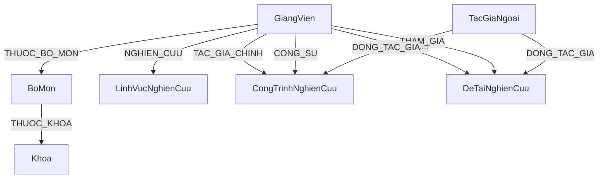
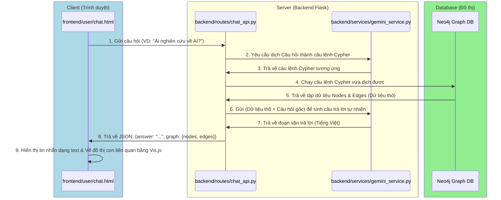
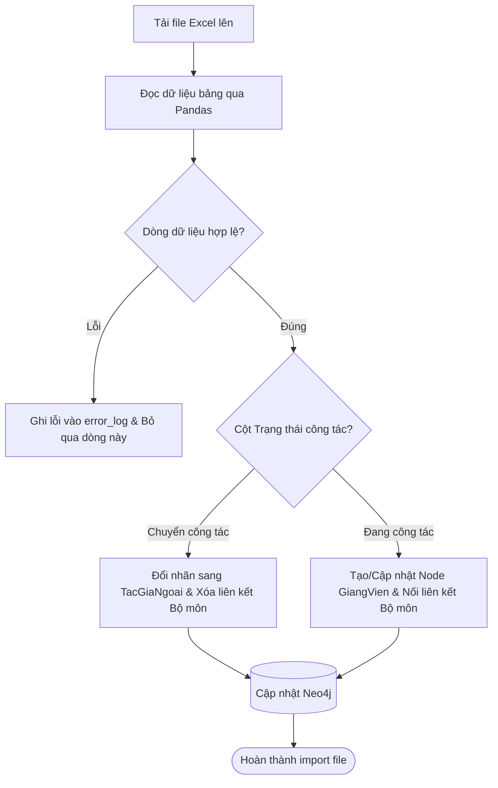
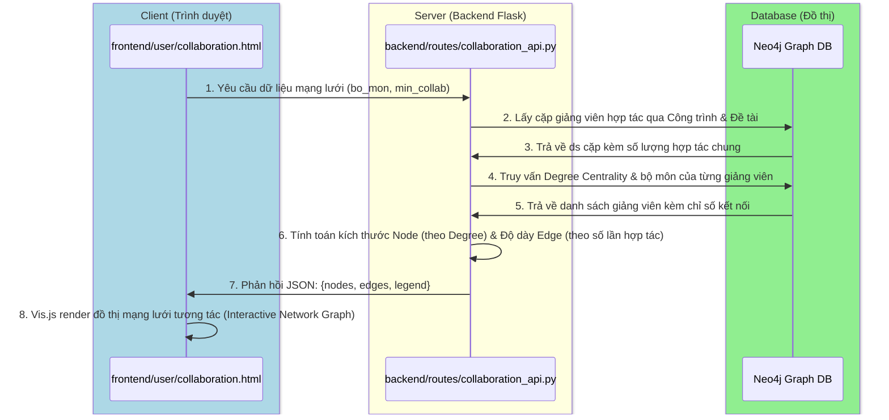
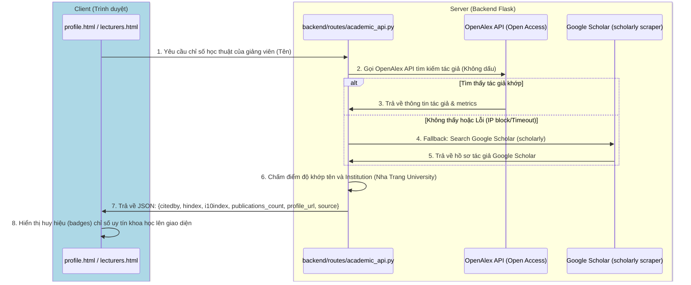
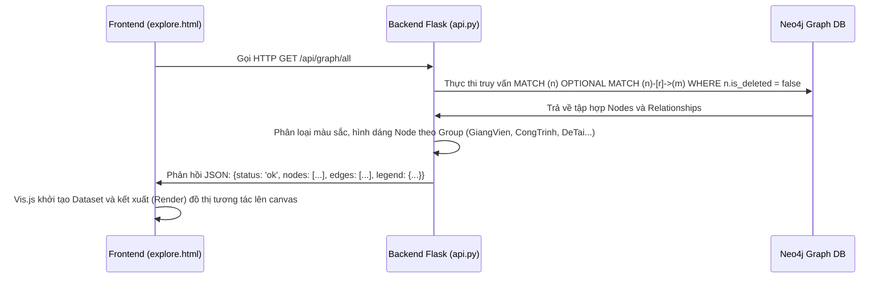

# Tài liệu Hướng dẫn Kiểm thử và Luồng Hoạt động Toàn diện Hệ thống Bản đồ Tri thức Nghiên cứu Khoa học (NTU)

Tài liệu này được biên soạn chi tiết nhằm phục vụ công tác kiểm thử hệ thống và hỗ trợ chuẩn bị bảo vệ đồ án tốt nghiệp. Nội dung bao gồm kiến trúc dữ liệu, luồng hoạt động (Data Flow/Workflows) chi tiết từ Frontend qua API Flask xuống Cơ sở dữ liệu đồ thị Neo4j, cùng các kịch bản kiểm thử (Test Cases) đặc biệt cho từng chức năng.

---

## KIẾN TRÚC HỆ THỐNG VÀ ĐỒ THỊ DỮ LIỆU (NEO4J SCHEMA)

Hệ thống hoạt động theo mô hình Client-Server với API RESTful:
* **Frontend:** Single/Multi-Page App sử dụng HTML5, CSS3 (Vanilla), Javascript ES6 và thư viện trực quan hóa đồ thị **Vis.js**.
* **Backend:** **Flask (Python)** xử lý logic, phân quyền người dùng, tích hợp API ngôn ngữ lớn (Gemini AI) và kết nối với Neo4j thông qua thư viện `neo4j-python-driver`.
* **Database:** **Neo4j** (Cơ sở dữ liệu đồ thị) lưu trữ các thực thể dưới dạng các Node và liên kết giữa chúng dưới dạng các Relationship.

### Sơ đồ quan hệ thực thể đồ thị (Neo4j Schema Diagram)



---

## PHẦN I: CÁC LUỒNG HOẠT ĐỘNG CỐT LÕI (CORE WORKFLOWS & DEFENSE TIPS)

### 1. Luồng Hỏi đáp Nghiên cứu qua AI (Chatbot AI - Graph-RAG)
*Đây là tính năng hiện đại nhất của đồ án, kết hợp giữa Trí tuệ nhân tạo (Gemini API) và Cơ sở dữ liệu đồ thị (Neo4j).*

#### A. Sơ đồ tuần tự (Sequence Diagram)


#### B. Giải thích chi tiết các bước
1. **Bước 1 (Frontend):** Người dùng nhập câu hỏi vào giao diện Chatbot. Trình duyệt thực hiện gửi yêu cầu `POST /api/chat/ask` chứa chuỗi câu hỏi.
2. **Bước 2 & 3 (Backend & AI):** Backend nhận câu hỏi. Do CSDL đồ thị Neo4j sử dụng ngôn ngữ truy vấn **Cypher**, backend không thể dùng SQL. Nó sẽ gửi câu hỏi kèm theo **Schema đồ thị** (danh sách tên Node, quan hệ) cho Gemini để Gemini dịch ngôn ngữ tự nhiên sang câu lệnh Cypher thích hợp.
3. **Bước 4 & 5 (Database):** Backend nhận câu lệnh Cypher, thực thi trực tiếp trên Neo4j thông qua driver. Neo4j trả về kết quả là danh sách các nút và liên kết tương quan trực tiếp.
4. **Bước 6 & 7 (AI tổng hợp câu trả lời):** Kết quả thô từ database rất khó đọc đối với người dùng bình thường. Backend gửi kết quả thô này quay lại Gemini cùng chỉ thị: *"Hãy dùng dữ liệu chính xác này để soạn câu trả lời đầy đủ, thân thiện bằng tiếng Việt cho người dùng"*. Gemini trả về đoạn text đã được trau chuốt.
5. **Bước 8 & 9 (Hiển thị):** Backend đóng gói cả đoạn text và tập dữ liệu đồ thị con trả về Frontend. Frontend in câu trả lời ra màn hình chat và dùng **Vis.js** dựng một đồ thị mini trực quan hóa ngay dưới tin nhắn để người dùng nhìn thấy sự kết nối.

> [!TIP]
> **Câu hỏi thầy cô hay hỏi:** *"Nếu API Gemini bị lỗi hoặc mất mạng thì Chatbot của em có bị chết không?"*
> **Cách trả lời:** *"Dạ thưa thầy/cô, hệ thống đã được thiết kế cơ chế dự phòng (Fallback). Nếu API Gemini không phản hồi hoặc gặp lỗi mạng, Backend sẽ tự động phát hiện và chuyển sang cơ chế tìm kiếm luật (Rule-based) bằng Regex để lọc từ khóa thô trong CSDL và trả về danh sách kết quả thay thế dạng bảng tĩnh, đảm bảo Chatbot không bị crash hoàn toàn."*

---

### 2. Luồng đề xuất & Phê duyệt cập nhật Hồ sơ Giảng viên (Pending Approval)
*Đảm bảo tính bảo mật và toàn vẹn dữ liệu: Giảng viên chỉ được đề xuất, chỉ Admin mới được ghi đè dữ liệu chính thức lên Đồ thị.*

#### A. Sơ đồ hoạt động (Activity Diagram)


#### B. Giải thích chi tiết các bước
1. **Bước 1 (Đề xuất sửa):** Khi giảng viên sửa thông tin cá nhân (ví dụ nâng học vị lên Tiến sĩ), yêu cầu sửa được gửi đi.
2. **Bước 2 (Lưu tạm):** Backend không ghi đè trực tiếp vào thuộc tính `hoc_vi` hiện tại của giảng viên. Thay vào đó, nó ghi vào một trường tạm là `pending_hoc_vi` trên node `GiangVien` đó và thiết lập thuộc tính `trang_thai_duyet = 'Chờ duyệt'`.
3. **Bước 3 (Hiển thị cho Admin):** Admin vào bảng điều khiển phê duyệt sẽ thấy các yêu cầu. Hệ thống hiển thị song song: **Thông tin hiện tại** (`hoc_vi`) và **Thông tin đề xuất** (`pending_hoc_vi`) để Admin đối chiếu.
4. **Bước 4 (Duyệt/Từ chối):**
   * Nếu **Admin Duyệt:** Backend thực hiện câu lệnh Cypher sao chép giá trị từ `pending_hoc_vi` sang `hoc_vi`, sau đó đặt thuộc tính `pending_hoc_vi = null` (xóa trường tạm) và đổi trạng thái duyệt thành `'Đã duyệt'`.
   * Nếu **Admin Từ chối:** Chỉ đặt các trường tạm `pending_...` bằng `null` và đổi trạng thái duyệt thành `'Từ chối'`. Dữ liệu chính thức trước đó hoàn toàn không bị ảnh hưởng.

> [!TIP]
> **Câu hỏi thầy cô hay hỏi:** *"Tại sao em không cho Giảng viên tự cập nhật luôn hồ sơ của mình cho nhanh?"*
> **Cách trả lời:** *"Dạ, vì đây là hệ thống học thuật của Khoa/Trường, dữ liệu hiển thị trên Bản đồ Tri thức ảnh hưởng đến uy tín khoa học công khai của đơn vị. Để tránh trường hợp giảng viên khai báo sai thông tin hoặc tài khoản giảng viên bị xâm nhập tự ý sửa đổi dữ liệu không kiểm soát, hệ thống bắt buộc phải áp dụng quy trình kiểm duyệt 2 bước (Maker-Checker) này."*

---

### 3. Luồng Nhập dữ liệu hàng loạt từ Excel & Chuyển đổi trạng thái Giảng viên
*Giải quyết bài toán đồng bộ hóa dữ liệu khoa học thực tế khi giảng viên chuyển công tác.*

#### A. Sơ đồ xử lý (Process Flow)


#### B. Giải thích chi tiết các bước
1. **Bước 1 (Tải và Đọc):** Admin upload tệp Excel chứa danh sách công trình/đề tài/giảng viên. Backend dùng thư viện Python (`pandas` / `openpyxl`) để đọc tệp dữ liệu.
2. **Bước 2 (Kiểm thử dòng hợp lệ):** Backend duyệt qua từng dòng dữ liệu trong bảng. Nếu một dòng bị thiếu thông tin bắt buộc (ví dụ không có Mã giảng viên), hệ thống sẽ ghi nhận dòng đó vào nhật ký lỗi để trả về cho Admin kiểm tra sau, tránh việc lỗi một dòng làm hủy bỏ toàn bộ quá trình tải dữ liệu của 99 dòng còn lại.
3. **Bước 3 (Xử lý giảng viên chuyển công tác):** Nếu cột trạng thái công tác của giảng viên ghi nhận là "Chuyển công tác" hoặc "Nghỉ hưu":
   - Hệ thống chạy câu lệnh Cypher để thay đổi nhãn (label) của node đó từ `GiangVien` thành `TacGiaNgoai` (Tác giả ngoài).
   - Xóa bỏ quan hệ `THUOC_BO_MON` nối node đó đến Bộ môn (vì họ không còn thuộc bộ môn nào của khoa nữa).
   - Tuy nhiên, các công trình nghiên cứu cũ của họ trong quá khứ vẫn được giữ nguyên liên kết trên bản đồ tri thức để phục vụ mục đích thống kê lịch sử của khoa.

> [!TIP]
> **Câu hỏi thầy cô hay hỏi:** *"Nếu import trùng một giảng viên đã có sẵn trong cơ sở dữ liệu đồ thị thì hệ thống xử lý thế nào?"*
> **Cách trả lời:** *"Dạ, hệ thống không dùng lệnh tạo mới thông thường (`CREATE`), mà sử dụng câu lệnh `MERGE` của Cypher dựa trên thuộc tính định danh duy nhất là Mã giảng viên (`ma_gv`). Nếu giảng viên đã tồn tại, hệ thống chỉ cập nhật thông tin thay đổi (`ON MATCH SET`), ngược lại mới tạo node mới (`ON CREATE SET`), đảm bảo không bao giờ xảy ra hiện tượng trùng lặp hoặc phân mảnh dữ liệu."*

---

### 4. Luồng Phân tích & Trực quan Mạng lưới Hợp tác Nghiên cứu (Co-authorship Network Flow)
*Cung cấp cái nhìn toàn cảnh về các nhóm nghiên cứu, sự liên kết liên bộ môn, và vai trò của từng giảng viên trong mạng lưới học thuật.*

#### A. Sơ đồ tuần tự (Sequence Diagram)


#### B. Giải thích chi tiết các bước
1. **Bước 1 & 2 (Truy vấn CSDL Đồ thị):** Khi người dùng xem trang Mạng lưới Hợp tác, Frontend gửi yêu cầu tới `/api/collaboration/graph`. Backend thực hiện hai truy vấn Cypher độc lập để tìm các cặp giảng viên cùng tham gia vào công trình (`CongTrinhNghienCuu`) hoặc đề tài (`DeTaiNghienCuu`) nghiên cứu.
2. **Bước 3 & 4 (Tính toán Chỉ số Đồ thị):** Dữ liệu thô được gộp lại tại Backend để tính tổng số lần hợp tác chung của mỗi cặp. Đồng thời, Backend tính toán **Degree Centrality** (Bậc kết nối - số lượng cộng sự duy nhất của mỗi người) để xác định tầm ảnh hưởng của giảng viên đó trong mạng lưới.
3. **Bước 5 & 6 (Chuẩn hóa tham số Trực quan):**
   - **Kích thước Node (Size):** Tỉ lệ thuận với Bậc kết nối (Degree Centrality), giúp nổi bật những "ngôi sao kết nối" hoặc "cầu nối liên bộ môn" (Bridge Connectors).
   - **Độ dày Cạnh (Width):** Tỉ lệ thuận với số lượng công trình/đề tài chung, thể hiện mức độ khăng khít của mối quan hệ hợp tác.
   - **Màu sắc Node:** Định nghĩa theo Bộ môn (`BoMon`) để dễ dàng nhận biết các cụm nghiên cứu nội bộ bộ môn hay hợp tác liên ngành.
4. **Bước 7 & 8 (Render):** Trả dữ liệu JSON chuẩn về cho Frontend để thư viện **Vis.js** vẽ mạng lưới liên kết thông minh, cho phép người dùng zoom, kéo thả và click vào từng node/edge để xem chi tiết.

> [!TIP]
> **Câu hỏi thầy cô hay hỏi:** *"Degree Centrality và Bridge Connector có ý nghĩa gì đối với công tác quản lý của Khoa?"*
> **Cách trả lời:** *"Dạ thưa thầy/cô, các chỉ số này giúp ban lãnh đạo Khoa nhận diện được các nhân tố cốt lõi trong hoạt động nghiên cứu. Giảng viên có Degree Centrality cao là những người năng nổ, có khả năng dẫn dắt nhóm. Bridge Connector là những người thúc đẩy nghiên cứu liên ngành giữa các bộ môn khác nhau (ví dụ Công nghệ phần mềm hợp tác với Mạng máy tính). Điều này hỗ trợ việc thành lập các nhóm nghiên cứu mạnh một cách khoa học."*

---

### 5. Luồng Đồng bộ Chỉ số Học thuật Quốc tế (Academic Citations Sync - OpenAlex & Google Scholar)
*Tự động lấy và đối sánh chỉ số khoa học thực tế (Citations, H-Index, i10-Index) từ các cơ sở dữ liệu thư mục toàn cầu.*

#### A. Sơ đồ tuần tự (Sequence Diagram)


#### B. Giải thích chi tiết các bước
1. **Bước 1 & 2 (Truy vấn nguồn chính):** Khi hiển thị chi tiết giảng viên, hệ thống sẽ tự động gọi `/api/academic/<name>`. Nguồn dữ liệu chính là **OpenAlex API** - một hệ thống danh mục học thuật mở (Open Access), nhanh chóng, hỗ trợ API chính thức và không bị giới hạn IP/Rate-limit nghiêm ngặt.
2. **Bước 3 (Thuật toán đối sánh thực thể):** Do trùng tên là hiện tượng rất phổ biến trên toàn cầu, backend cài đặt thuật toán chấm điểm độ tin cậy (Scoring Matcher):
   - Khớp tên chính xác: +150 điểm.
   - Cơ quan công tác cuối cùng (`last_known_institution`) hoặc lịch sử liên kết có chứa "Nha Trang University" hoặc "NTU": +200 điểm.
   - Nếu tổng điểm >= 100, hệ thống tự tin chọn tác giả này làm thực thể đại diện cho giảng viên đang tìm kiếm.
3. **Bước 4 & 5 (Cơ chế dự phòng Fallback):** Nếu OpenAlex không có dữ liệu hoặc gặp lỗi, hệ thống sẽ kích hoạt luồng phụ: cào dữ liệu từ **Google Scholar** thông qua thư viện `scholarly`. Truy vấn được tối ưu bằng cách ghép thêm tên trường (VD: "Nguyen Thanh Tu Nha Trang University") để tăng độ chính xác.
4. **Bước 6 & 7:** Trích xuất các chỉ số quan trọng: **Số lượng trích dẫn (Citations)**, **H-Index**, **i10-Index**, **Link profile gốc** và trả về Frontend hiển thị dạng Badge chuyên nghiệp.

> [!TIP]
> **Câu hỏi thầy cô hay hỏi:** *"Tại sao em không lưu trực tiếp chỉ số trích dẫn (Citations, H-Index) vào Neo4j luôn mà phải gọi API ngoài thời gian thực?"*
> **Cách trả lời:** *"Dạ, vì các chỉ số trích dẫn và ấn phẩm quốc tế thay đổi liên tục theo thời gian thực trên các nền tảng toàn cầu. Việc truy vấn Dynamic API giúp thông tin hiển thị luôn mới nhất và chính xác nhất mà không cần quản trị viên phải cập nhật thủ công hàng ngày. Điều này giúp hệ thống luôn đồng hành với dòng chảy tri thức thế giới mà không cần chi phí duy trì dữ liệu tĩnh."*

---

### 6. Luồng Quản lý Thùng rác Toàn cục & Khôi phục Phân quyền (Global Trash Bin & Two-Step Restoration Flow)
*Ngăn ngừa mất mát dữ liệu do vô tình xóa và đảm bảo tính nhất quán của cơ sở dữ liệu đồ thị khi khôi phục các mối quan hệ.*

#### A. Sơ đồ hoạt động (Activity Diagram)


#### B. Giải thích chi tiết các bước
1. **Bước 1 (Cơ chế Xóa mềm - Soft Delete):** Mọi hành động xóa thông thường trên hệ thống chỉ đặt thuộc tính `is_deleted = true` trên Node đó, chứ không dùng lệnh `DELETE` vật lý. Điều này giúp các liên kết đồ thị không bị gãy đột ngột và dữ liệu có thể khôi phục lại bất kỳ lúc nào.
2. **Bước 2 (Khôi phục có phân quyền):**
   - Đối với các mục nháp/chưa duyệt: Giảng viên có quyền tự bấm Khôi phục để đưa về lại danh sách quản lý cá nhân.
   - Đối với các mục đã duyệt chính thức (dữ liệu công khai): Giảng viên chỉ được gửi "Yêu cầu khôi phục". Đề xuất này sẽ được chuyển vào hàng đợi phê duyệt của Admin nhằm đảm bảo tính toàn vẹn của dữ liệu chung.
3. **Bước 3 (Xóa vĩnh viễn & Dọn dẹp Đồ thị):** Khi Admin bấm xóa vĩnh viễn trong thùng rác hệ thống:
   - Sử dụng lệnh Cypher `DETACH DELETE` để cắt bỏ toàn bộ các quan hệ kết nối trước khi hủy node, tránh lỗi cô lập dữ liệu.
   - Hệ thống tự động quét các node tác giả ngoài (`TacGiaNgoai`) liên quan. Nếu tác giả ngoài đó không còn liên kết với bất kỳ bài báo hay đề tài nào khác trong hệ thống (tác giả mồ côi), node tác giả ngoài đó cũng sẽ được xóa bỏ để giữ cho bộ nhớ CSDL đồ thị luôn tinh gọn, sạch sẽ.

> [!TIP]
> **Câu hỏi thầy cô hay hỏi:** *"Tại sao khi xóa vĩnh viễn lại phải dùng DETACH DELETE thay vì DELETE thông thường trong Neo4j?"*
> **Cách trả lời:** *"Dạ thưa thầy/cô, trong Cơ sở dữ liệu đồ thị Neo4j, một Node không thể bị xóa nếu nó vẫn còn các mối quan hệ (Relationships/Edges) kết nối tới các Node khác. Nếu dùng lệnh `DELETE` thông thường, Neo4j sẽ trả về lỗi vi phạm ràng buộc và chặn hành động đó. Sử dụng `DETACH DELETE` sẽ hướng dẫn Neo4j tự động tìm và xóa tất cả các quan hệ hướng vào và hướng ra của Node đó trước, sau đó mới xóa bản thân Node, giúp thao tác diễn ra trơn tru mà không lỗi hệ thống."*

---

## PHẦN II: LUỒNG HOẠT ĐỘNG & KIỂM THỬ CHO KHÁCH VÃNG LAI & SINH VIÊN

### Chức năng 1.1: Trực quan hóa Bản đồ Tri thức (Knowledge Map)
* **API Endpoint:** `GET /api/graph/all`
* **Tệp backend xử lý:** `backend/routes/api.py`

#### A. Luồng hoạt động (Data Flow)


#### B. Các trường hợp ngoại lệ & Kịch bản kiểm thử (Test Cases)
1. **Lọc trạng thái xóa mềm (`is_deleted`):**
   * *Ngoại lệ:* Có node hoặc quan hệ đã bị xóa mềm (`is_deleted: true`) vẫn xuất hiện trên bản đồ.
   * *Cách kiểm thử:* Thực hiện xóa mềm một công trình trong trang Admin, tải lại trang Khám phá và xác nhận công trình đó không còn tồn tại trên đồ thị.
2. **Đồ thị quá dày đặc (Dense Graph):**
   * *Ngoại lệ:* Trình duyệt bị đơ/lag do số lượng node quá lớn (>1000 nodes).
   * *Cách kiểm thử:* Bật chế độ tắt hiệu ứng vật lý tự động sau khi đồ thị ổn định (`stabilization: {iterations: 200}`) để tránh Vis.js liên tục tính toán lực đẩy Coulomb.

---

### Chức năng 1.2: Tìm kiếm Tổng hợp (Global Search)
* **API Endpoint:** `GET /api/search?q=<keyword>&type=<all|giang_vien|cong_trinh|de_tai>`
* **Tệp backend xử lý:** `backend/routes/api.py`

#### A. Luồng hoạt động (Data Flow)
1. **Frontend:** Người dùng gõ từ khóa tìm kiếm (Ví dụ: "Nguyễn Thanh Tú") vào thanh tìm kiếm.
2. **Backend:** Nhận tham số `q` (từ khóa) và `type` (bộ lọc phân loại).
3. **Database (Cypher Query):**
   ```cypher
   MATCH (n)
   WHERE (n:GiangVien OR n:CongTrinhNghienCuu OR n:DeTaiNghienCuu)
     AND (n.ho_va_ten CONTAINS $q OR n.ten_cong_trinh CONTAINS $q OR n.ten_de_tai CONTAINS $q)
     AND coalesce(n.is_deleted, false) = false
   RETURN n LIMIT 10
   ```
4. **Phản hồi:** Trả về danh sách kết quả đã được chuẩn hóa kèm theo thông tin nhãn để hiển thị biểu tượng tương ứng.

#### B. Các trường hợp ngoại lệ & Kịch bản kiểm thử (Test Cases)
1. **Tìm kiếm tiếng Việt không dấu và chữ hoa/thường:**
   * *Ngoại lệ:* Tìm kiếm "nguyen thanh tu" không ra kết quả của giảng viên "Nguyễn Thanh Tú".
   * *Cách kiểm thử:* Gõ tìm kiếm không dấu, hệ thống phải thực hiện chuyển đổi chữ hoa/thường và không dấu (hoặc sử dụng hàm `toLower()` kết hợp regex trong Cypher) để hiển thị chính xác kết quả.
2. **Nhập ký tự đặc biệt nguy hiểm (Cypher Injection):**
   * *Ngoại lệ:* Người dùng cố tình nhập `' OR 1=1 OR n.id = '` để phá câu lệnh Cypher.
   * *Cách kiểm thử:* Gõ các ký tự phá câu lệnh truy vấn. Đảm bảo driver Neo4j sử dụng tham số hóa truy vấn (parameterized queries) dạng `$q` chứ không cộng chuỗi trực tiếp.

---

## PHẦN III: LUỒNG HOẠT ĐỘNG & KIỂM THỬ CHO GIẢNG VIÊN

### Chức năng 2.2: Quy trình Thêm / Sửa / Xóa mềm Công trình và Đề tài
* **API Endpoint:** 
  * `POST /api/lecturer/publications` (Thêm mới)
  * `PUT /api/lecturer/publications/<id>` (Chỉnh sửa)
  * `DELETE /api/lecturer/publications/<id>` (Yêu cầu xóa)
* **Tệp backend xử lý:** `backend/routes/lecturer_api.py`

#### A. Luồng hoạt động (Data Flow)
1. **Thêm mới:** Giảng viên điền thông tin công trình/đề tài -> Gửi yêu cầu -> Node mới được tạo với thuộc tính `trang_thai = 'Chờ duyệt'` và `is_deleted = false`. Chỉ xuất hiện trong màn hình cá nhân của giảng viên, ẩn hoàn toàn trên bản đồ tri thức công khai.
2. **Chỉnh sửa:**
   * Sửa một mục đang `'Chờ duyệt'`: Backend cập nhật trực tiếp dữ liệu và giữ nguyên trạng thái chờ duyệt.
   * Sửa một mục đã `'Đã duyệt'`: Backend cập nhật dữ liệu đồng thời tự động reset trạng thái về lại `'Chờ duyệt'`. Mục này lập tiếp bị ẩn khỏi bản đồ tri thức công khai cho đến khi Admin duyệt lại.
3. **Yêu cầu Xóa:**
   * *Luồng xóa:*
   ```mermaid
   graph TD
       Start[Bấm nút Xóa] --> CheckState{Trạng thái công trình?}
       CheckState -->|Đang Chờ duyệt hoặc Bị từ chối| DeleteSoft[Xóa mềm trực tiếp: Set is_deleted = true]
       CheckState -->|Đã duyệt / Hoàn thành| RequestDelete[Chuyển trạng thái sang 'Yêu cầu xóa' chờ Admin duyệt]
       DeleteSoft --> End[Vào Thùng rác giảng viên]
       RequestDelete --> End
   ```

#### B. Các trường hợp ngoại lệ & Kịch bản kiểm thử (Test Cases)
1. **Mối quan hệ liên kết kép của tác giả:**
   * *Ngoại lệ:* Khi thêm đề tài/bài báo, giảng viên gán nhầm bản thân vừa làm `CHU_NHIEM` vừa làm `THAM_GIA`.
   * *Cách kiểm thử:* Backend phải kiểm tra logic trước khi tạo quan hệ. Nếu giảng viên đã có quan hệ `CHU_NHIEM` thì không tạo quan hệ `THAM_GIA` để tối ưu số lượng cạnh trong cơ sở dữ liệu đồ thị.
2. **Trùng lặp tiêu đề bài báo (Unique Slug):**
   * *Ngoại lệ:* Đăng ký bài báo trùng tiêu đề hoàn toàn.
   * *Cách kiểm thử:* Backend sử dụng hàm tạo slug tự động. Nếu slug đã tồn tại, tự động nối thêm hậu tố số (VD: `-1`, `-2`) để tránh lỗi trùng định danh URL.

---

### Chức năng 2.3: Thùng rác Cá nhân của Giảng viên (Lecturer Trash Bin)
* **API Endpoint:** 
  * `GET /api/lecturer/trash` (Xem danh sách thùng rác)
  * `PUT /api/lecturer/trash/<type>/<id>/restore` (Khôi phục)
  * `DELETE /api/lecturer/trash/<type>/<id>/permanent` (Xóa vĩnh viễn)

#### A. Luồng hoạt động (Data Flow)
1. **Xem thùng rác:** Truy vấn các node do giảng viên sở hữu có thuộc tính `is_deleted = true`.
2. **Khôi phục:**
   * Nếu trước khi xóa ở trạng thái `'Chờ duyệt'`: Set `is_deleted = false` và đưa về lại danh sách nháp của giảng viên.
   * Nếu trước khi xóa ở trạng thái `'Đã duyệt'`: Chuyển trạng thái sang `'Yêu cầu khôi phục'` để gửi tới Admin phê duyệt, đảm bảo giảng viên không tự ý khôi phục dữ liệu chính thức mà không kiểm soát.
3. **Xóa vĩnh viễn:** Thực thi câu lệnh Cypher:
   ```cypher
   MATCH (n {id: $id}) DETACH DELETE n
   ```

#### B. Các trường hợp ngoại lệ & Kịch bản kiểm thử (Test Cases)
1. **Ảnh hưởng đến cộng tác viên khác:**
   * *Ngoại lệ:* Giảng viên A bấm xóa vĩnh viễn đề tài nghiên cứu làm chung với giảng viên B trong thùng rác của giảng viên A.
   * *Cách kiểm thử:* Cần kiểm tra xem giảng viên B có bị mất đề tài không. Vì đề tài là node chung trên đồ thị, hành động xóa vĩnh viễn (`DETACH DELETE`) sẽ xóa sạch node đó khỏi hệ thống. Hệ thống phải hiển thị cảnh báo cảnh báo giảng viên A: *"Đề tài này có sự tham gia của giảng viên khác. Xóa vĩnh viễn sẽ làm mất dữ liệu của họ."*

---

## PHẦN IV: LUỒNG HOẠT ĐỘNG & KIỂM THỬ CHO QUẢN TRỊ VIÊN (ADMIN)

### Chức năng 3.2: Phê duyệt hàng đợi yêu cầu (Pending Approval)
* **Tệp backend xử lý:** `backend/routes/admin_lecturers.py`, `backend/routes/admin_trash.py`

#### A. Luồng hoạt động (Data Flow)
1. Admin xem danh sách các yêu cầu đang chờ xử lý (Hồ sơ giảng viên, Công trình mới, Yêu cầu xóa, Yêu cầu khôi phục).
2. **Duyệt cập nhật thông tin:** Backend copy các giá trị từ các trường tạm thời (ví dụ `pending_hoc_vi`) sang trường chính thức (`hoc_vi`), sau đó xóa sạch dữ liệu tạm thời để giải phóng bộ nhớ.
3. **Từ chối cập nhật:** Backend chỉ cần xóa sạch dữ liệu trong các trường tạm thời (ví dụ set `pending_hoc_vi = null`) và giữ nguyên dữ liệu gốc hiện tại của giảng viên.

#### B. Các trường hợp ngoại lệ & Kịch bản kiểm thử (Test Cases)
1. **Duyệt xóa công trình có tác giả ngoài:**
   * *Ngoại lệ:* Khi Admin duyệt xóa một bài báo có liên kết với một Tác giả ngoài. Node Tác giả ngoài có bị mồ côi (không liên kết với bất kỳ bài viết nào khác) không?
   * *Cách kiểm thử:* Thực hiện duyệt yêu cầu xóa bài báo. Hệ thống phải kiểm tra xem node `TacGiaNgoai` liên quan còn liên kết với bài báo nào khác không. Nếu không còn liên kết nào, hệ thống nên xóa mềm luôn node tác giả ngoài đó để giữ sạch tài nguyên đồ thị CSDL.
