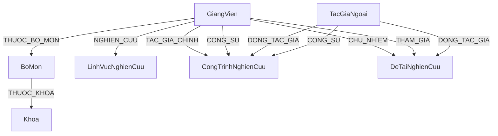
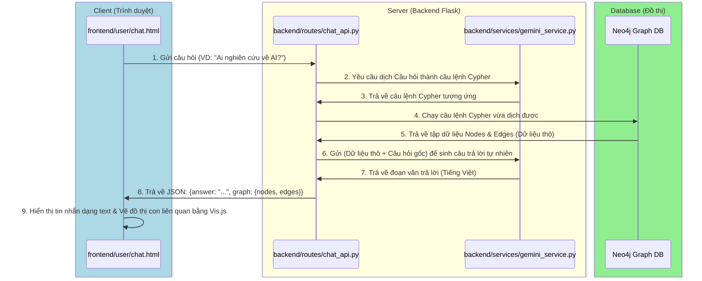
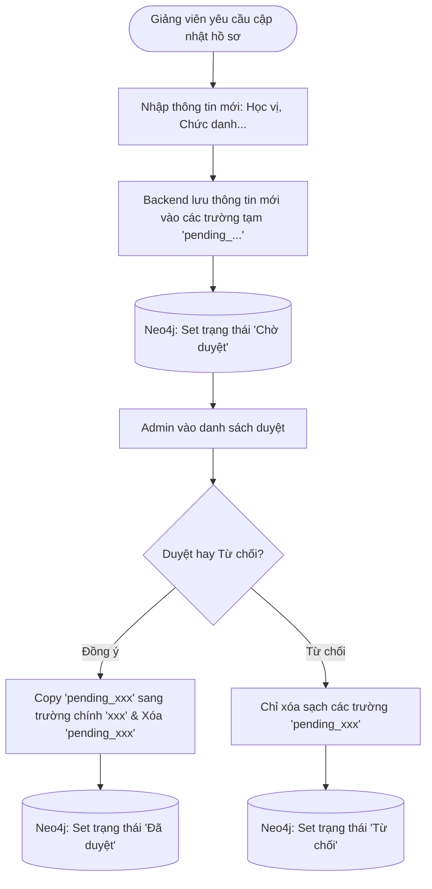
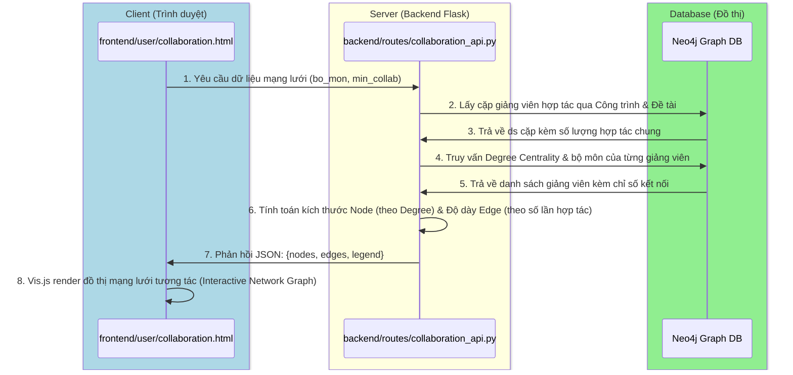
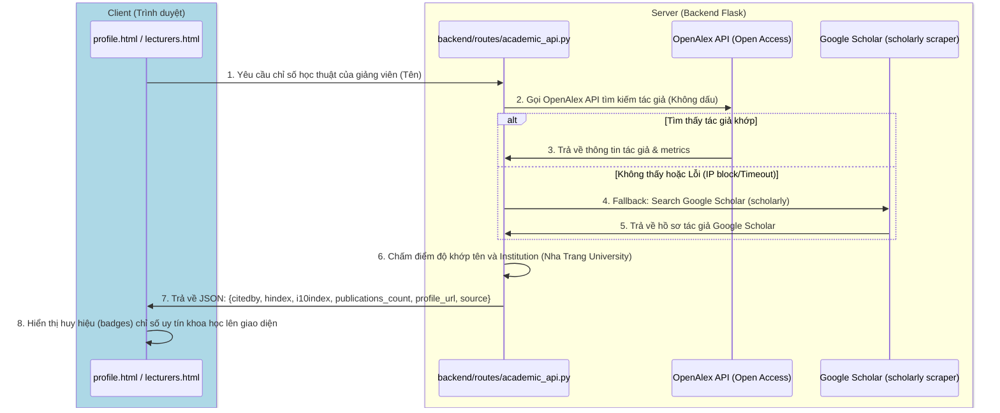
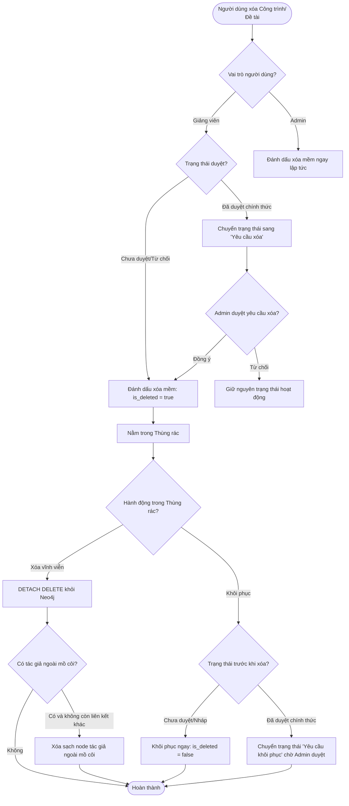

# Hướng dẫn Kiểm thử và Danh mục Chức năng Hệ thống Bản đồ Tri thức Nghiên cứu Khoa học (NTU)

Tài liệu này cung cấp toàn bộ danh mục chức năng của hệ thống phân chia theo 3 nhóm người dùng (**Khách vãng lai / Sinh viên**, **Giảng viên**, **Quản trị viên**), mô tả các luồng dữ liệu chính và hướng dẫn kiểm thử chi tiết từng chức năng để phục vụ quá trình nghiệm thu, kiểm thử và chuẩn bị bảo vệ đồ án tốt nghiệp.

---

## KIẾN TRÚC HỆ THỐNG VÀ ĐỒ THỊ DỮ LIỆU (NEO4J SCHEMA)

Hệ thống hoạt động theo mô hình Client-Server với API RESTful:
* **Frontend:** Trang web tương tác sử dụng HTML5, CSS3 (Vanilla), Javascript ES6 và thư viện trực quan hóa đồ thị **Vis.js**.
* **Backend:** **Flask (Python)** xử lý logic, phân quyền người dùng, tích hợp API ngôn ngữ lớn (Gemini AI) và kết nối với Neo4j thông qua thư viện `neo4j-python-driver`.
* **Database:** **Neo4j** (Cơ sở dữ liệu đồ thị) lưu trữ các thực thể dưới dạng các Node và liên kết giữa chúng dưới dạng các Relationship.

### Sơ đồ quan hệ thực thể đồ thị (Neo4j Schema Diagram)



---

## PHẦN I: CÁC LUỒNG HOẠT ĐỘNG CỐT LÕI (CORE WORKFLOWS & DEFENSE TIPS)

### 1. Luồng Hỏi đáp Nghiên cứu qua AI (Chatbot AI - Graph-RAG)
*Đây là tính năng hiện đại nhất của đồ án, kết hợp giữa Trí tuệ nhân tạo (Gemini API) và Cơ sở dữ liệu đồ thị (Neo4j).*

#### A. Sơ đồ tuần tự (Sequence Diagram)


#### B. Giải thích chi tiết các bước
1. **Bước 1 (Frontend):** Người dùng nhập câu hỏi vào giao diện Chatbot. Trình duyệt thực hiện gửi yêu cầu `POST /api/chat/ask` chứa chuỗi câu hỏi.
2. **Bước 2 & 3 (Backend & AI):** Backend nhận câu hỏi. Do CSDL đồ thị Neo4j sử dụng ngôn ngữ truy vấn **Cypher**, backend không thể dùng SQL. Nó sẽ gửi câu hỏi kèm theo **Schema đồ thị** (danh sách tên Node, quan hệ) cho Gemini để Gemini dịch ngôn ngữ tự nhiên sang câu lệnh Cypher thích hợp.
3. **Bước 4 & 5 (Database):** Backend nhận câu lệnh Cypher, thực thi trực tiếp trên Neo4j thông qua driver. Neo4j trả về kết quả là danh sách các nút và liên kết tương quan trực tiếp.
4. **Bước 6 & 7 (AI tổng hợp câu trả lời):** Kết quả thô từ database rất khó đọc đối với người dùng bình thường. Backend gửi kết quả thô này quay lại Gemini cùng chỉ thị: *"Hãy dùng dữ liệu chính xác này để soạn câu trả lời đầy đủ, thân thiện bằng tiếng Việt cho người dùng"*. Gemini trả về đoạn text đã được trau chuốt.
5. **Bước 8 & 9 (Hiển thị):** Backend đóng gói cả đoạn text và tập dữ liệu đồ thị con trả về Frontend. Frontend in câu trả lời ra màn hình chat và dùng **Vis.js** dựng một đồ thị mini trực quan hóa ngay dưới tin nhắn để người dùng nhìn thấy sự kết nối.

> [!TIP]
> **Câu hỏi thầy cô hay hỏi:** *"Nếu API Gemini bị lỗi hoặc mất mạng thì Chatbot của em có bị chết không?"*
> **Cách trả lời:** *"Dạ thưa thầy/cô, hệ thống đã được thiết kế cơ chế dự phòng (Fallback). Nếu API Gemini không phản hồi hoặc gặp lỗi mạng, Backend sẽ tự động phát hiện và chuyển sang cơ chế tìm kiếm luật (Rule-based) bằng Regex để lọc từ khóa thô trong CSDL và trả về danh sách kết quả thay thế dạng bảng tĩnh, đảm bảo Chatbot không bị crash hoàn toàn."*

---

### 2. Luồng đề xuất & Phê duyệt cập nhật Hồ sơ Giảng viên (Pending Approval)
*Đảm bảo tính bảo mật và toàn vẹn dữ liệu: Giảng viên chỉ được đề xuất, chỉ Admin mới được ghi đè dữ liệu chính thức lên Đồ thị.*

#### A. Sơ đồ hoạt động (Activity Diagram)


#### B. Giải thích chi tiết các bước
1. **Bước 1 (Đề xuất sửa):** Khi giảng viên sửa thông tin cá nhân (ví dụ nâng học vị lên Tiến sĩ), yêu cầu sửa được gửi đi.
2. **Bước 2 (Lưu tạm):** Backend không ghi đè trực tiếp vào thuộc tính `hoc_vi` hiện tại của giảng viên. Thay vào đó, nó ghi vào một trường tạm là `pending_hoc_vi` trên node `GiangVien` đó và thiết lập thuộc tính `trang_thai_duyet = 'Chờ duyệt'`.
3. **Bước 3 (Hiển thị cho Admin):** Admin vào bảng điều khiển phê duyệt sẽ thấy các yêu cầu. Hệ thống hiển thị song song: **Thông tin hiện tại** (`hoc_vi`) và **Thông tin đề xuất** (`pending_hoc_vi`) để Admin đối chiếu.
4. **Bước 4 (Duyệt/Từ chối):**
   * Nếu **Admin Duyệt:** Backend thực hiện câu lệnh Cypher sao chép giá trị từ `pending_hoc_vi` sang `hoc_vi`, sau đó đặt thuộc tính `pending_hoc_vi = null` (xóa trường tạm) và đổi trạng thái duyệt thành `'Đã duyệt'`.
   * Nếu **Admin Từ chối:** Chỉ đặt các trường tạm `pending_...` bằng `null` và đổi trạng thái duyệt thành `'Từ chối'`. Dữ liệu chính thức trước đó hoàn toàn không bị ảnh hưởng.

> [!TIP]
> **Câu hỏi thầy cô hay hỏi:** *"Tại sao em không cho Giảng viên tự cập nhật luôn hồ sơ của mình cho nhanh?"*
> **Cách trả lời:** *"Dạ, vì đây là hệ thống học thuật của Khoa/Trường, dữ liệu hiển thị trên Bản đồ Tri thức ảnh hưởng đến uy tín khoa học công khai của đơn vị. Để tránh trường hợp giảng viên khai báo sai thông tin hoặc tài khoản giảng viên bị xâm nhập tự ý sửa đổi dữ liệu không kiểm soát, hệ thống bắt buộc phải áp dụng quy trình kiểm duyệt 2 bước (Maker-Checker) này."*

---

### 3. Luồng Nhập dữ liệu hàng loạt từ Excel & Chuyển đổi trạng thái Giảng viên
*Giải quyết bài toán đồng bộ dữ liệu khoa học thực tế và chuẩn hóa trạng thái.*

#### A. Sơ đồ xử lý (Process Flow)


#### B. Giải thích chi tiết các bước
1. **Bước 1 (Tải và Đọc):** Admin upload tệp Excel chứa danh sách công trình/đề tài/giảng viên. Backend dùng thư viện Python (`pandas` / `openpyxl`) để đọc tệp dữ liệu.
2. **Bước 2 (Kiểm thử dòng hợp lệ):** Backend duyệt qua từng dòng dữ liệu trong bảng. Nếu một dòng bị thiếu thông tin bắt buộc (ví dụ không có Mã giảng viên), hệ thống sẽ ghi nhận dòng đó vào nhật ký lỗi để trả về cho Admin kiểm tra sau, tránh việc lỗi một dòng làm hủy bỏ toàn bộ quá trình tải dữ liệu của các dòng khác.
3. **Bước 3 (Xử lý giảng viên chuyển công tác):** Nếu cột trạng thái công tác của giảng viên ghi nhận là "Chuyển công tác" hoặc "Nghỉ hưu":
   - Hệ thống chạy câu lệnh Cypher để thay đổi nhãn (label) của node đó từ `GiangVien` thành `TacGiaNgoai` (Tác giả ngoài).
   - Xóa bỏ quan hệ `THUOC_BO_MON` nối node đó đến Bộ môn.
   - Tuy nhiên, các công trình nghiên cứu cũ của họ trong quá khứ vẫn được giữ nguyên liên kết trên bản đồ tri thức để phục vụ mục đích thống kê lịch sử của khoa.

---

### 4. Luồng Phân tích & Trực quan Mạng lưới Hợp tác Nghiên cứu (Co-authorship Network Flow)
*Cung cấp cái nhìn toàn cảnh về các nhóm nghiên cứu và vai trò của từng giảng viên trong mạng lưới học thuật.*

#### A. Sơ đồ tuần tự (Sequence Diagram)


#### B. Giải thích chi tiết các bước
1. **Bước 1 & 2 (Truy vấn CSDL Đồ thị):** Khi người dùng xem trang Mạng lưới Hợp tác, Frontend gửi yêu cầu tới `/api/collaboration/graph`. Backend thực hiện hai truy vấn Cypher độc lập để tìm các cặp giảng viên cùng tham gia vào công trình (`CongTrinhNghienCuu`) hoặc đề tài (`DeTaiNghienCuu`) nghiên cứu.
2. **Bước 3 & 4 (Tính toán Chỉ số Đồ thị):** Dữ liệu thô được gộp lại tại Backend để tính tổng số lần hợp tác chung của mỗi cặp. Đồng thời, Backend tính toán **Degree Centrality** (Bậc kết nối - số lượng cộng sự duy nhất của mỗi người) để xác định tầm ảnh hưởng của giảng viên đó trong mạng lưới.
3. **Bước 5 & 6 (Chuẩn hóa tham số Trực quan):**
   - **Kích thước Node (Size):** Tỉ lệ thuận với Bậc kết nối (Degree Centrality), giúp nổi bật những "ngôi sao kết nối" hoặc "cầu nối liên bộ môn" (Bridge Connectors).
   - **Độ dày Cạnh (Width):** Tỉ lệ thuận với số lượng công trình/đề tài chung, thể hiện mức độ khăng khít của mối quan hệ hợp tác.
   - **Màu sắc Node:** Định nghĩa theo Bộ môn (`BoMon`) để dễ dàng nhận biết các cụm nghiên cứu nội bộ bộ môn hay hợp tác liên ngành.
4. **Bước 7 & 8 (Render):** Trả dữ liệu JSON chuẩn về cho Frontend để thư viện **Vis.js** vẽ mạng lưới liên kết thông minh, cho phép người dùng zoom, kéo thả và click vào từng node/edge để xem chi tiết.

---

### 5. Luồng Đồng bộ Chỉ số Học thuật Quốc tế (Academic Citations Sync - OpenAlex & Google Scholar)
*Tự động lấy và đối sánh chỉ số khoa học thực tế (Citations, H-Index, i10-Index) từ các cơ sở dữ liệu thư mục toàn cầu.*

#### A. Sơ đồ tuần tự (Sequence Diagram)


#### B. Giải thích chi tiết các bước
1. **Bước 1 & 2 (Truy vấn nguồn chính):** Khi hiển thị chi tiết giảng viên, hệ thống sẽ tự động gọi `/api/academic/<name>`. Nguồn dữ liệu chính là **OpenAlex API** - một hệ thống danh mục học thuật mở (Open Access), nhanh chóng, hỗ trợ API chính thức và không bị giới hạn IP/Rate-limit nghiêm ngặt.
2. **Bước 3 (Thuật toán đối sánh thực thể):** Do trùng tên là hiện tượng rất phổ biến trên toàn cầu, backend cài đặt thuật toán chấm điểm độ tin cậy (Scoring Matcher):
   - Khớp tên chính xác: +150 điểm.
   - Cơ quan công tác cuối cùng (`last_known_institution`) hoặc lịch sử liên kết có chứa "Nha Trang University" hoặc "NTU": +200 điểm.
   - Nếu tổng điểm >= 100, hệ thống tự tin chọn tác giả này làm thực thể đại diện cho giảng viên đang tìm kiếm.
3. **Bước 4 & 5 (Cơ chế dự phòng Fallback):** Nếu OpenAlex không có dữ liệu hoặc gặp lỗi, hệ thống sẽ kích hoạt luồng phụ: cào dữ liệu từ **Google Scholar** thông qua thư viện `scholarly`. Truy vấn được tối ưu bằng cách ghép thêm tên trường (VD: "Nguyen Thanh Tu Nha Trang University") để tăng độ chính xác.
4. **Bước 6 & 7:** Trích xuất các chỉ số quan trọng: **Số lượng trích dẫn (Citations)**, **H-Index**, **i10-Index**, **Link profile gốc** và trả về Frontend hiển thị dạng Badge chuyên nghiệp.

> [!TIP]
> **Câu hỏi thầy cô hay hỏi:** *"Tại sao em không lưu trực tiếp chỉ số trích dẫn (Citations, H-Index) vào Neo4j luôn mà phải gọi API ngoài thời gian thực?"*
> **Cách trả lời:** *"Dạ, vì các chỉ số trích dẫn và ấn phẩm quốc tế thay đổi liên tục theo thời gian thực trên các nền tảng toàn cầu. Việc truy vấn Dynamic API giúp thông tin hiển thị luôn mới nhất và chính xác nhất mà không cần quản trị viên phải cập nhật thủ công hàng ngày. Điều này giúp hệ thống luôn đồng hành với dòng chảy tri thức thế giới mà không cần chi phí duy trì dữ liệu tĩnh."*

---

### 6. Luồng Quản lý Thùng rác Toàn cục & Khôi phục Phân quyền (Global Trash Bin & Two-Step Restoration Flow)
*Ngăn ngừa mất mát dữ liệu do vô tình xóa và đảm bảo tính nhất quán của cơ sở dữ liệu đồ thị khi khôi phục các mối quan hệ.*

#### A. Sơ đồ hoạt động (Activity Diagram)


#### B. Giải thích chi tiết các bước
1. **Bước 1 (Cơ chế Xóa mềm - Soft Delete):** Mọi hành động xóa thông thường trên hệ thống chỉ đặt thuộc tính `is_deleted = true` trên Node đó, chứ không dùng lệnh `DELETE` vật lý. Điều này giúp các liên kết đồ thị không bị gãy đột ngột và dữ liệu có thể khôi phục lại bất kỳ lúc nào.
2. **Bước 2 (Khôi phục có phân quyền):**
   - Đối với các mục nháp/chưa duyệt: Giảng viên có quyền tự bấm Khôi phục để đưa về lại danh sách quản lý cá nhân.
   - Đối với các mục đã duyệt chính thức (dữ liệu công khai): Giảng viên chỉ được gửi "Yêu cầu khôi phục". Đề xuất này sẽ được chuyển vào hàng đợi phê duyệt của Admin nhằm đảm bảo tính toàn vẹn của dữ liệu chung.
3. **Bước 3 (Xóa vĩnh viễn & Dọn dẹp Đồ thị):** Khi Admin bấm xóa vĩnh viễn trong thùng rác hệ thống:
   - Sử dụng lệnh Cypher `DETACH DELETE` để cắt bỏ toàn bộ các quan hệ kết nối trước khi hủy node, tránh lỗi cô lập dữ liệu.
   - Hệ thống tự động quét các node tác giả ngoài (`TacGiaNgoai`) liên quan. Nếu tác giả ngoài đó không còn liên kết với bất kỳ bài báo hay đề tài nào khác trong hệ thống (tác giả mồ côi), node tác giả ngoài đó cũng sẽ được xóa bỏ để giữ cho bộ nhớ CSDL đồ thị luôn tinh gọn, sạch sẽ.

> [!TIP]
> **Câu hỏi thầy cô hay hỏi:** *"Tại sao khi xóa vĩnh viễn lại phải dùng DETACH DELETE thay vì DELETE thông thường trong Neo4j?"*
> **Cách trả lời:** *"Dạ thưa thầy/cô, trong Cơ sở dữ liệu đồ thị Neo4j, một Node không thể bị xóa nếu nó vẫn còn các mối quan hệ (Relationships/Edges) kết nối tới các Node khác. Nếu dùng lệnh `DELETE` thông thường, Neo4j sẽ trả về lỗi vi phạm ràng buộc và chặn hành động đó. Sử dụng `DETACH DELETE` sẽ hướng dẫn Neo4j tự động tìm và xóa tất cả các quan hệ hướng vào và hướng ra của Node đó trước, sau đó mới xóa bản thân Node, giúp thao tác diễn ra trơn tru mà không lỗi hệ thống."*

---

## PHẦN II: DANH MỤC CHỨC NĂNG & KỊCH BẢN KIỂM THỬ THEO NHÓM NGỜI DÙNG

---

### NHÓM 1: KHÁCH VÃNG LAI & SINH VIÊN (GUEST / STUDENT)

#### Chức năng 1.1: Trực quan hóa Bản đồ Tri thức (Knowledge Map Visualization)
* **Mô tả:** Hiển thị mạng lưới kết nối trực quan giữa giảng viên, đề tài, bộ môn, khoa và lĩnh vực bằng Vis.js. Cho phép tìm kiếm nhanh, lọc theo phân loại thực thể, zoom, kéo thả và tương tác.
* **API:** `GET /api/graph/all`
* **Kịch bản kiểm thử (Test Case):**
  1. **Bước 1:** Truy cập trang chủ Khám phá (`explore.html`).
  2. **Bước 2:** Click chọn bộ lọc phân loại thực thể phía dưới thanh tìm kiếm (ví dụ: Giảng viên, Công trình hoặc Đề tài).
  3. **Bước 3:** Nhấp chuột vào một nút Giảng viên trên đồ thị Vis.js.
  4. **Kết quả kỳ vọng:** 
     - Đồ thị Vis.js hiển thị đầy đủ, mượt mà các nút và liên kết.
     - Khi lọc phân loại thực thể hoặc tìm kiếm, danh sách kết quả phù hợp sẽ hiển thị ở bảng phía trên đồ thị.
     - Khi nhấp vào nút Giảng viên, một panel chi tiết hoặc modal mở ra hiển thị thông tin chính xác của giảng viên đó.
  5. **Xác thực CSDL:** Đảm bảo các node đã xóa mềm (`is_deleted = true`) không xuất hiện trên giao diện.
     ```cypher
     MATCH (n) WHERE coalesce(n.is_deleted, false) = true RETURN count(n) AS should_be_zero_on_ui
     ```

#### Chức năng 1.2: Tìm kiếm tổng hợp (Global Search)
* **Mô tả:** Tìm kiếm nhanh giảng viên, đề tài, công trình bằng tiếng Việt có dấu, không dấu, chữ hoa, chữ thường.
* **API:** `GET /api/search?q=<keyword>&type=<all|giang_vien|cong_trinh|de_tai>`
* **Kịch bản kiểm thử (Test Case):**
  1. **Bước 1:** Nhập từ khóa tiếng Việt không dấu: `nguyen thanh tu` vào ô tìm kiếm.
  2. **Bước 2:** Nhấn Tìm kiếm.
  3. **Bước 3:** Nhập chuỗi ký tự đặc biệt nguy hiểm: `' OR 1=1 OR n.id = '` để kiểm tra bảo mật (Cypher Injection).
  4. **Kết quả kỳ vọng:**
     - Tìm kiếm "nguyen thanh tu" trả về kết quả chính xác của "Nguyễn Thanh Tú" (hệ thống xử lý chuẩn hóa không dấu tự động).
     - Khi nhập chuỗi ký tự đặc biệt, hệ thống không báo lỗi 500 hoặc rò rỉ dữ liệu (backend dùng tham số hóa truy vấn an toàn).

#### Chức năng 1.3: Chatbot AI hỏi đáp nghiên cứu (Graph-RAG Chatbot)
* **Mô tả:** Người dùng trò chuyện tự nhiên với AI để hỏi về thông tin nghiên cứu trong khoa.
* **API:** `POST /api/chat/ask`
* **Kịch bản kiểm thử (Test Case):**
  1. **Bước 1:** Nhập câu hỏi: "Ai nghiên cứu về AI và Machine Learning?".
  2. **Bước 2:** Bấm gửi.
  3. **Bước 3:** Tắt kết nối internet của máy chủ (hoặc cấu hình sai API Key Gemini) và gửi lại câu hỏi.
  4. **Kết quả kỳ vọng:**
     - Ở bước 2: AI trả về câu trả lời tự nhiên chính xác và vẽ đồ thị con (Sub-graph) tương tác chứa các nút giảng viên nghiên cứu lĩnh vực đó.
     - Ở bước 3: Hệ thống kích hoạt cơ chế Fallback thành công, không bị crash, hiển thị câu trả lời dưới dạng danh sách/bảng tĩnh được trích xuất từ Regex tìm kiếm thô.

#### Chức năng 1.4: Trực quan mạng lưới hợp tác (Co-authorship Network)
* **Mô tả:** Xem mạng lưới các giảng viên hợp tác viết bài báo hoặc làm đề tài khoa học chung, hỗ trợ lọc theo Bộ môn và số lượng hợp tác tối thiểu.
* **API:** `GET /api/collaboration/graph`
* **Kịch bản kiểm thử (Test Case):**
  1. **Bước 1:** Truy cập trang Mạng lưới hợp tác (`collaboration.html`).
  2. **Bước 2:** Chọn bộ lọc Bộ môn (ví dụ: Công nghệ phần mềm) và/hoặc điều chỉnh thanh trượt "Số hợp tác tối thiểu" lên mức `2`, sau đó bấm nút "Cập nhật đồ thị".
  3. **Kết quả kỳ vọng:**
     - Khi chọn bộ lọc Bộ môn, đồ thị chỉ hiển thị các giảng viên thuộc Bộ môn được chọn và các mối quan hệ hợp tác của họ.
     - Khi tăng số lượng hợp tác tối thiểu lên `2`, đồ thị chỉ hiển thị các liên kết giữa những giảng viên đã từng đứng chung tên trong từ 2 công trình/đề tài trở lên.
     - Kích thước của node giảng viên thay đổi tỉ lệ thuận với chỉ số kết nối (Degree Centrality). Độ dày đường nối tỉ lệ thuận với số công trình chung.

#### Chức năng 1.5: Xem hồ sơ Giảng viên & Chỉ số học thuật thực tế
* **Mô tả:** Xem chi tiết lý lịch khoa học của giảng viên, timeline nghiên cứu và citations badge.
* **API:** `GET /api/lecturer/timeline` và `GET /api/academic/<name>`
* **Kịch bản kiểm thử (Test Case):**
  1. **Bước 1:** Mở trang danh sách giảng viên, click chọn một giảng viên cụ thể.
  2. **Bước 2:** Quan sát timeline và khu vực hiển thị Citation Badge.
  3. **Kết quả kỳ vọng:**
     - Các sự kiện đề tài, công trình của giảng viên được sắp xếp chuẩn xác theo thứ tự năm giảm dần.
     - Hệ thống tải động chỉ số từ OpenAlex/Google Scholar (hiển thị hiệu ứng loading rồi hiện số Citations, H-Index thật).

---

### NHÓM 2: GIẢNG VIÊN (LECTURER)

#### Chức năng 2.1: Quản lý đăng nhập và Đặt lại mật khẩu (Authentication & OTP Reset)
* **Mô tả:** Giảng viên đăng nhập, đăng ký, đổi mật khẩu và khôi phục mật khẩu thông qua mã xác thực OTP gửi qua email.
* **API:** `POST /api/auth/login`, `POST /api/auth/register`, `POST /api/auth/reset-password-request` (OTP)
* **Kịch bản kiểm thử (Test Case):**
  1. **Bước 1:** Đăng nhập với mật khẩu sai -> Hệ thống báo lỗi.
  2. **Bước 2:** Nhấp "Quên mật khẩu", điền email đăng ký tài khoản.
  3. **Bước 3:** Nhập sai mã OTP -> Hệ thống báo lỗi. Nhập đúng mã OTP và mật khẩu mới.
  4. **Kết quả kỳ vọng:**
     - Hệ thống xử lý thông báo rõ ràng cho từng bước lỗi.
     - Sau khi khôi phục bằng OTP thành công, có thể đăng nhập bằng mật khẩu mới.

#### Chức năng 2.2: Đề xuất cập nhật Hồ sơ cá nhân (Maker-Checker Profile)
* **Mô tả:** Giảng viên chỉnh sửa hồ sơ. Thông tin được đưa vào hàng đợi chờ duyệt thay vì ghi đè trực tiếp.
* **API:** `PUT /api/auth/profile` (Sử dụng các trường tạm `pending_...`)
* **Kịch bản kiểm thử (Test Case):**
  1. **Bước 1:** Đăng nhập tài khoản Giảng viên. Sửa học vị từ "Thạc sĩ" thành "Tiến sĩ" và bấm Lưu.
  2. **Bước 2:** Sử dụng trình duyệt ẩn danh (Khách vãng lai) truy cập xem hồ sơ giảng viên này.
  3. **Kết quả kỳ vọng:**
     - Ở màn hình giảng viên: Thông tin hiển thị trạng thái "Đang chờ duyệt".
     - Ở màn hình công khai: Học vị của giảng viên vẫn là "Thạc sĩ" (chưa thay đổi).
  4. **Xác thực CSDL:**
     ```cypher
     MATCH (g:GiangVien {id: $gv_id}) 
     RETURN g.hoc_vi AS current, g.pending_hoc_vi AS proposed, g.profile_edit_status AS status
     // Kết quả kỳ vọng: current = "Thạc sĩ", proposed = "Tiến sĩ", status = "Chờ duyệt"
     ```

#### Chức năng 2.3: Quản lý Công trình & Đề tài cá nhân
* **Mô tả:** Thêm, sửa, yêu cầu xóa bài báo, đề tài. Hỗ trợ chọn đồng tác giả nội bộ và tác giả ngoài.
* **API:** `POST / PUT / DELETE` trên `/api/lecturer/cong-trinh` và `/api/lecturer/de-tai`
* **Kịch bản kiểm thử (Test Case):**
  1. **Bước 1:** Giảng viên thêm bài báo mới. Gán giảng viên B làm đồng tác giả (Cộng sự) và chọn 1 Tác giả ngoài.
  2. **Bước 2:** Sửa một bài báo đã được duyệt chính thức -> Kiểm tra xem trạng thái có bị đổi về "Chờ duyệt" để kiểm duyệt lại hay không.
  3. **Bước 3:** Bấm nút Xóa đối với 1 bài báo đã được duyệt -> Kiểm tra xem nó có bị xóa ngay không.
  4. **Kết quả kỳ vọng:**
     - Ở bước 1: Bài báo tạo mới thành công, ở trạng thái "Chờ duyệt", không hiện công khai.
     - Ở bước 2: Bài báo sau khi sửa bị tự động đưa về trạng thái "Chờ duyệt" và ẩn khỏi bản đồ công khai.
     - Ở bước 3: Hệ thống không xóa ngay mà chuyển trạng thái thành "Yêu cầu xóa", gửi yêu cầu phê duyệt tới Admin.

#### Chức năng 2.4: Thùng rác cá nhân của Giảng viên (Lecturer Trash Bin)
* **Mô tả:** Xem lại các mục đã xóa mềm, khôi phục hoặc xóa vĩnh viễn.
* **API:** `/api/lecturer/trash` (GET, PUT restore, DELETE permanent)
* **Kịch bản kiểm thử (Test Case):**
  1. **Bước 1:** Bấm xóa mềm bài báo nháp (chưa duyệt) -> Kiểm tra Thùng rác cá nhân xem có xuất hiện không.
  2. **Bước 2:** Khôi phục bài báo nháp vừa xóa -> Kiểm tra xem nó có quay lại danh sách nháp trực tiếp không.
  3. **Bước 3:** Xóa một bài báo đã duyệt. Vào thùng rác bấm khôi phục -> Kiểm tra trạng thái.
  4. **Kết quả kỳ vọng:**
     - Bài báo nháp khôi phục thành công trực tiếp mà không cần Admin duyệt.
     - Bài báo đã duyệt khi khôi phục từ thùng rác sẽ chuyển sang trạng thái "Yêu cầu khôi phục" chứ không tự ý xuất hiện lại trên bản đồ.

---

### NHÓM 3: QUẢN TRỊ VIÊN (ADMIN)

#### Chức năng 3.1: Phê duyệt hàng đợi yêu cầu (Maker-Checker Queue)
* **Mô tả:** Admin phê duyệt hồ sơ giảng viên, công trình/đề tài mới, yêu cầu xóa, yêu cầu khôi phục.
* **API:** Tệp tin `backend/routes/admin_lecturers.py`, `backend/routes/admin_trash.py`
* **Kịch bản kiểm thử (Test Case):**
  1. **Bước 1:** Truy cập trang duyệt yêu cầu của Admin.
  2. **Bước 2:** Duyệt yêu cầu sửa đổi hồ sơ giảng viên (ví dụ nâng học vị lên "Tiến sĩ" ở Chức năng 2.2) -> Bấm "Duyệt".
  3. **Bước 3:** Duyệt "Từ chối" một yêu cầu thêm công trình mới.
  4. **Kết quả kỳ vọng:**
     - Ở bước 2: Hồ sơ giảng viên cập nhật thuộc tính chính thức `hoc_vi = 'Tiến sĩ'`, thuộc tính `pending_hoc_vi` bị xóa bỏ (`null`), trạng thái đổi thành "Đã duyệt".
     - Ở bước 3: Công trình bị từ chối chuyển trạng thái thành "Từ chối", giảng viên tạo nhận được thông báo để sửa đổi lại.
  5. **Xác thực CSDL sau khi duyệt:**
     ```cypher
     MATCH (g:GiangVien {id: $gv_id}) 
     RETURN g.hoc_vi AS hoc_vi, g.pending_hoc_vi AS pending
     // Kết quả kỳ vọng: hoc_vi = "Tiến sĩ", pending = null
     ```

#### Chức năng 3.2: Nhập dữ liệu hàng loạt từ Excel (Bulk Import & Error Logging)
* **Mô tả:** Admin tải file Excel để import đồng thời nhiều giảng viên, công trình, đề tài vào CSDL Neo4j.
* **API:** `POST /api/admin/import`
* **Kịch bản kiểm thử (Test Case):**
  1. **Bước 1:** Tạo file Excel mẫu, dòng số 1 và 2 hợp lệ, dòng số 3 bị lỗi (ví dụ: thiếu Mã giảng viên hoặc sai định dạng năm).
  2. **Bước 2:** Tiến hành Upload file Excel này lên hệ thống.
  3. **Kết quả kỳ vọng:**
     - Hệ thống xử lý không bị lỗi toàn bộ tệp (Transaction rollback từng phần hoặc Skip error line).
     - Hiển thị thông báo chi tiết: "Import thành công 2 dòng. Dòng số 3 bị lỗi: Thiếu mã giảng viên". Dữ liệu dòng 1 và 2 được lưu thành công vào Neo4j.

#### Chức năng 3.3: Đồng bộ và Chuyển đổi trạng thái Giảng viên
* **Mô tả:** Thay đổi trạng thái công tác của giảng viên. Nếu giảng viên nghỉ việc/chuyển đi, chuyển họ thành tác giả ngoài để giữ tính nhất quán lịch sử.
* **API:** Tệp tin `backend/routes/admin_lecturers.py`
* **Kịch bản kiểm thử (Test Case):**
  1. **Bước 1:** Tìm giảng viên A đang công tác, chuyển trạng thái thành "Chuyển công tác" hoặc "Nghỉ hưu".
  2. **Bước 2:** Kiểm tra trên Neo4j và giao diện bản đồ tri thức.
  3. **Kết quả kỳ vọng:**
     - Nhãn của Node giảng viên A đổi từ `GiangVien` thành `TacGiaNgoai`.
     - Mối quan hệ `THUOC_BO_MON` nối đến bộ môn cũ bị cắt bỏ hoàn toàn.
     - Các mối quan hệ hợp tác công trình khoa học cũ vẫn giữ nguyên.

#### Chức năng 3.4: Thùng rác hệ thống toàn cục & Dọn dẹp thực thể mồ côi (Global Trash Bin & Orphan Cleanup)
* **Mô tả:** Admin quản lý thùng rác chung. Khi xóa vĩnh viễn một mục, hệ thống tự động dọn dẹp các tác giả ngoài mồ côi liên quan.
* **API:** `/api/admin/trash/...`
* **Kịch bản kiểm thử (Test Case):**
  1. **Bước 1:** Tạo một bài báo có liên kết với Tác giả ngoài B (Tác giả này chỉ tham gia duy nhất bài báo này).
  2. **Bước 2:** Tiến hành xóa mềm bài báo -> Đăng nhập Admin vào thùng rác chọn Xóa vĩnh viễn bài báo này.
  3. **Kết quả kỳ vọng:**
     - Bài báo bị xóa vĩnh viễn khỏi CSDL đồ thị.
     - Node Tác giả ngoài B tự động bị xóa theo (vì không còn liên kết với bất kỳ node nào khác - node mồ côi), đảm bảo CSDL sạch sẽ.
  4. **Xác thực CSDL:**
     ```cypher
     MATCH (t:TacGiaNgoai {id: $tgn_id}) RETURN count(t)
     // Kết quả kỳ vọng: 0 (Đã bị tự động xóa dọn dẹp)
     ```

#### Chức năng 3.5: Quản lý mối quan hệ tùy biến (Custom Relationships Management)
* **Mô tả:** Admin thiết lập thủ công các mối quan hệ bổ sung trực tiếp trên đồ thị giữa các nút.
* **API:** `POST /api/admin/relations`
* **Kịch bản kiểm thử (Test Case):**
  1. **Bước 1:** Chọn hai nút giảng viên bất kỳ (GV A và GV B).
  2. **Bước 2:** Chọn loại quan hệ (ví dụ: `DONG_NGHIEP` hoặc `THAY_TRO`) và bấm Tạo.
  3. **Kết quả kỳ vọng:**
     - Hệ thống báo tạo quan hệ thành công.
     - Trên bản đồ tri thức công khai xuất hiện đường liên kết trực quan giữa GV A và GV B kèm theo nhãn quan hệ đã chọn.

---

## PHẦN III: HƯỚNG DẪN CÁC PHƯƠNG PHÁP KIỂM THỬ HIỆU QUẢ (TESTING BEST PRACTICES)

Để quá trình kiểm thử hệ thống đạt hiệu quả cao nhất và phục vụ tốt cho buổi bảo vệ đồ án tốt nghiệp, người kiểm thử nên áp dụng các phương pháp sau:

### 1. Sử dụng Neo4j Browser để Đối chiếu Dữ liệu (Database Verification)
* Không chỉ kiểm tra giao diện (UI), người kiểm thử nên mở song song công cụ quản trị **Neo4j Browser** (thường ở cổng `http://localhost:7474`) để xác thực trạng thái thực sự của dữ liệu.
* **Mẹo bảo vệ:** Hãy chuẩn bị sẵn các câu lệnh Cypher cơ bản để truy vấn nhanh khi Hội đồng giáo viên yêu cầu xem trực tiếp cơ sở dữ liệu đồ thị dưới database.
  - *Ví dụ kiểm tra các yêu cầu chưa duyệt:*
    ```cypher
    MATCH (n) WHERE n.trang_thai = 'Chờ duyệt' RETURN n
    ```

### 2. Kiểm thử Tải trọng Đồ thị (Graph Density Testing)
* Thư viện Vis.js kết xuất đồ thị trên thẻ HTML5 Canvas. Khi số lượng node tăng lên quá nhiều (> 500 nodes), trình duyệt có thể bị giật lag do thuật toán vật lý tính toán vị trí nút liên tục.
* **Cách xử lý hiệu quả:**
  - Bật cấu hình `stabilization: { iterations: 150 }` trong tùy chọn Vis.js để đồ thị tự tính toán trước khi vẽ ra màn hình.
  - Sử dụng tính năng phân cụm (Clustering) hoặc ẩn bớt các node đề tài/công trình, chỉ hiển thị node Giảng viên làm trung tâm, khi click vào giảng viên mới mở rộng (expand) các node liên quan.

### 3. Kiểm thử Bảo mật Vai trò (Role-based Access Control - RBAC)
* Kiểm tra việc phân quyền truy cập API bằng cách copy token hoặc Session của Giảng viên để cố tình gửi yêu cầu gọi các API Admin (ví dụ: `/api/admin/import` hoặc `/api/admin/trash/empty`).
* **Kỳ vọng:** Backend phải chặn và trả về mã lỗi HTTP `403 Forbidden` kèm theo phản hồi JSON cấu trúc lỗi rõ ràng.

### 4. Kiểm thử các tình huống Biên của Chatbot AI (Edge Cases & Fallbacks)
* AI Gemini dịch Cypher đôi khi có thể sinh ra câu lệnh lỗi cú pháp nếu câu hỏi của người dùng quá mơ hồ hoặc chứa ký tự đặc biệt lạ.
* **Cách kiểm thử hiệu quả:**
  - Nhập câu hỏi không liên quan đến hệ thống: "Thời tiết Nha Trang hôm nay thế nào?" -> Đảm bảo AI trả lời lịch sự rằng câu hỏi nằm ngoài phạm vi học thuật của hệ thống.
  - Nhập câu hỏi cực kỳ phức tạp để ép hệ thống dùng cơ chế Fallback (Rule-based) và kiểm tra giao diện bảng kết quả thay thế có hiển thị đúng chuẩn không.
